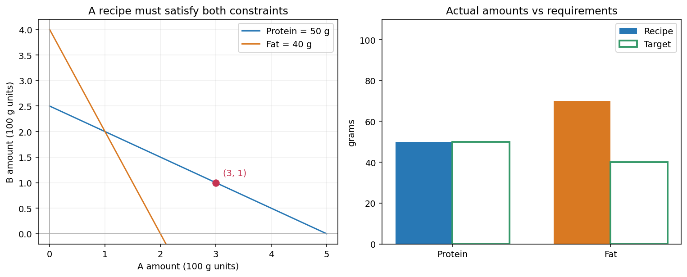

## 我们要做出什么样的配方？

假设我们手边有甲、乙两种原料，想把它们混成一份含 50 克蛋白质、40 克脂肪的材料。每 100 克原料的成分如下，数据均为教学假设：

| 每 100 克 | 蛋白质 | 脂肪 |
|---|---|---|
| 甲 | 10 克 | 20 克 |
| 乙 | 20 克 | 10 克 |

我们要找的是各放多少。为方便计算，令 `x,y` 分别表示甲、乙各有多少个“100 克”。例如 `(x,y)=(1,2)` 表示甲 100 克、乙 200 克。

## 先只满足蛋白质要求

甲贡献 `10x` 克蛋白质，乙贡献 `20y` 克，合起来要有 50 克。因此第一个要求是

\[
10x+20y=50.
\]

我们先试几份配方。甲不放，乙需要几份？甲放一份呢？甲放三份呢？你先算，再打开核对。

> [!DETAILS] 三份都符合蛋白质要求
> `(0,2.5)`、`(1,2)`、`(3,1)` 分别得到 `0+50`、`10+40`、`30+20` 克蛋白质。

只有这三份吗？甲也可以放 150 克，也就是 `x=1.5`；乙取 `y=1.75`，仍然符合要求。用量可以连续变化，挨个试不能把所有配方列完。

### 把全部候选写出来

我们从等式两边减去 `10x`，再除以 20：

\[
y=2.5-0.5x.
\]

这条式子告诉我们：选定甲的用量，乙就必须按这个关系取值。所有满足蛋白质要求的实数数对组成一个**解集**：

\[
S_1=\{(x,y)\in\mathbb{R}^2:y=2.5-0.5x\}.
\]

解方程不只是猜中一份配方，而是描述这个条件允许的全部选择。

厨房里不能放负量，所以还要要求 `x≥0,y≥0`，留下 `0≤x≤5` 的部分。先分清两件事：方程的实数解集，以及其中实际可用的配方。

## 再检查脂肪

刚才几份配方都满足蛋白质要求，脂肪却未必相同。把甲 100 克、乙 200 克，与甲 300 克、乙 100 克分别代入表格，脂肪各有多少？

> [!DETAILS] 用第二个要求筛选
> `(1,2)` 得到 `20×1+10×2=40` 克脂肪，符合要求。
> `(3,1)` 得到 `20×3+10×1=70` 克脂肪，不符合要求。

第二个要求可以写为

\[
20x+10y=40.
\]

它也允许一批配方，记为 `S_2`。我们真正需要的配方，必须同时在两批候选里：

\[
S_{\text{共同}}=S_1\cap S_2.
\]

这就是解方程组：找各条方程解集的交集。

左图每个点表示一份配方，横轴是甲、纵轴是乙，每单位表示 100 克。蓝线上的点满足蛋白质要求，橙线上的点满足脂肪要求；交点才同时满足两者。红点是一份被第二个要求排除的候选，右图显示它错在哪里。

## 怎样确认交点只有一个？

我们已经找到 `(1,2)`，但还要确认没有漏掉别的共同解。两条约束是

\[
\begin{cases}
10x+20y=50,\\
20x+10y=40.
\end{cases}
\]

第一条乘 2，`x` 的系数就与第二条相同。用第二条减去第一条的两倍，会留下什么？

> [!DETAILS] 先消去甲的用量
> `(20x+10y)−2(10x+20y)=40−100`，得到 `−30y=−60`，所以 `y=2`。

再代回第一条，甲应放多少？

> [!DETAILS] 代回并核对
> `10x+40=50`，所以 `x=1`。两条原式分别得到 50 和 40。两个用量都被确定，因此共同解集恰好为 `{(1,2)}`，并且这份配方非负、可用。

注意，我们保留了第一条方程。新系统可以倒回去：把第一条的两倍加回新第二条，就恢复原第二条。这才保证化简没有把共同解改掉。

## 把原料名称放下，哪些关系还成立？

配方题里，每个要求都是“已知数乘未知量，再相加，等于目标”。如果只是把原料改名，或者换成别的成分数据，这个结构不变。

我们把形如

\[
a_1x_1+\cdots+a_nx_n=b
\]

的关系叫作**线性方程**，这里的系数和右端已经给定，未知量以一次项出现，不相互相乘。几条这样的方程共用一组未知量，就组成线性方程组。

纯代数题 `x+y=5, 2x−y=1` 也一样：没有原料名称，仍然是在求两个解集的交集。你可以用刚才的办法求出 `(2,3)`，核对每一步是否能倒回去。

## 实验与下一步

打开[配料实验](https://colab.research.google.com/github/xiaoheng008/linear-algebra-evolution/blob/main/experiments/application_examples.ipynb)，沿蛋白质约束改变用量，先预测脂肪怎样变化，再检查何时也满足脂肪目标。[方程组实验](https://colab.research.google.com/github/xiaoheng008/linear-algebra-evolution/blob/main/experiments/01_equations.ipynb)则把原料名称去掉，直接观察直线与解集。

这一份配方可以消元求出，但新的要求不一定真的增加信息，也可能与旧要求矛盾。下一章我们沿着同一份配料记录，看看消元怎样把区别显出来。

## 合上书，自己走一遍

从成分表写出两条约束，说明单条方程为什么有一批解、方程组为什么取交集。再换一个目标，判断实数解与可用配方是否相同。
