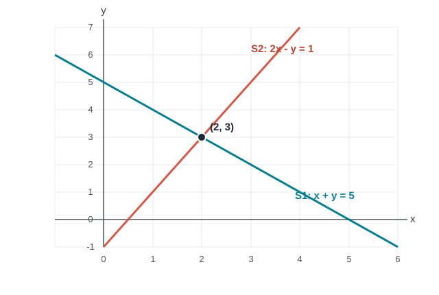

## 先从一个方程开始

在平面上取一点 `(x,y)`。先只要求它的两个坐标相加为 5：

\[
x+y=5.
\]

### 先试几个值

先试几个整数。`x=0`，就有 `y=5`；`x=1`，就有 `y=4`；`x=2`，则 `y=3`。每一对都说得通。可是，解只有这三个吗？当然不是。`x` 还可以是 `0.5`，也可以是 `2.37`。只要允许实数，挨个试就永远试不完。

### 不再一个个试

与其继续猜，不如把 `y` 单独留在一边。从等式两边减去 `x`：

\[
y=5-x.
\]

现在可以直接读出所有解：`x` 想取什么实数都行，`y` 必须取 `5−x`。例如 `x=2.37` 时，`y=2.63`。把所有这样的数对收在一起，叫作这个方程的解集：

\[
S_1=\{(x,y)\in\mathbb{R}^2\mid y=5-x\}.
\]

画在平面上，它们排成一条直线。刚才那几个整数点只是这条线上的几个点；式子 `y=5−x` 才把整条线都说全了。

### 加入第二个条件

再加一个条件：横坐标的两倍减去纵坐标，结果是 1。于是还有一个方程 `2x−y=1`，也有一整组满足它的点：

\[
S_2=\{(x,y)\in\mathbb{R}^2\mid 2x-y=1\}.
\]

## 两个条件同时成立，意味着什么？

现在要找的数对，得同时满足两个方程。换句话说，它既在 `S_1` 里，也在 `S_2` 里。这样的点就是两个解集的交集：

\[
S_{\text{system}}=S_1\cap S_2.
\]

一个方程给出一批可能的数对；方程组留下的是这些可能里共同的部分。我们来把刚才这两个解集的交集找出来。

## 让两条直线相交

每条直线上的点都满足一个方程。两条线交在哪里？先猜一猜，再算给自己看。

### 跟着例子走：两条约束怎样缩小候选范围？

先不要急着求出 `x` 和 `y`。每一步只做一个决定。

看这两条式子：`+y` 和 `−y` 正好相反。把等式左右分别相加，`y` 会怎样？

> [!DETAILS] 给我一点提示
> `+y` 与 `−y` 相加为 0，两个 `y` 项就消掉了。

> [!DETAILS] 展开这一步
> `(x+y)+(2x−y)=5+1`，得到 `3x=6`，所以 `x=2`。

知道 `x=2` 了。代回第一条方程，`y` 应该是多少？

> [!DETAILS] 检查
> 代入 `x+y=5`，得到 `2+y=5`，所以 `y=3`。

算出 `y=3` 后，还不能只看第一条。把 `(2,3)` 代回两条原方程，检查一下。

> [!DETAILS] 核对
> `2+3=5` 且 `2×2−3=1`。这对数同时满足两条约束。

所以这个方程组的解集不是只报一个点，而是

\[
S_{\text{system}}=S_1\cap S_2=\{(2,3)\}.
\]

回头看：试整数只能找到几个解，`y=5−x` 才说出了第一个方程的全部解；第二个方程再把这条线上的点筛一遍，最后只剩 `(2,3)`。

图里两条直线的交点也是 `(2,3)`。图能帮我们看见答案，但“只有这一个交点”仍要由计算来确认。

## 还要问：这样的解有几个？

这个例子刚好只有一个交点。换两条方程，可能会没有交点，也可能整条线都重合。方程再多一些时，有没有办法不用画图，也能分清这几种情况？

## 变形时，别把解弄丢了

解方程组时，我们是在找同时通过所有条件的数。化简可以让问题更容易算，但有一条底线：化简前后，能满足整组方程的数对必须一样。

## 这种关系叫线性方程

例如，下面这种形式的方程叫线性方程：

\[
a_1x_1+a_2x_2+\cdots+a_nx_n=b
\]

几个线性方程共用一组未知量，就组成线性方程组。这里的“线性”有具体含义：未知量只单独出现一次，不互相相乘，也不放进平方、正弦等函数里。

## 为什么可以把两条方程相加？

为什么刚才可以把两个方程相加？如果 `(x,y)` 满足原来的两式，它当然满足两式相加后的 `3x=6`。反过来，只靠 `3x=6` 还不够，所以我们还把 `x=2` 代回原方程求 `y`。做消元时，交换方程、把一个方程乘以非零数、或用一条方程减去另一条的倍数，都是可以倒回去的操作，因此不会改变整组方程的解。

这正是本例的做法：两式相加得到 `3x=6`，再代回求出 `y=3`。每一步都能回到原来的条件。

## 实验

打开[方程组交互实验](https://colab.research.google.com/github/xiaoheng008/linear-algebra-evolution/blob/main/experiments/01_equations.ipynb)，先改右端的数字，猜猜两条线会相交、平行还是重合，再运行代码看看。想在本地运行，可以下载[实验文件](https://github.com/xiaoheng008/linear-algebra-evolution/blob/main/experiments/01_equations.ipynb)。

## 下一步：怎样稳定地做这类化简？

两个方程我们还能慢慢算。方程一多，怎样安排消去未知量的步骤才不容易乱？下一章就从这个问题开始。

## 合上书，自己走一遍

合上书，试着回答：为什么方程组的解要同时满足每条方程？自己编一个两元方程组，解出来，并说明每次变形为什么没有改变答案。
