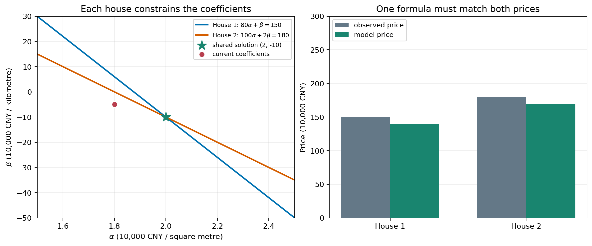

## 还是这张成分表

前两章，我们一直在处理甲、乙两种原料。每份 100 克，甲贡献蛋白质 10 克、脂肪 20 克，乙贡献蛋白质 20 克、脂肪 10 克。目标是蛋白质 50 克、脂肪 40 克，未知用量为 `x,y`：

\[
10x+20y=50,\qquad 20x+10y=40.
\]

如果有十种原料、二十项成分要求，逐条抄写时，哪些东西在重复？我们每次都按相同顺序写用量，变化的是它们前面的成分数。

## 每个要求一行，每种原料一列

我们先只把系数排好。第一行计算蛋白质，第二行计算脂肪；每行都按甲、乙的顺序取数：

| 要求 | 甲每份贡献 | 乙每份贡献 |
|---|---|---|
| 蛋白质 | 10 | 20 |
| 脂肪 | 20 | 10 |

注意原来的成分表按原料列行，这里为了逐条计算要求，改成了每项成分一行。每个数仍是“每 100 克原料贡献多少克”，没有改动数据。

把用量单独写成一列，目标也单独写成一列：

\[
A=\begin{bmatrix}10&20\\20&10\end{bmatrix},\qquad
\mathbf{x}=\begin{bmatrix}x\\y\end{bmatrix},\qquad
\mathbf{b}=\begin{bmatrix}50\\40\end{bmatrix}.
\]

这种矩形数表叫作**矩阵**。`A` 的两列对应两种原料，两行对应两项要求。粗体 `x` 收集全部用量，与其中单个用量 `x` 区别开。

## 新记号必须能读回原问题

我们约定让每行的数分别乘对应的用量，再相加：

\[
A\mathbf{x}
=\begin{bmatrix}10x+20y\\20x+10y\end{bmatrix}.
\]

第一项是蛋白质总克数，第二项是脂肪总克数。要求两项恰好达到目标，就写成

\[
A\mathbf{x}=\mathbf{b}.
\]

先读回这两行，再用已经求出的用量 `(1,2)` 核对。记号变短，不意味着多了一条条件，也没有改变共同解集。

## 目标可以换，成分表不用重新抄

如果我们选用甲 200 克、乙 100 克，先预测产出，再核对：

> [!DETAILS] 同一张表，另一个输入
> 用量为 `(2,1)`，蛋白质 `10×2+20×1=40` 克，脂肪 `20×2+10×1=50` 克。同一个 `A` 把新的用量送到新的结果。

这里已知成分表和用量，算产出；前两章已知成分表和目标，求用量。两种方向使用同一张表，这正是 `Ax=b` 里已知量与待求量的区别。

## 换成房价，是否还能这样排列？

我们再试一个不同的问题：假设价格（万元）由面积（平方米）与到学校的距离（公里）按固定系数相加得到，暂不加固定起价。

| 房屋 | 面积 | 距离 | 价格 |
|---|---|---|---|
| 甲房 | 80 | 1 | 150 |
| 乙房 | 100 | 2 | 180 |

数据是教学假设。面积、距离和价格已知，未知的是两个模型系数 `α,β`。每套房给出一条条件：

\[
80\alpha+\beta=150,\qquad 100\alpha+2\beta=180.
\]

你先消去 `β`，再求 `α`。完成后，把房屋数据、未知系数与价格分别排列：

> [!DETAILS] 求解并写成同一种格式
> 第一式乘 2 再减去第二式，得到 `60α=120`，因此 `α=2`，代回得 `β=−10`。
> \[
> A=\begin{bmatrix}80&1\\100&2\end{bmatrix},\quad
> \mathbf{x}=\begin{bmatrix}\alpha\\\beta\end{bmatrix},\quad
> \mathbf{b}=\begin{bmatrix}150\\180\end{bmatrix}.
> \]
> 仍是 `Ax=b`。这里每行是一套房，每列是一项特征，`x` 装的是模型系数，不再是原料用量。

图中一个点是系数组合 `(α,β)`，不是一套房的位置。两条约束的交集确定了同一组系数。

现在丙房面积 90 平方米，距离 0.5 公里。先用系数手算，再读这个式子：

\[
\begin{bmatrix}90&0.5\end{bmatrix}
\begin{bmatrix}2\\-10\end{bmatrix}
=\begin{bmatrix}175\end{bmatrix}.
\]

我们得到模型价格 175 万元，不是实际成交价。配料表中的数字来自假设成分记录，房价关系来自假设模型；两个场景的依据不同，但组织计算的形式相同。

`Ax=b` 的 `b` 是每条方程的右端，不是写法 `y=ax+b` 中专门表示截距的那个 `b`。记号含义由当前问题决定。

## 最后只保留计算结构

现在我们暂时去掉原料、成分、房屋的名称。若有 `n` 个未知量、`m` 条线性要求，就把系数排成 `m×n` 矩阵，未知量排成 `n` 项的列，右端排成 `m` 项的列。

第 `i` 行的要求是

\[
a_{i1}x_1+\cdots+a_{in}x_n=b_i.
\]

把所有行收在一起，仍写成 `Ax=b`。之所以能推广，是因为我们保留了“每行计算一项要求、每列对应一个未知量”的结构。

## 实验与下一步

先运行[配料实验](https://colab.research.google.com/github/xiaoheng008/linear-algebra-evolution/blob/main/experiments/application_examples.ipynb)，自己读出矩阵各行各列；再运行[房价实验](https://colab.research.google.com/github/xiaoheng008/linear-algebra-evolution/blob/main/experiments/03_matrix_system.ipynb)，把同一种排列用于求系数和算预测。

下一章，我们要直接合并和缩放这些数列。配方、成分、位移、力，各自的一列数怎样作为一个整体参与计算？

## 合上书，自己写一次

分别为配料与房价写出 `A,x,b`，说明每个数的含义和单位。再给一张三项要求、两种原料的成分表，写出矩阵尺寸，并把每一行读回方程。
