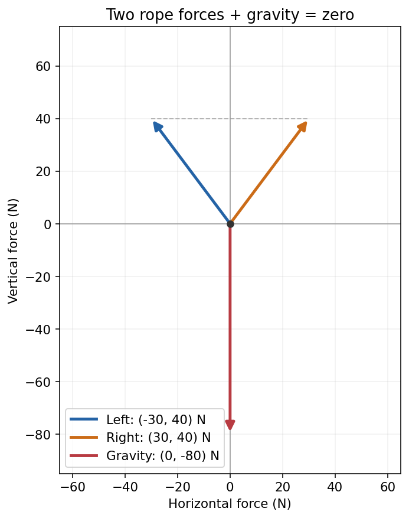

## 一份原料，带来两个数

前面我们一直同时记录蛋白质和脂肪。每 100 克甲带来蛋白质 10 克、脂肪 20 克；乙带来蛋白质 20 克、脂肪 10 克。我们按“蛋白质、脂肪”的顺序，把一份甲记作 \((10,20)\)，一份乙记作 \((20,10)\)。

先取一份甲、两份乙。你先分别算出两项成分的总量。

> [!DETAILS] 对照
> 蛋白质是 \(10+2\times20=50\) 克，脂肪是 \(20+2\times10=40\) 克。因此整份配料的成分是 \((50,40)\)。

两次计算做的是同一件事：把对应的成分相加。我们可以合在一起写：

\[
(10,20)+2(20,10)=(50,40).
\]

这里乘 2，表示乙的用量变成两份，两项成分一起变成原来的两倍。把甲乙的记录顺序弄反，会把蛋白质和脂肪混在一起；能相加的两组数，必须采用相同的坐标意义和单位。

## 换成行走，规则还成立吗？

我们从原点出发，先向右走 1 米、向上走 2 米，再向右走 3 米、向下走 1 米。总位移是多少？

\[
(1,2)+(3,-1)=(4,1)\text{ 米}.
\]

这次坐标不再是成分，而是两个方向的位移。不过，计算仍然是对应坐标相加。若同一段位移重复两次，就有 \(2(1,2)=(2,4)\)。

成分的负数通常表示减少了多少；位移的负数表示朝约定的反方向走。我们不能仅凭正负号判断一个结果在实际问题中是否合理。

## 两根绳子怎样托住一个物体？

现在看一个需要同时考虑方向和大小的问题。

一个物体受到向下 80 牛顿的重力。两根绳子在同一个连接点拉住它，左绳指向左上方，右绳指向右上方。每根绳子的方向都组成一个 3、4、5 直角三角形：水平方向占绳长的 \(3/5\)，竖直方向占 \(4/5\)。

规定向右、向上为正。左绳每提供 1 牛顿拉力，水平分量是 \(-0.6\) 牛顿，竖直分量是 \(0.8\) 牛顿；右绳则是 \((0.6,0.8)\)。

先假设两根绳子各拉 50 牛顿。你先算：水平分量会不会抵消？两根绳子一共提供多少向上的力？

> [!DETAILS] 把三个力相加
> 左绳的力是 \(50(-0.6,0.8)=(-30,40)\) 牛顿，右绳的力是 \(50(0.6,0.8)=(30,40)\) 牛顿。
> 两绳合力为 \((0,80)\) 牛顿，加上重力 \((0,-80)\) 牛顿，合力恰好为零。

蓝、橙箭头分别表示两根绳子的拉力，红箭头表示重力。箭头长度表示力的大小，不表示绳子实际有多长。

这里采用共同作用于一个点的理想模型，静止时各个力的和为零。绳子的强度和伸长暂不考虑；真实物体还可能需要检查力矩平衡。这些假设来自[静力平衡的条件](https://openstax.org/books/university-physics-volume-1/pages/12-1-conditions-for-static-equilibrium)。

## 不知道拉力时，我们又回到了方程组

分别把左、右绳的拉力大小记作 \(T_L,T_R\)。要让物体静止，需要

\[
\begin{cases}
-0.6T_L+0.6T_R=0,\\
0.8T_L+0.8T_R=80.
\end{cases}
\]

第一行要求水平方向平衡，第二行要求两根绳子托住向下的重力。第一行给出 \(T_L=T_R\)，代入第二行，得到两根绳子各承担 50 牛顿。

这与配料的方程组很像：一份原料同时贡献两项成分，一牛顿绳索拉力同时贡献两个方向的力。每个未知量都把一整组数按比例放大，然后这些贡献相加。

## 给共同的计算起一个名字

我们把有固定顺序的 \(n\) 个实数写成一列，叫作 \(\mathbb R^n\) 中的向量：

\[
\mathbf{x}=\begin{bmatrix}x_1\\x_2\\\vdots\\x_n\end{bmatrix}.
\]

同样长度的向量，可以对应坐标相加，也可以每个坐标同时乘以一个实数：

\[
\begin{bmatrix}u_1\\u_2\end{bmatrix}
+\begin{bmatrix}v_1\\v_2\end{bmatrix}
=\begin{bmatrix}u_1+v_1\\u_2+v_2\end{bmatrix},
\qquad
c\begin{bmatrix}u_1\\u_2\end{bmatrix}
=\begin{bmatrix}cu_1\\cu_2\end{bmatrix}.
\]

这两条规则没有再提成分、位移或拉力。我们从具体问题走到了共同的数学对象。以后把向量推广到函数等对象时，仍然会保留这两类运算；眼下先把实数坐标算清楚。

## 库存和声音也可以这样记录

仓库库存按“苹果、梨”的顺序记为 \((12,8)\) 箱，送来 \((3,2)\) 箱后，库存是 \((15,10)\) 箱。

双声道录音在同一时刻的采样值可以记为 \((L,R)\)。对齐的两段音频相加，就是分别相加左右声道；乘 \(0.5\)，就是把两个声道的信号幅度一起减半。负采样值表示波形的方向，不是负的音量。实际设备的幅度限制要另行考虑。

## 实验

打开[绳索与力的合成实验](https://colab.research.google.com/github/xiaoheng008/linear-algebra-evolution/blob/main/experiments/physics_forces.ipynb)。先把两根绳子的拉力都设为 40 牛顿，预测物体所受合力；再改成 50 牛顿核对。最后保持总拉力不变，只把其中 10 牛顿从左绳移到右绳，看看哪个方向的合力改变了。

[位移实验](https://colab.research.google.com/github/xiaoheng008/linear-algebra-evolution/blob/main/experiments/04_vectors.ipynb)可以帮助我们比较向量加法和数乘。运行前先画出你预测的箭头。

## 下一步：同一张表，能不能按列读？

配料的成分与绳索的力，都能写成一组列向量的和。下一章我们回到矩阵，把按行算的结果重新按列拆开，看看每个输入到底贡献了什么。

合上书，自己用成分和拉力两个例子解释加法与数乘。随后只用坐标写出两条运算规则，不再提它们原来的场景。
