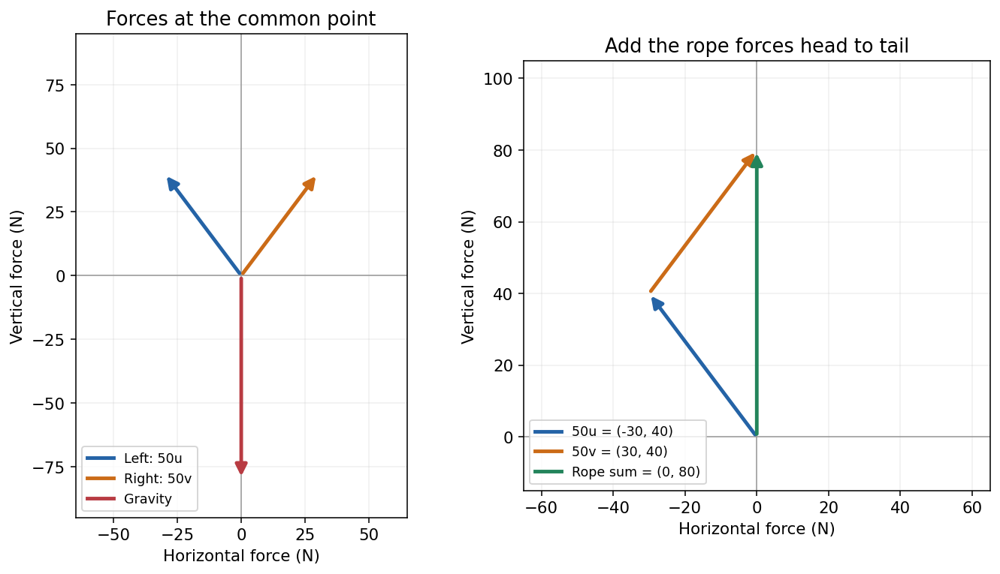

## 已经选好配方，会得到什么？

第三章把成分表写成了

\[
A=\begin{bmatrix}10&20\\20&10\end{bmatrix}.
\]

每行按蛋白质、脂肪排列，每列按甲、乙排列。现在我们使用甲 100 克、乙 200 克，用量向量就是 `x=(1,2)`。

先不看公式，用成分表算出两项总量。每行分别取对应的用量相乘、相加：

\[
A\begin{bmatrix}1\\2\end{bmatrix}
=\begin{bmatrix}10\cdot1+20\cdot2\\20\cdot1+10\cdot2\end{bmatrix}
=\begin{bmatrix}50\\40\end{bmatrix}.
\]

这叫按行计算：第一行算蛋白质，第二行算脂肪。`A` 的数是每份成分克数，输入是份数，输出是总成分克数。

## 换一个读法：先看每种原料带来了什么

甲的一份同时带来蛋白质 10 克、脂肪 20 克；乙的一份同时带来蛋白质 20 克、脂肪 10 克。我们把每种原料的完整贡献写成一列：

\[
\mathbf{a}_1=\begin{bmatrix}10\\20\end{bmatrix},\qquad
\mathbf{a}_2=\begin{bmatrix}20\\10\end{bmatrix}.
\]

它们恰好就是矩阵的两列。要算一份甲、两份乙，可以先把两份乙的贡献放大，再合起来：

\[
1\begin{bmatrix}10\\20\end{bmatrix}
+2\begin{bmatrix}20\\10\end{bmatrix}
=\begin{bmatrix}10\\20\end{bmatrix}
+\begin{bmatrix}40\\20\end{bmatrix}
=\begin{bmatrix}50\\40\end{bmatrix}.
\]

得到的还是刚才的结果。按行是在问每项成分总共多少；按列是在问每种原料贡献多少，再把完整贡献合并。

## 改一次用量，看看这个读法是否还行

把配方改成甲 200 克、乙 100 克。你先按列算，再按行核对。如果全部用量翻倍，两项总成分又会怎样？

> [!DETAILS] 核对两个变化
> 新配方是 `2a_1+a_2=(40,50)`。若把原配方 `(1,2)` 翻倍成 `(2,4)`，产出也翻倍成 `(100,80)`。成分表没有变，变的是每列取多少倍。

因此对任意用量 `x,y`，都有

\[
A\begin{bmatrix}x\\y\end{bmatrix}
=x\mathbf{a}_1+y\mathbf{a}_2.
\]

这条等式来自重新分组，不是猜出的另一种算法。

## 把同一件事放到绳索受力中

第四章中，两根绳子每 1 牛顿张力分别贡献水平、竖直分量 `(−0.6,0.8)` 与 `(0.6,0.8)`。设两根绳的张力为 `T_L,T_R`，单位牛顿。

先看 `T_L=T_R=50`。我们可以分别算两根绳的力，再把它们相加：

\[
50\begin{bmatrix}-0.6\\0.8\end{bmatrix}
+50\begin{bmatrix}0.6\\0.8\end{bmatrix}
=\begin{bmatrix}-30\\40\end{bmatrix}
+\begin{bmatrix}30\\40\end{bmatrix}
=\begin{bmatrix}0\\80\end{bmatrix}\ {\rm N}.
\]

水平分量抵消，竖直分量相加，恰好抵消向下的 80 牛顿重力。把两支方向排成列，也就是

\[
A=\begin{bmatrix}-0.6&0.6\\0.8&0.8\end{bmatrix},\qquad
A\begin{bmatrix}T_L\\T_R\end{bmatrix}
=\begin{bmatrix}0\\80\end{bmatrix}.
\]

这里矩阵的数是无单位的方向分量，输入与输出的单位都是牛顿。它和配料计算的列结构相同，但每个数的物理意义不同。

左图画出作用于同一个点的三个力；右图把两支绳索力首尾相接。箭头长度表示力的大小，不是实际绳长。绿色箭头只表示两根绳的合力，仍须加上重力才得到总外力零。

## 现在给这种计算起个名字

把若干向量分别乘一个数，再相加，叫作它们的**线性组合**。配料的系数是用量，绳索的系数是张力；名字不同，保留下来的计算关系相同。

在纯数学定义中，系数可以取任意实数。原料用量与绳索张力却须非负；数学允许的组合，不一定是这个场景里实际可用的选择。下一章我们会专门检查这个区别。

## 最后去掉原料与力，推导一般式子

设矩阵第 `j` 列为 `a_j`，输入第 `j` 个坐标为 `x_j`。先只比较第 `i` 个输出：

\[
(A\mathbf{x})_i=A_{i1}x_1+\cdots+A_{in}x_n.
\]

各列按 `x_j` 倍相加后，第 `i` 个坐标也正是这个和。每个坐标都相同，所以

\[
A\mathbf{x}=\sum_{j=1}^{n}x_j\mathbf{a}_j.
\]

这个结论不需要知道坐标表示蛋白质还是水平力。我们从具体计算走到通用式子，保留的是各项相乘、相加与重新分组的规则。

## 已知输入与寻找输入，是两种问题

配方或张力已经选定，`Ax` 告诉我们会产生什么输出。目标已经给定，则要求哪些输入满足 `Ax=b`：每行给出一条约束，答案必须在它们解集的交集里。

第三章的房价也如此：先用房屋数据与价格求系数，再用数据与系数算模型价格。这个场景多了一层“模型系数”的解释，列组合的计算并没有变。

作为纯符号练习，取 `A=[[1,1],[2,−1]]`，输入 `(2,3)`。你可以按行得到 `(5,1)`，再按列写成 `2(1,2)+3(1,−1)` 核对。没有应用背景时，我们也知道为什么这样计算。

## 实验与下一步

在[配料实验](https://colab.research.google.com/github/xiaoheng008/linear-algebra-evolution/blob/main/experiments/application_examples.ipynb)里改变用量，再在[绳索受力实验](https://colab.research.google.com/github/xiaoheng008/linear-algebra-evolution/blob/main/experiments/physics_forces.ipynb)里改变张力。先画出两列各取几倍，再看合力是否平衡重力。[列组合实验](https://colab.research.google.com/github/xiaoheng008/linear-algebra-evolution/blob/main/experiments/05_column_combination.ipynb)保留纯坐标计算，供我们去掉背景后练习。

下一章继续问：这些方向所有可能的组合，究竟能到哪里？能算出一个输出，还不等于了解全部输出范围。

## 合上书，重新分组一次

用配料或绳索说明一行、一列和输入系数的含义，再不借助背景推导 `Ax=Σx_ja_j`。说清任意实数系数与实际可用系数的区别。
