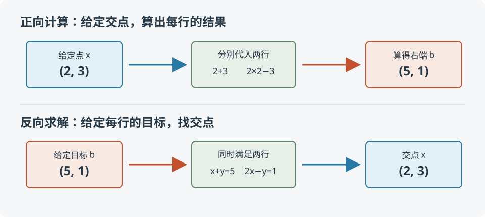

## 回到第一章的交点

我们在第一章解过这组方程：

\[
\begin{cases}
x+y=5,\\
2x-y=1.
\end{cases}
\]

当右边的数是 5 和 1 时，两条直线交于 `(2,3)`。当时我们从方程出发找交点。现在反过来：若已知点 `(2,3)`，把它代进每条方程，右边会得到什么？

\[
2+3=5,\qquad 2\cdot2-3=1.
\]

每一行各算出一个数，按顺序排起来就是 `b=(5,1)`。这一次是给定 `x`，逐行算出 `b`；第一章则是给定 `b`，找出同时满足两行的 `x`。

## 把两行写成矩阵

把每行中 `x`、`y` 的系数排在一起：

\[
A=\begin{bmatrix}1&1\\2&-1\end{bmatrix},\qquad
\mathbf{x}=\begin{bmatrix}2\\3\end{bmatrix},\qquad
\mathbf{b}=\begin{bmatrix}5\\1\end{bmatrix}.
\]

按行计算，第一行给出 `1·2+1·3=5`，第二行给出 `2·2−1·3=1`。所以

\[
A\mathbf{x}=\begin{bmatrix}1&1\\2&-1\end{bmatrix}
\begin{bmatrix}2\\3\end{bmatrix}
=\begin{bmatrix}5\\1\end{bmatrix}=\mathbf{b}.
\]

这里的 `b` 是计算结果，不是预先指定的目标。

## 同一次计算，按列重排

刚才我们按行看，每一行各算一个输出。现在换个分组方式：把 `x` 的第一项 2 与矩阵第一列相乘，把第二项 3 与第二列相乘，再把两列相加：

\[
2\begin{bmatrix}1\\2\end{bmatrix}
+3\begin{bmatrix}1\\-1\end{bmatrix}
=\begin{bmatrix}2\\4\end{bmatrix}
+\begin{bmatrix}3\\-3\end{bmatrix}
=\begin{bmatrix}5\\1\end{bmatrix}.
\]

得到的还是刚才的 `b`。输入 `x` 的坐标，恰好是矩阵各列要乘的倍数。按行分组容易算出每个输出坐标；按列分组则让我们看见：输入怎样把各列组合成输出。

## 这叫线性组合

把若干向量各乘一个数，再把结果相加，叫作它们的**线性组合**。本例中，`A` 的两列是

\[
\mathbf{a}_1=\begin{bmatrix}1\\2\end{bmatrix},\qquad
\mathbf{a}_2=\begin{bmatrix}1\\-1\end{bmatrix},
\]

因此 `A x = 2a_1+3a_2=b`。这不是另一条矩阵乘法规则，而是把按行展开的乘法重新分组。

若矩阵有 `n` 列，把第 `i` 个输出坐标展开，就能核对一般情形：

\[
(A\mathbf{x})_i=\sum_{j=1}^n A_{ij}x_j.
\]

矩阵第 `j` 列在第 `i` 个位置的数正是 `A_ij`，所以各列按 `x_j` 倍相加后，第 `i` 个坐标仍是这个和。每个坐标都相同，便有

\[
A\mathbf{x}=\sum_{j=1}^n x_j\mathbf{a}_j.
\]

## 已知哪一边，决定要做哪件事

`A x=b` 可以提出两个方向的问题。已知 `A` 和 `x`，按行计算就得到 `b`；已知 `A` 和目标 `b`，则要找出能组成这个目标的输入 `x`。后者正是解方程组：每个目标坐标都给出一条约束，答案必须同时满足它们。

所以“根据 `A` 和给定的 `x` 求 `b`”并不是另一种解方程。它是在执行矩阵规定的计算；反过来求 `x`，才是在问哪些输入会产生指定输出。

## 回到房价模型

[第三章]()用两套房的已知价格，求出面积和距离的系数 `x=(2,−10)`。当时两套房各给出一条关于系数的约束，求 `x` 就是找这些约束的共同解。

系数确定以后，面积 90 平方米、距离 0.5 公里的丙房可以直接算出模型价格：

\[
\begin{bmatrix}90&0.5\end{bmatrix}
\begin{bmatrix}2\\-10\end{bmatrix}
=\begin{bmatrix}175\end{bmatrix}.
\]

这一行房屋数据是 `A`，两项模型系数是 `x`，算出的价格是 `b`。这里已知 `A,x`，待求 `b`。把两种问题放在一起看：有房屋数据和价格，就求能解释它们的系数；有房屋数据和系数，就算模型给出的价格。

## 同一张成分表，既能查配方，也能算产出

把第一章的原料数据排成矩阵：行按“蛋白质、脂肪”，列按“甲、乙”。

\[
A=\begin{bmatrix}10&20\\20&10\end{bmatrix},\qquad
\mathbf{x}=\begin{bmatrix}1\\2\end{bmatrix},\qquad
A\mathbf{x}=\begin{bmatrix}50\\40\end{bmatrix}=\mathbf{b}.
\]

`A` 的每个数是每 100 克原料贡献的成分克数；`x` 的每个数是使用多少个 100 克；`b` 的每个数是混合后的成分克数。

按行读，第一行算蛋白质总量，第二行算脂肪总量。按列读，第一列是甲的一份成分，第二列是乙的一份成分；取一份甲、两份乙，再合起来。

若已知想要 `b=(50,40)`，不知道配方 `x`，就解方程组。若已经选定 `x=(2,1)`，则无需解方程，直接算出 `b=(40,50)`。先猜这两项为什么对调了，再按行核对。

房价模型中的 `x` 是待估计的模型系数，这里 `x` 是原料用量。它们在各自问题里含义不同，但都处在矩阵计算的输入位置。

## 实验

打开[列组合交互实验](https://colab.research.google.com/github/xiaoheng008/linear-algebra-evolution/blob/main/experiments/05_column_combination.ipynb)，先按实验给出的矩阵和输入，分别用行、列两种方式手算输出，再运行代码核对。随后改变输入，观察列的倍数变了，输出怎样跟着变。也可以下载[实验文件](https://github.com/xiaoheng008/linear-algebra-evolution/blob/main/experiments/05_column_combination.ipynb)在本地运行。

## 下一步：这些列一共能生成哪些输出？

输入改变时，输出仍是这两列的某种组合。哪些目标能这样得到，哪些够不着？下一章就来找出这批可能输出的范围。

## 不看推导，重新分组一次

从 `A x` 的按行计算出发，自己把各项按 `x` 的坐标重新分组，说明为什么结果等于矩阵列的加权和。再回答：已知 `A,x` 与已知 `A,b`，分别要找什么？
