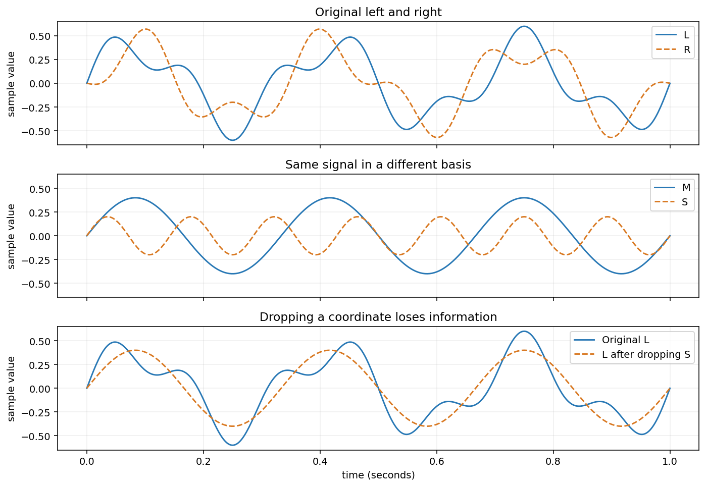

## 删掉丙以后，只留甲行不行？

上一章的三种原料，每份贡献的蛋白质、脂肪是

\[
\begin{aligned}
\mathbf a&=\begin{bmatrix}10\\20\end{bmatrix},&
\mathbf b&=\begin{bmatrix}20\\10\end{bmatrix},\\
\mathbf c&=\begin{bmatrix}30\\30\end{bmatrix}=\mathbf a+\mathbf b.
\end{aligned}
\]

丙可以由甲乙替代，所以暂时删去丙。我们还想继续精简：只留下甲行不行？

先试目标 \((50,40)^T\) 克。只用甲，蛋白质要求我们取 5 份，脂肪却要求取 2 份。同一份用量不能同时满足两项要求。

甲本身没有重复，可是它不够用。这提醒我们：找一组好的描述，需要同时检查“够用”和“不重复”。

## 留下甲乙，先算几份配方

目标 \((50,40)^T\) 的系数是 \((1,2)\)，目标 \((40,50)^T\) 的系数是 \((2,1)\)。每一对系数都告诉我们两种原料各取多少份。

现在问更一般的问题：给定蛋白质与脂肪目标 \((P,F)^T\)，能否找到实数系数 \(r,s\)，使

\[
r\mathbf a+s\mathbf b=\begin{bmatrix}P\\F\end{bmatrix}?
\]

展开两项成分再消元，得到

\[
r=\frac{2F-P}{30},\qquad
s=\frac{2P-F}{30}.
\]

你先把 \(P=50,F=40\) 代回检查。再试 \(P=10,F=0\)，看两项系数的符号。

> [!DETAILS] 把数学答案读回配料
> 第一组得到 \(r=1,s=2\)。第二组得到 \(r=-1/3,s=2/3\)：作为实数线性组合，它确实产生 \((10,0)^T\)，但需要负的甲用量，不能作为实际配方。
> 我们说甲乙能表示整个二维平面，是允许任意实数系数的数学结论，不是说所有成分目标都能实际配出来。

甲乙既能表示每个实数二维向量，组合成零时又只能两项系数都为零。因此，它们既够用，也没有重复。

## 这两项条件合起来，叫作基

一组向量若**张成**一个空间，并且**线性无关**，就称为这个空间的一组**基**。

甲乙的成分向量是 \(\mathbb R^2\) 的一组基。只留甲，无关但不能张成平面；把丙也留下，能张成平面但相关。单独满足其中一项不够。

这里讨论的是允许任意实数系数的向量空间。实际配方的非负限制，会从这些组合中筛掉一部分，并不改变我们刚才对基的判断。

## 换成乙丙，还是够用吗？

甲乙不是唯一的选择。既然 \(\mathbf a=\mathbf c-\mathbf b\)，我们可以把原来的表示改写成

\[
r\mathbf a+s\mathbf b
=r(\mathbf c-\mathbf b)+s\mathbf b
=(s-r)\mathbf b+r\mathbf c.
\]

所以每个甲乙能表示的向量，乙丙也能表示。乙丙之间有没有重复？假设 \(\alpha\mathbf b+\beta\mathbf c=\mathbf0\)，用 \(\mathbf c=\mathbf a+\mathbf b\) 替换，得到

\[
\beta\mathbf a+(\alpha+\beta)\mathbf b=\mathbf0.
\]

甲乙无关，所以 \(\beta=0\)，再得到 \(\alpha=0\)。因此乙丙也是一组基。

再看同一个目标 \((50,40)^T\)：用甲乙表示，坐标是 \((1,2)\)；用乙丙表示，坐标是 \((1,1)\)。成分没变，记录它的系数变了。

注意坐标必须连同基的顺序一起读：\((1,1)\) 在这里表示一份乙、一份丙，不表示蛋白质与脂肪各一克。

## 换基能保留向量，却不一定保留可行配方

试一份甲，也就是目标 \((10,20)^T\)。在甲乙基下，坐标为 \((1,0)\)；在乙丙基下，坐标为 \((-1,1)\)。

数学上，两组基都能表示它；实际配料时，只用乙丙却需要负的一份乙。因此“换一组基”保留的是**实数线性表示的全部向量**，未必保留非负系数能实现的范围。

这也解释了上一章为什么专门检查替代系数的符号：删去丙能保留非负配方范围；删去甲，虽然仍有一组基，却不再保留同一个非负范围。

## 为什么选定基后，坐标是唯一的？

先用具体例子想：同一个成分目标，能否有两套不同的甲乙用量？若两套用量产生相同的成分，把它们相减，就得到一项输出为零的调整。甲乙无关，只有不调整才行，所以两套用量必然一样。

把这段推理去掉原料名称。假设 \(\mathbf v_1,\ldots,\mathbf v_k\) 是一组基，同一个向量有两种表示：

\[
\mathbf z=\sum_i r_i\mathbf v_i=\sum_i s_i\mathbf v_i.
\]

相减得到 \(\sum_i(r_i-s_i)\mathbf v_i=\mathbf0\)。线性无关要求每个 \(r_i-s_i=0\)，所以坐标逐项相同。

张成保证坐标存在，线性无关保证坐标唯一。这就是基同时要求两个条件的原因。

## 不借助配料，再读一次标准基

现在取

\[
\begin{aligned}
\mathbf e_1&=\begin{bmatrix}1\\0\end{bmatrix},&
\mathbf e_2&=\begin{bmatrix}0\\1\end{bmatrix},\\
\mathbf d&=\begin{bmatrix}1\\1\end{bmatrix}=\mathbf e_1+\mathbf e_2.
\end{aligned}
\]

任意二维向量都有

\[
x\mathbf e_1+y\mathbf e_2
=x\begin{bmatrix}1\\0\end{bmatrix}
+y\begin{bmatrix}0\\1\end{bmatrix}
=\begin{bmatrix}x\\y\end{bmatrix}.
\]

组合成零时只能 \(x=y=0\)，所以 \(\mathbf e_1,\mathbf e_2\) 是平面的标准基。第三支满足 \(\mathbf d=\mathbf e_1+\mathbf e_2\)，可以删掉。这里的论证与删去丙完全一样，只是具体数字更简单。

另一组基是 \(\mathbf p=(1,1)^T\)、\(\mathbf q=(1,-1)^T\)，因为

\[
\frac{x+y}{2}\mathbf p+\frac{x-y}{2}\mathbf q
=\begin{bmatrix}x\\y\end{bmatrix},
\]

而 \(\alpha\mathbf p+\beta\mathbf q=\mathbf0\) 给出 \(\alpha+\beta=0,\alpha-\beta=0\)，只能两项都为零。

例如 \((3,1)^T=3\mathbf e_1+\mathbf e_2=2\mathbf p+\mathbf q\)。同一个向量在这两组基下的坐标分别是 \((3,1)\)、\((2,1)\)。

## 双声道：分别记录左右，还是共同与差别？

第四章把同一时刻的左右采样值记为 \((L,R)^T\)。用标准基记录，就是 \(L\mathbf e_1+R\mathbf e_2\)。

换成刚才的 \(\mathbf p,\mathbf q\)：\(\mathbf p\) 给两边相同信号，\(\mathbf q\) 给两边相反信号。设它们的系数为 \(M,S\)，就有

\[
\begin{bmatrix}L\\R\end{bmatrix}
=M\begin{bmatrix}1\\1\end{bmatrix}
+S\begin{bmatrix}1\\-1\end{bmatrix},\qquad
L=M+S,\quad R=M-S.
\]

所以 \(M=(L+R)/2\)，\(S=(L-R)/2\)。这里采用除以 2 的中间/侧边刻度。

先取 \((L,R)=(3,1)\)，新坐标是 \((M,S)=(2,1)\)。重建时左边为 \(2+1=3\)，右边为 \(2-1=1\)。换基没有改变信号。

再试 \((2,2)\) 与 \((2,-2)\)。哪一个只需要 \(\mathbf p\)，哪一个只需要 \(\mathbf q\)？若把 \(S\) 丢掉，还能恢复所有左右采样值吗？

> [!DETAILS] 检查删去一个坐标的代价
> \((2,2)^T=2\mathbf p\)，\((2,-2)^T=2\mathbf q\)。只留下 \(M\)，左右差别就丢失了。例如 \((3,1)\) 与 \((2,2)\) 都有 \(M=2\)，无法再区分。换基与丢掉坐标是两件不同的事。

横轴是时间，纵轴是采样值。前两幅保留同一信号的完整信息；第三幅显示删掉 \(S\) 的损失。

## 实验与重建

打开[配料、基与维数实验](https://colab.research.google.com/github/xiaoheng008/linear-algebra-evolution/blob/main/experiments/ingredients_basis.ipynb)，比较同一个目标在甲乙、乙丙两组基下的坐标。先试 \((50,40)\)，再试一份甲，区分“能表示”与“非负用量能实现”。

[基与坐标实验](https://colab.research.google.com/github/xiaoheng008/linear-algebra-evolution/blob/main/experiments/08_basis.ipynb)提供纯坐标计算；[双声道实验](https://colab.research.google.com/github/xiaoheng008/linear-algebra-evolution/blob/main/experiments/application_examples.ipynb)可以检验波形换基与重建。

合上书，分别举出“无关但不够用”和“够用但相关”的例子。再从两套表示的差，证明一组基的坐标唯一。

我们已经找到好几组平面的基，方向不同，却都是两支。能不能只用一支，或找到三支仍然没有重复的向量？下一章要说明，这个个数为什么固定。
