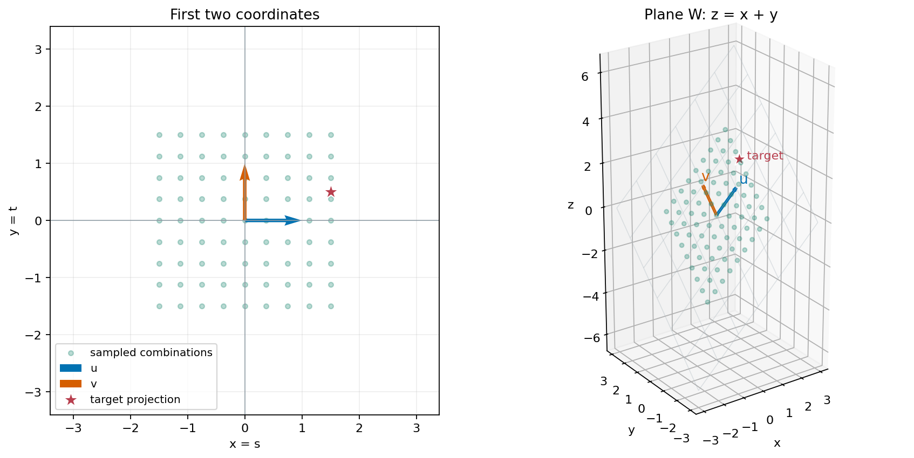

## 三种原料，为什么还是只需要两个数？

上一章选过两组基：甲乙，以及乙丙。它们的成分向量是

\[
\begin{aligned}
\mathbf a&=(10,20)^T,\\
\mathbf b&=(20,10)^T,\\
\mathbf c&=(30,30)^T=\mathbf a+\mathbf b.
\end{aligned}
\]

同一个目标 \((50,40)^T\)，用甲乙记录，需要两项系数 \((1,2)\)；用乙丙记录，也需要两项系数 \((1,1)\)。记录方式变了，系数的个数却没变。

为什么不能只记一种原料的倍数？只用甲，脂肪总是蛋白质的两倍，无法表示 \((50,40)^T\)。只用任意一支非零向量也一样：它的倍数都在一条经过原点的直线上，不能覆盖整个平面。

那么三支呢？甲乙丙能表示平面，但 \(-\mathbf a-\mathbf b+\mathbf c=\mathbf0\)，有一支可以替代，三个系数不独立。看起来需要的数是两个；我们还得说明这不只是几组例子的巧合。

## 先换一支原料，看看为什么没有多出一个位置

从甲乙开始，把丙放进来。因为 \(\mathbf a=\mathbf c-\mathbf b\)，删去甲之后，任何原来的组合仍能改写成乙丙的组合：

\[
r\mathbf a+s\mathbf b=(s-r)\mathbf b+r\mathbf c.
\]

每加进一支新向量，就能替掉一支旧向量，张成的平面不变。这次换基仍使用两个位置。

这里仍然允许任意实数系数。“张成的平面不变”并不保证非负配方的范围不变，上一章已经检查过这个区别。

我们希望把“放进一支、替掉一支”的办法用于任何有限向量组。为看清步骤，先用坐标更简单的标准基做两次替换：

\[
\begin{aligned}
\mathbf e_1&=\begin{bmatrix}1\\0\end{bmatrix},&
\mathbf e_2&=\begin{bmatrix}0\\1\end{bmatrix},\\
\mathbf p&=\begin{bmatrix}1\\1\end{bmatrix},&
\mathbf q&=\begin{bmatrix}1\\-1\end{bmatrix}.
\end{aligned}
\]

## 用新向量替换旧向量

我们先试着把旧基 \(e_1,e_2\) 一支一支换成 \(p,q\)，每次都要求仍能拼出整个平面，看看向量个数为什么没有变化。

**先放入 \(p\)。** 因为 \(p=e_1+e_2\)，能否用 \(p\) 替掉 \(e_1\)，留下 \(p,e_2\)？关键是：删掉的 \(e_1\) 还能不能用留下的两支表示？

> [!DETAILS] 展开这次替换
> 把等式移项，得到 \(e_1=p-e_2\)。原来需要 \(e_1\) 的地方，都可以换成 \(p-e_2\)。因此 \(p,e_2\) 仍能拼出整个平面。

**再放入 \(q\)。** 现在手头是 \(p,e_2\)。先把 \(q\) 用它们表示，再看看能替掉哪一支。

> [!DETAILS] 展开第二次替换
> \(q=e_1-e_2=(p-e_2)-e_2=p-2e_2\)，所以 \(e_2=(p-q)/2\)。用 \(q\) 替掉 \(e_2\)，剩下的 \(p,q\) 仍能拼出整个平面。

我们换了两次，每放进一支新向量，都能取出一支旧向量。最后两支新向量已能表示整个平面；再加进平面内的任何向量，它都可以由这两支表示，便会产生重复。

## 为什么不会多，也不会少？

刚才的替换有一个可推广的理由。假设某个空间能由 \(m\) 支向量拼出来，另外找到 \(r\) 支线性无关的向量。我们逐支放入这 \(r\) 支向量，每次取出一支原来的向量，并始终保留拼出整个空间的能力。

为什么每次都能找到可替换的旧向量？下面把这一步说清楚。

> [!DETAILS] 从这两次替换走到一般证明
> 设原来的 \(v_1,\ldots ,v_m\) 张成空间，准备放入的 \(u_1,\ldots ,u_r\) 线性无关。
>
> 第一步，把 \(u_1\) 写成旧向量的组合：
> \[
> \mathbf{u}_1=c_1\mathbf{v}_1+\cdots+c_m\mathbf{v}_m.
> \]
> \(u_1\) 不是零向量，所以至少有一个系数非零。假设 \(c_j\ne 0\)，就能把这条等式改写成
> \[
> \mathbf{v}_j=\frac{1}{c_j}\left(\mathbf{u}_1-\sum_{k\ne j}c_k\mathbf{v}_k\right).
> \]
> 这说明可以用 \(u_1\) 替掉 \(v_j\)：删掉的向量仍能由留下的向量表示，所以张成的空间没变。
>
> 接着放入 \(u_2\)。它也能由当前清单表示。如果表示中只用了 \(u_1\)，就说明 \(u_2\) 是 \(u_1\) 的倍数，与线性无关矛盾。因此，至少有一支尚未换掉的旧向量系数非零，又能用同样的移项替掉它。
>
> 放入第 \(i\) 支时也一样：它不能只由前 \(i-1\) 支新向量表示，否则这组新向量就线性相关。因此还得有一支旧向量可以替掉。原清单只有 \(m\) 个位置；全部替换完后，其余向量都能由这 \(m\) 支表示，不可能再加入一支仍保持线性无关的向量。所以 \(r\le m\)。

于是得到：**空间里线性无关的向量，个数不会超过任何一组张成它的向量。**

现在我们拿空间的两组基比较，假设各有 \(r\) 支、\(m\) 支。一组线性无关，另一组张成空间，所以 \(r\le m\)。交换两组的角色，又有 \(m\le r\)。因此只能

\[
r=m.
\]

两组基可以朝着不同方向，向量的个数却一定相同。平面已有一组两支向量的基，所以它的任何一组基都恰好有两支。

## 这个固定的数叫维数

对于能由有限个向量张成的空间，一组基中向量的个数叫作空间的**维数**，记作 \(\dim V\)。前面的证明保证了这个定义不依赖我们选哪组基。

这样的空间总能找到基：从有限的张成组开始，若有向量能由其余向量表示，就删掉它。每次删除都保留张成的空间；有限次删除后，没有冗余的清单就是一组基。

它数的是：既能表示空间里的所有向量、又没有重复信息时，需要几个独立的系数。

例如，直线

\[
L=\{(t,2t)\mid t\in\mathbb{R}\}
\]

只用 \(u=(1,2)\) 就能表示其中任意向量。\(u\) 非零，一支就线性无关，因此 \(u\) 是 \(L\) 的基，\(\dim L=1\)。虽然向量写成两个坐标，这条直线只有一维。

这里所说的空间是对向量加法和数乘封闭的实向量集合，例如 \(L\)、整个平面，以及下面这个例子。平移后不经过原点的直线，不属于这里所说的空间。

## 三个报表字段，先试着只存两个

一张报表记录“线上销售额、线下销售额、总额”，单位都是元。例如 \((120,80,200)\) 与 \((60,140,200)\)。

只存总额 200，能恢复是哪一份记录吗？不能，两份记录的渠道分配不同。若存线上、线下两项，第三项则可以直接相加恢复。

所以三个字段并不意味着三个独立的数。我们先把实际记录写成 \((s,t,s+t)\)：前两项选好，第三项就定了。再问这个关系允许哪些有符号的记录，就进入下面的数学空间。

实际销售额通常非负。为了讨论向量空间，我们允许退款或调整对应的有符号金额，并进一步允许任意实数 \(s,t\)。只允许非负的记录集合不对任意实数数乘封闭，不能直接把它叫作向量空间。

## 三个坐标，也可能只需要两个系数

在三维坐标中看这个集合：

\[
W=\{(s,t,s+t)\mid s,t\in\mathbb{R}\}.
\]

前两个坐标选定后，第三个坐标就定了。它是经过原点的平面 \(z=x+y\)。先试着用两支向量表示其中任意一点：

\[
\mathbf{u}=\begin{bmatrix}1\\0\\1\end{bmatrix},\qquad
\mathbf{v}=\begin{bmatrix}0\\1\\1\end{bmatrix}.
\]

给定 \((s,t,s+t)\)，\(u,v\) 的系数应当各取多少？这两支有没有重复信息？

> [!DETAILS] 检查基的两个条件
> 任意 \((s,t,s+t)=s u+t v\)，所以 \(u,v\) 张成 \(W\)。
> 若 \(a u+b v=0\)，前两个坐标分别给出 \(a=0\)、\(b=0\)，所以它们线性无关。
> 因此 \(u,v\) 是 \(W\) 的一组基，\(\dim W=2\)。

图中散点只是若干组合的抽样；整个平面都能表示，是刚才的等式 \(s u+t v=(s,t,s+t)\) 证明的。

这也告诉我们该数什么：向量的三个坐标说明它在三维坐标里怎样记录；\(W\) 的维数说明在 \(W\) 内选一个向量，需要几个独立的系数。整个三维空间还包含 \((0,0,1)\) 这样的点，它不满足 \(z=x+y\)，所以不在 \(W\) 里。

## 增加一个真正独立的字段，会发生什么？

如果报表又记录“总额与两渠道之和的差额” \(h\)，记录变成 \((s,t,s+t+h)\)。当 \(h\) 可以独立变化时，原来的两支基就不够了。例如 \((0,0,1)\) 无法由它们组成。

再加入 \(\mathbf w=(0,0,1)^T\)，就能写成

\[
s\begin{bmatrix}1\\0\\1\end{bmatrix}
+t\begin{bmatrix}0\\1\\1\end{bmatrix}
+h\begin{bmatrix}0\\0\\1\end{bmatrix}
=\begin{bmatrix}s\\t\\s+t+h\end{bmatrix}.
\]

前三项系数组合为零时，前两个坐标先给出 \(s=t=0\)，第三个再给出 \(h=0\)。因此三支无关，而且任意 \((x,y,z)\) 都能取 \(s=x,t=y,h=z-x-y\) 得到。它们是整个 \(\mathbb R^3\) 的一组基。

增加维数的是一个可以独立变化的量，不是表头多了一项。

## 如果配料还要求总质量，三列仍然相关吗？

第七章判断丙可以由甲乙替代，只记录了蛋白质和脂肪。现在把每份原料的总质量也记录下来，三列变成

\[
\widetilde{\mathbf a}=\begin{bmatrix}10\\20\\100\end{bmatrix},\qquad
\widetilde{\mathbf b}=\begin{bmatrix}20\\10\\100\end{bmatrix},\qquad
\widetilde{\mathbf c}=\begin{bmatrix}30\\30\\100\end{bmatrix}.
\]

一份甲加一份乙，总质量是 200 克；一份丙只有 100 克。因此原来的零组合现在变成

\[
-\widetilde{\mathbf a}-\widetilde{\mathbf b}+\widetilde{\mathbf c}
=\begin{bmatrix}0\\0\\-100\end{bmatrix}\ne\mathbf0.
\]

不满足原来的关系，还不能直接断言无关，需要检查有没有别的关系。假设 \(r\widetilde{\mathbf a}+s\widetilde{\mathbf b}+t\widetilde{\mathbf c}=\mathbf0\)。前两项成分要求 \(r=s=-t\)，第三项质量则要求 \(r+s+t=0\)，代入后只能 \(t=0\)，因此三个系数全为零。

任意目标 \((P,F,M)^T\) 也能求出唯一的实数系数：

\[
t=\frac{P+F}{30}-\frac{M}{100},\qquad
r=\frac{M}{100}+\frac{F-2P}{30},\qquad
s=\frac{M}{100}+\frac{P-2F}{30}.
\]

逐行代回可以核对。因此三列现在张成 \(\mathbb R^3\)，并且无关，是它的一组基；实际配料还须检查三项用量是否非负。

原料没有换，记录与要求的输出换了。讨论“有几个独立方向”时，必须先说清楚：我们在描述哪个空间？

## 回到绳索，别把绳子数量当成维数

两根斜绳的方向 \((-0.6,0.8)^T\)、\((0.6,0.8)^T\) 无关，能以实数系数表示任意二维力，所以它们张成的空间维数为 2。

增加一根竖直绳，没有增加合力的维数，因为第三支方向已经是前两支的组合。反过来，如果所有绳子都竖直，哪怕有十根，实数合力也只有 \((0,t)^T\) 这一条线，维数为 1。

这说的是**合力空间**。绳子的拉力大小组成另一个输入向量，它有几项、多少分配能得到同一个合力，是另一个问题。第十三、十四章会把输入和输出的自由度分开讨论。

## 实验：删一支，加一支，再移出平面

先打开[配料、基与维数实验](https://colab.research.google.com/github/xiaoheng008/linear-algebra-evolution/blob/main/experiments/ingredients_basis.ipynb)。比较两项成分与增加“总质量”后的三项记录：为什么同样三种原料，前者只有两个独立方向，后者却有三个？先手算关系，再看计算核对。

打开[维数与目标范围实验](https://colab.research.google.com/github/xiaoheng008/linear-algebra-evolution/blob/main/experiments/09_dimension.ipynb)，使用上面的 \(u,v\)，以及 \(d=u+v\)。先预测，再改变选择：

1. 只留下 \(u\)。改变目标的 \(s,t\)，哪些目标还能拼出？找到一个够不着的目标。
2. 加入 \(v\)。目标仍在 \(W\) 内时，还有够不着的点吗？
3. 再加入 \(d\)。能拼出的范围扩大了吗？若删掉 \(v\)，只留 \(u,d\) 呢？
4. 保留三支向量，把目标的第三个坐标额外加 1。为什么多一支也帮不上忙？

实验提供复选框和滑块，也提供直接改函数参数的运行方式。你还可以下载[实验文件](https://github.com/xiaoheng008/linear-algebra-evolution/blob/main/experiments/09_dimension.ipynb)在本地运行。

如果一支也不选，只能得到零向量。仅含零向量的空间记为 \({0}\)；它用空的向量组作基，维数是 0。把零向量本身放进基反而不行，因为它会使向量组线性相关。

## 下一步：矩阵怎样移动整个空间？

前面一直给定几个向量，问它们能拼出什么。现在换个问题：固定矩阵 \(A\)，让输入向量在整个平面上移动，输出会怎样变化？如果知道 \(A\) 对一组基的作用，能不能知道它对所有向量的作用？下一章从这个问题看矩阵。

## 合上书，自己重建

不用背定理，解释为什么两组基的向量个数必须相同。再在三维坐标中各写出一个一维空间和二维空间，并指出它们的一组基。最后说明：维数和向量的坐标个数为什么可能不同？
