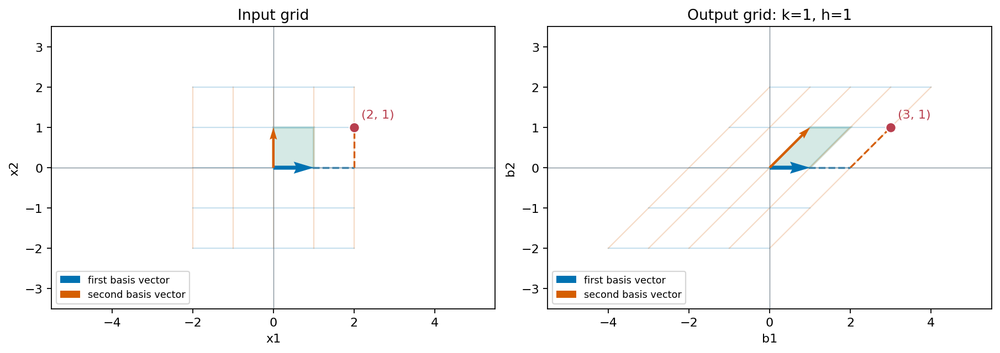
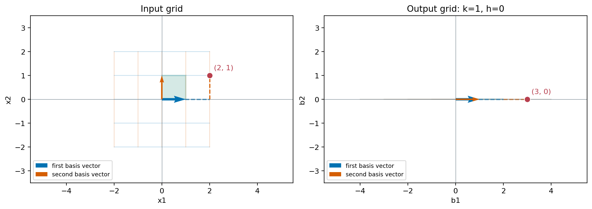

## 一个矩阵，不只算一个点

前面已经会算 `Ax`：给定输入，矩阵的每一行算出一个输出坐标。现在固定这个矩阵：

\[
A=\begin{bmatrix}1&1\\0&1\end{bmatrix}.
\]

让输入向量在平面上移动。每个输入都会得到一个输出，我们想知道整张方格网格会怎样变化。

我们先算输入 `(2,1)`。第一行把两个坐标相加，第二行保留第二个坐标，所以

\[
A\begin{bmatrix}2\\1\end{bmatrix}
=\begin{bmatrix}3\\1\end{bmatrix}.
\]

再试 `(0,1)`、`(1,0)`，以及 `(-1,1)`。先预测，再逐行算。点很多，逐个算总有算不完的时候；上一章的基能不能帮忙？

## 先跟踪两支基向量

平面的标准基是 `e_1=(1,0)`、`e_2=(0,1)`。先只看它们的输出：

\[
A\mathbf{e}_1
=\begin{bmatrix}1\\0\end{bmatrix},\qquad
A\mathbf{e}_2
=\begin{bmatrix}1\\1\end{bmatrix}.
\]

第一支没动，第二支向右斜了。注意，这两个输出恰好是 `A` 的第一列、第二列：乘 `e_1` 只取出第一列，乘 `e_2` 只取出第二列。

再回到 `(2,1)`。它可以写成 `2e_1+e_2`。如果先把两支基送到各自的输出，再取两倍、一倍相加，会得到什么？

> [!DETAILS] 用基的输出重算
> \[
> 2A\mathbf{e}_1+A\mathbf{e}_2
> =2\begin{bmatrix}1\\0\end{bmatrix}
> +\begin{bmatrix}1\\1\end{bmatrix}
> =\begin{bmatrix}3\\1\end{bmatrix}.
> \]
> 和直接计算 `A(2,1)` 得到同一个结果。

这并非这个输入刚好碰巧成立。任意 `(s,t)=s e_1+t e_2`，按第五章的列组合公式，都有

\[
A\begin{bmatrix}s\\t\end{bmatrix}
=sA\mathbf{e}_1+tA\mathbf{e}_2
=\begin{bmatrix}s+t\\t\end{bmatrix}.
\]

我们不用逐点列清单了。两支基的去向，已经决定了整个平面的去向。

## 整张方格网格怎样变？

输出的第二个坐标仍是 `t`，第一个坐标变成 `s+t`。先想象网格里同一条水平线上的点：它们的 `t` 相同，每一点向右移动的量也相同。

- 在 `t=0` 这条线上，点保持原位。
- 在 `t=1` 这条线上，所有点向右移动 1。
- 在 `t=2` 这条线上，所有点向右移动 2。
- 在 `t=−1` 这条线上，所有点向左移动 1。

原来的水平网格线仍然水平；原来的竖直网格线变成斜线。单位正方形的四个顶点原本是 `(0,0)、(1,0)、(1,1)、(0,1)`。先算它们的输出，再看图里绿色的区域。

> [!DETAILS] 检查四个顶点
> 输出依次是 `(0,0)、(1,0)、(2,1)、(1,1)`，组成一个平行四边形。这种网格的变化叫作剪切。

两图中的蓝色、橙色箭头分别跟踪两支基。红点跟踪同一个输入 `(2,1)`；输出是 `(3,1)`。绿色区域是单位正方形及其对应的输出。

## 哪种计算关系被保留下来？

刚才把输入拆成基的组合，再分别计算，最后组合，得到的结果与直接计算相同。这里有两种关系值得单独检查。

设 `u=(u_1,u_2)`、`v=(v_1,v_2)`。先相加再用矩阵算，得到

\[
A(\mathbf{u}+\mathbf{v})
=\begin{bmatrix}u_1+v_1+u_2+v_2\\u_2+v_2\end{bmatrix}.
\]

分别算 `Au`、`Av` 再相加，也得到同一个向量。因此

\[
A(\mathbf{u}+\mathbf{v})=A\mathbf{u}+A\mathbf{v}.
\]

再把一个输入乘实数 `c`。逐行展开，同样有

\[
A(c\mathbf{u})
=\begin{bmatrix}cu_1+cu_2\\cu_2\end{bmatrix}
=cA\mathbf{u}.
\]

换别的矩阵，这两条关系仍然成立：每一行都是“系数乘坐标，再相加”，乘法对加法的分配律保证了它们。

## 这样的作用叫线性变换

把每个输入向量送到一个输出向量的规则，叫作变换，常记为 `T`。如果它对任意输入 `u,v` 和实数 `c` 都满足

\[
T(\mathbf{u}+\mathbf{v})=T(\mathbf{u})+T(\mathbf{v}),\qquad
T(c\mathbf{u})=cT(\mathbf{u}),
\]

就称它为**线性变换**。刚才的 `T(x)=Ax` 就是一个例子。

这两条规则允许我们保留线性组合的系数：先把输入组合起来再变换，等于先变换每个向量再按原来的系数组合。正因为如此，知道一组基的输出，就知道所有输入的输出。

还可以立即核对原点的去向：取 `c=0`，便有 `T(0)=0`。如果把每个点都额外向右平移 1，例如 `F(s,t)=(s+t+1,t)`，原点就到了 `(1,0)`，这不满足线性变换的规则。原点不动是必要条件；要判断线性，仍需要检查前面的两条规则。

第八章是在换一组基描述同一个向量；这一章则是在用一个规则，把输入向量送到输出向量。

## 反过来，从基的去向写出矩阵

假如只告诉你一个线性变换把 `e_1` 送到 `(2,1)`，把 `e_2` 送到 `(1,−1)`，还能算出它对 `(3,2)` 的作用吗？先把输入拆成基的组合。

> [!DETAILS] 从两支基算起
> \[
> T(3\mathbf{e}_1+2\mathbf{e}_2)
> =3\begin{bmatrix}2\\1\end{bmatrix}
> +2\begin{bmatrix}1\\-1\end{bmatrix}
> =\begin{bmatrix}8\\1\end{bmatrix}.
> \]
> 把两支标准基的输出依次排成列，便得到矩阵 `[[2,1],[1,−1]]`。

一般地，对从 \(\mathbb{R}^n\) 到 \(\mathbb{R}^m\) 的线性变换，把每支标准基 `e_j` 的输出 `T(e_j)` 排成矩阵的第 `j` 列。任何输入都可以写成 \(\mathbf{x}=\sum_j x_j\mathbf{e}_j\)，所以

\[
T(\mathbf{x})=\sum_{j=1}^{n}x_jT(\mathbf{e}_j)=A\mathbf{x}.
\]

这样的矩阵有 `n` 列、`m` 行：输入需要 `n` 个坐标，每个输出有 `m` 个坐标。上一章的平面 `W={(s,t,s+t)}` 就能由这个三行两列的矩阵生成：

\[
\begin{bmatrix}1&0\\0&1\\1&1\end{bmatrix}
\begin{bmatrix}s\\t\end{bmatrix}
=\begin{bmatrix}s\\t\\s+t\end{bmatrix}.
\]

## 输入的两支基，输出还独立吗？

现在我们只改主例子矩阵右下角的一个数，把 1 改成 0，看看输出范围怎样变化：

\[
B=\begin{bmatrix}1&1\\0&0\end{bmatrix},\qquad
B\begin{bmatrix}s\\t\end{bmatrix}
=\begin{bmatrix}s+t\\0\end{bmatrix}.
\]

先预测：两支标准基会变成什么？输入点 `(1,0)` 和 `(0,1)`，输出能分清吗？

> [!DETAILS] 检查输出范围
> 两支基都变成 `(1,0)`，这两个不同的输入有了相同输出。任意输入的第二个输出坐标都是 0；而任意 `(r,0)` 都可以由输入 `(r,0)` 得到。所以所有输出恰好组成横轴这条直线。

`B` 仍然满足相加和数乘两条规则，所以仍是线性变换。它的输入有两个独立方向，输出却只张成一维空间。线性变换可以把不同输入合到一起，并不一定保留长度、角度或线性无关。

## 图像坐标里的剪切与拉伸

把一张图片上的特征点记为 `(s,t)`。这里先约定原点在图像中心，横轴向右，纵轴向上，坐标单位是像素；这与不少图像软件“左上角为原点、纵轴向下”的约定不同。

用本章的剪切矩阵 `A` 处理位置 `(20,10)`，得到 `(30,10)`。同一高度 `t=10` 的点都向右移动 10 个像素；高度 `t=−10` 的点都向左移动 10 个像素。网格的倾斜在这里对应图片形状的倾斜。

如果只想宽度变成两倍、高度不变，矩阵应当是什么？先分别考虑 `(1,0)` 和 `(0,1)` 的去向。

> [!DETAILS] 从基写出尺寸变化
> 两支基分别变成 `(2,0)` 与 `(0,1)`，所以矩阵是 `[[2,0],[0,1]]`。位置 `(20,10)` 变成 `(40,10)`。

这里的矩阵作用于点的位置，不是把像素的颜色或亮度乘以同一个矩阵。把位置变换做成实际图片，还需要重新安排像素、处理空缺与越界；本章先讨论坐标的变化。

再看房价模型：固定第三章的房屋数据矩阵，系数 `(α,β)` 映射到两套房的模型价格，是线性变换。若模型新增固定的起价 30 万元，就变成 `Ax+(30,30)`。把系数设为零，价格仍非零，所以这个带固定项的映射不再是关于 `x` 的线性变换。

## 实验：先预测基，再看网格

打开[基向量与网格变换实验](https://colab.research.google.com/github/xiaoheng008/linear-algebra-evolution/blob/main/experiments/10_transformations.ipynb)，用矩阵 `[[1,k],[0,h]]` 改变两个参数：

1. 固定 `h=1`，只改 `k`。先预测第二支基的去向，再看网格怎样倾斜。
2. 固定 `k=1`，把 `h` 从 1 改为 0。哪些不同的输入开始得到同一个输出？
3. 固定矩阵，只移动输入红点。用两支基的输出手算红点的输出，再运行核对。
4. 从给定的两支基的输出，自己写出矩阵；再检查另一个输入。

实验提供滑块，也可以直接修改函数参数。你可以下载[实验文件](https://github.com/xiaoheng008/linear-algebra-evolution/blob/main/experiments/10_transformations.ipynb)在本地运行。网格只画有限区域；线性规则和输出范围的结论由上面的代数推导保证。

## 下一步：两次作用，能合成一次吗？

如果先把输入送进矩阵 `A`，再把输出送进矩阵 `B`，怎样计算最后的结果？能否提前找出一个矩阵，一次就得到同样的输出？下一章从接连执行两个变换，推导矩阵乘法。

## 合上书，自己重建

用列组合解释，为什么两支标准基的去向足以确定平面上的线性变换。再举一个会把平面压成直线的矩阵，说明哪些输入被合到一起。最后检查 `T(s,t)=(s²,t)`：它保持原点不动，却为什么不是线性变换？
