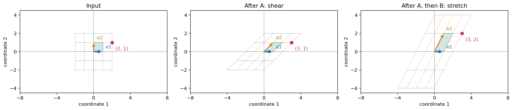
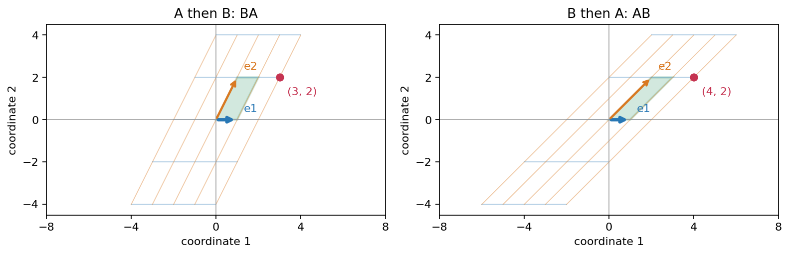

## 先剪切，再把高度拉长

上一章用过这个矩阵：

\[
A=\begin{bmatrix}1&1\\0&1\end{bmatrix},\qquad
A\begin{bmatrix}s\\t\end{bmatrix}=\begin{bmatrix}s+t\\t\end{bmatrix}.
\]

它把高度为 `t` 的点向右移动 `t`，整个网格因此倾斜。现在想在这一步之后，把每个点的高度拉长到原来的两倍，横坐标保持不变。这第二步用一个新矩阵表示：

\[
B=\begin{bmatrix}1&0\\0&2\end{bmatrix},\qquad
B\begin{bmatrix}u\\v\end{bmatrix}=\begin{bmatrix}u\\2v\end{bmatrix}.
\]

这里的 `B` 表示拉伸，与上一章压到横轴的矩阵不同。

先拿输入 `(2,1)` 试一遍。剪切后是 `(3,1)`；再拉伸，得到什么？

> [!DETAILS] 检查第二步
> 第二步接收的是第一步的输出 `(3,1)`，所以最后得到 `(3,2)`。
> \[
> \begin{bmatrix}2\\1\end{bmatrix}
> \xrightarrow{A}\begin{bmatrix}3\\1\end{bmatrix}
> \xrightarrow{B}\begin{bmatrix}3\\2\end{bmatrix}.
> \]

每次都可以这样分两步算。但如果要处理很多点，能否先算出一个矩阵 `C`，以后只算一次 `Cx`？它必须对所有输入都与这两步相同，不能只碰巧算对 `(2,1)`。

## 先让两支基走完这两步

上一章给了我们一个办法：线性变换由标准基的输出确定。不过，两次线性变换接起来，仍然是线性变换吗？

设整个过程为 `S(x)=B(Ax)`。用两次线性的规则展开：

\[
S(\mathbf{u}+\mathbf{v})
=B(A\mathbf{u}+A\mathbf{v})
=B(A\mathbf{u})+B(A\mathbf{v}),
\]

数乘也有 `S(cu)=B(cAu)=cB(Au)`。所以整个过程仍然保留线性组合，跟踪标准基就够了。

先看 `e_1=(1,0)`：经过 `A`，它仍是 `(1,0)`；经过 `B` 呢？再看 `e_2=(0,1)`：经过 `A`，它成为 `(1,1)`；经过 `B` 呢？先把两条路线写完。

> [!DETAILS] 两支基的完整路线
> \[
> \mathbf{e}_1\xrightarrow{A}\begin{bmatrix}1\\0\end{bmatrix}
> \xrightarrow{B}\begin{bmatrix}1\\0\end{bmatrix},\qquad
> \mathbf{e}_2\xrightarrow{A}\begin{bmatrix}1\\1\end{bmatrix}
> \xrightarrow{B}\begin{bmatrix}1\\2\end{bmatrix}.
> \]
> 把最终的两个输出按顺序排成列，得到
> \[
> C=\begin{bmatrix}1&1\\0&2\end{bmatrix}.
> \]

用它检查 `(2,1)`，得到 `(3,2)`。更重要的是，对任意输入 `(s,t)`，都有

\[
C\begin{bmatrix}s\\t\end{bmatrix}
=\begin{bmatrix}s+t\\2t\end{bmatrix}
=B\left(A\begin{bmatrix}s\\t\end{bmatrix}\right).
\]

因此，两步变换与 `C` 对所有输入的作用完全相同。

图从左向右读。蓝色箭头跟踪第一支基，橙色箭头跟踪第二支基，绿色区域跟踪单位正方形，红点跟踪输入 `(2,1)`。每一步处理的都是前一步的输出。

## 这就是矩阵乘法

把“先用 `A`，再用 `B`”合成的矩阵，记为 `BA`。刚才求出的就是

\[
BA=\begin{bmatrix}1&0\\0&2\end{bmatrix}
\begin{bmatrix}1&1\\0&1\end{bmatrix}
=\begin{bmatrix}1&1\\0&2\end{bmatrix}.
\]

为什么先做 `A`，却把 `A` 写在右边？从输入向左读就明白：在 `B(Ax)` 中，贴着 `x` 的 `A` 先接收输入，`B` 再接收 `Ax`。

现在把具体数字暂时放下。设 `A` 的列是 `a_1,...,a_n`。乘标准基 `e_j` 会取出第 `j` 列，所以这支基走完两步后的输出是

\[
B(A\mathbf{e}_j)=B\mathbf{a}_j.
\]

依次把这些输出排成列，便得到**矩阵乘积**的定义：

\[
BA=\begin{bmatrix}B\mathbf{a}_1&B\mathbf{a}_2&\cdots&B\mathbf{a}_n\end{bmatrix}.
\]

我们已经会做矩阵乘向量。现在只需让 `B` 分别作用于 `A` 的每一列，就能算出矩阵乘矩阵。

## “行乘列”是怎样来的？

还是算刚才的第二列。`A` 的第二列是 `(1,1)`；让 `B` 作用于它，就得到

\[
B\begin{bmatrix}1\\1\end{bmatrix}
=\begin{bmatrix}1\cdot1+0\cdot1\\0\cdot1+2\cdot1\end{bmatrix}
=\begin{bmatrix}1\\2\end{bmatrix}.
\]

乘积的第 1 行、第 2 列那个数，来自 `B` 的第 1 行与 `A` 的第 2 列，对应相乘后相加。第 2 行、第 2 列也一样。每列都这样计算，就得到通常说的“行乘列”。

一般地，如果 `A` 是 `m×n`，`B` 是 `p×m`，则

\[
(BA)_{ij}=\sum_{k=1}^{m}B_{ik}A_{kj},\qquad BA\text{ 是 }p\times n\text{ 矩阵}.
\]

这里的 `m` 是中间向量的坐标个数：`A` 输出 `m` 个数，`B` 恰好接收 `m` 个数。尺寸必须接得上。例如一个 `3×2` 矩阵先把两个数变成三个数，再由一个 `1×3` 矩阵把三个数变成一个数，合成后就是 `1×2`。

试试看：若第一步把 `(s,t)` 变成 `(s,t,s+t)`，第二步把三个坐标相加，最后的输出是什么？不用先套求和公式，直接跟踪输入。

> [!DETAILS] 一个非方阵的例子
> 最后得到 `s+t+(s+t)=2s+2t`，因此
> \[
> \begin{bmatrix}1&1&1\end{bmatrix}
> \begin{bmatrix}1&0\\0&1\\1&1\end{bmatrix}
> =\begin{bmatrix}2&2\end{bmatrix}.
> \]

## 如果把顺序交换呢？

回到剪切 `A` 和拉伸 `B`。刚才先剪切再拉伸，输入 `(2,1)` 到了 `(3,2)`。现在先拉伸：`(2,1)` 变成 `(2,2)`。再剪切，会到哪里？

> [!DETAILS] 交换顺序后的结果
> 剪切把新的高度 2 加到横坐标上，因此最终得到 `(4,2)`。
> 对任意 `(s,t)`，这条路线是
> \[
> \begin{bmatrix}s\\t\end{bmatrix}
> \xrightarrow{B}\begin{bmatrix}s\\2t\end{bmatrix}
> \xrightarrow{A}\begin{bmatrix}s+2t\\2t\end{bmatrix}.
> \]
> 所以
> \[
> AB=\begin{bmatrix}1&2\\0&2\end{bmatrix},
> \qquad BA=\begin{bmatrix}1&1\\0&2\end{bmatrix}.
> \]

区别来自剪切那一步读取的高度。先剪切，它读到的是原来的 `t`；先拉伸，它读到的是 `2t`。因此矩阵乘法一般不能交换顺序。某些矩阵可以交换，但不能把实数乘法的交换律直接搬过来。

## 三步变换，能分组计算吗？

如果再接一个矩阵 `D`，实际路线就是 `x → Ax → B(Ax) → D(B(Ax))`。可以先合成前两步，也可以先合成后两步，只要没有交换它们的顺序。

\[
(DB)A=D(BA).
\]

这叫矩阵乘法的结合律。为什么它成立？左右两边都让每个输入依次经历 `A、B、D`；特别是每支标准基的最终输出相同，所以对应的矩阵相同。上述乘积都以尺寸相容为前提。

## 实验：什么时候交换顺序没有差别？

打开[两次变换与顺序实验](https://colab.research.google.com/github/xiaoheng008/linear-algebra-evolution/blob/main/experiments/11_composition.ipynb)。实验把剪切量记为 `k`，竖直拉伸倍数记为 `h`：

\[
A=\begin{bmatrix}1&k\\0&1\end{bmatrix},\qquad
B=\begin{bmatrix}1&0\\0&h\end{bmatrix}.
\]

1. 先保持 `k=1,h=2`，手算红点和两支基的两条路线，再运行看图。
2. 只改变 `h`。两种顺序的横坐标为什么越差越远，或重新重合？
3. 试 `k=0` 或 `h=1`。预测整个网格是否仍有差别，再检查。
4. 把红点放在横轴上。即使两个矩阵不同，这个点的两个输出会不会相同？

实验同时显示中间步骤、最终网格和红点。可以用滑块，也可以直接修改函数参数；[实验文件](https://github.com/xiaoheng008/linear-algebra-evolution/blob/main/experiments/11_composition.ipynb)可下载到本地运行。图中只有有限条网格线，所有输入的结论要靠下面的式子检查：

> [!DETAILS] 从图中的差别写出条件
> 两种顺序的输出分别是 `(s+kt,ht)` 和 `(s+kht,ht)`。第二种减第一种，得到 `(k(h−1)t,0)`。
> 对某个输入，两种结果相同只需 `k(h−1)t=0`。但要让两个矩阵相同，必须对所有 `t` 都成立，因此条件是 `k(h−1)=0`，也就是 `k=0` 或 `h=1`。
> 仅检查一个横轴上的点，会漏掉两个变换的差别。

## 下一步：能把变换撤销吗？

现在能把多步变换合成一步。反过来，能否找一个矩阵，把 `A` 的输出送回原输入？剪切看起来可以向反方向剪回来；上一章把平面压到直线后，两个输入已经合到一起，还能恢复吗？下一章从这个区别研究逆矩阵。

## 合上书，自己重建

暂时忘掉行乘列公式。只用“标准基的输出决定矩阵”，重新说明为什么 `BA` 的第 `j` 列是 `B` 乘 `A` 的第 `j` 列。再用这一章的剪切与拉伸，解释为什么 `BA` 先执行右边的矩阵，为什么交换顺序可能改变结果，以及为什么分组计算不改变结果。
