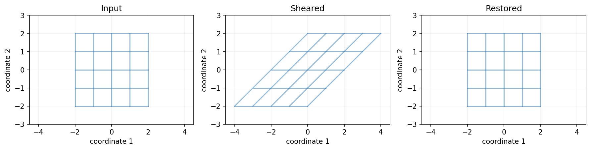

## 已知成分，还能找回用量吗？

前面我们经常给定原料用量，再算成分。每份原料是 100 克，甲贡献蛋白质 10 克、脂肪 20 克，乙贡献蛋白质 20 克、脂肪 10 克：

\[
A=\begin{bmatrix}10&20\\20&10\end{bmatrix}.
\]

甲一份、乙两份，得到蛋白质 50 克、脂肪 40 克：

\[
A\begin{bmatrix}1\\2\end{bmatrix}
=\begin{bmatrix}50\\40\end{bmatrix}.
\]

现在反过来：配料记录丢了，只留下这两项成分总量，还知道成分表。我们能不能恢复甲乙各用了多少？

你可能会说：重新解一遍方程就可以。没错。这一章再多问一步：**能不能先求出一条恢复规则，以后拿到任何成分总量，都用同一条规则算回用量？**

## 先恢复一份，再恢复任意一份

先把蛋白质 50 克、脂肪 40 克代入：

\[
\begin{cases}
10r+20s=50,\\
20r+10s=40.
\end{cases}
\]

第二式减去第一式的两倍，得到 \(-30s=-60\)，所以乙取 \(s=2\) 份；再代回，甲取 \(r=1\) 份。我们找回了原来的用量。

不过，恢复这一份还不够。把蛋白质和脂肪的总量分别记为 \(P,F\)，重复同样的消元：

\[
\begin{cases}
10r+20s=P,\\
20r+10s=F.
\end{cases}
\]

第二式减去第一式的两倍：

\[
-30s=F-2P,\qquad
s=\frac{2P-F}{30}.
\]

代回第一式，得到

\[
r=\frac{2F-P}{30}.
\]

因此，我们得到了通用的恢复规则：

\[
\boxed{
\begin{aligned}
r&=-\frac{1}{30}P+\frac{2}{30}F,\\
s&=\frac{2}{30}P-\frac{1}{30}F.
\end{aligned}}
\]

先别往下看：如果记录为蛋白质 40 克、脂肪 50 克，甲乙各取多少？

> [!DETAILS] 换一组总量，检查规则
> \(r=(2\times50-40)/30=2\)，\(s=(2\times40-50)/30=1\)。把甲两份、乙一份放回成分表，确实得到 \((40,50)^T\)。
> 同一条规则恢复了另一份输入，不需要重新设计一种办法。

## 恢复规则本身，也是一个矩阵

这两条恢复公式，仍然是“各坐标乘系数，再相加”。所以可以写成矩阵：

\[
R=\frac1{30}\begin{bmatrix}-1&2\\2&-1\end{bmatrix},
\qquad
\begin{bmatrix}r\\s\end{bmatrix}
=R\begin{bmatrix}P\\F\end{bmatrix}.
\]

这里输入、输出的角色交换了：

| 计算 | 输入 | 输出 |
|---|---|---|
| \(A\mathbf x\) | 甲乙用量（份） | 两项成分（克） |
| \(R\mathbf b\) | 两项成分（克） | 甲乙用量（份） |

成分表 \(A\) 的系数按克/份解释，恢复表 \(R\) 的系数按份/克解释。矩阵里的数字不是无缘无故出现的，就是刚才消元得到的系数。

## 怎样确认它恢复的是所有输入？

只检查 \((50,40)\) 和 \((40,50)\) 两个例子，还不能证明恢复规则对任何输入都正确。我们把任意用量 \((r,s)\) 先送进 \(A\)，再送进 \(R\)。

原来甲的用量能否恢复，取决于

\[
\frac{-(10r+20s)+2(20r+10s)}{30}=r.
\]

乙的用量能否恢复，取决于

\[
\frac{2(10r+20s)-(20r+10s)}{30}=s.
\]

两项都恰好恢复。把先 \(A\)、后 \(R\) 的连续计算合成一次，就是矩阵乘积 \(RA\)：

\[
RA
=\frac1{30}
\begin{bmatrix}-1&2\\2&-1\end{bmatrix}
\begin{bmatrix}10&20\\20&10\end{bmatrix}
=\begin{bmatrix}1&0\\0&1\end{bmatrix}.
\]

最后这个矩阵叫作**单位矩阵**，记为 \(I\)。它不是一个数 1，但作用相似：对每个向量都有 \(I\mathbf x=\mathbf x\)，不改变输入。

还要反向检查：从任意目标成分 \((P,F)\) 出发，先用 \(R\) 算用量，再用 \(A\) 算成分，能不能回到原来的目标？将两条恢复公式代回成分式，得到

\[
\begin{aligned}
10\frac{2F-P}{30}+20\frac{2P-F}{30}&=P,\\
20\frac{2F-P}{30}+10\frac{2P-F}{30}&=F.
\end{aligned}
\]

也就是说 \(AR=I\)。两种检查的意义不同：

- \(RA=I\)：用量经过成分计算之后，可以恢复原用量。
- \(AR=I\)：目标经过用量恢复之后，能重新产生原目标。

这两个恒等式检查整个规则，不只是检查某个点。

## 这样的恢复矩阵，叫作逆矩阵

对于 \(n\times n\) 方阵 \(A\)，若同尺寸矩阵 \(R\) 满足

\[
RA=AR=I,
\]

就称 \(A\)**可逆**，把 \(R\) 叫作 \(A\) 的**逆矩阵**，记为 \(A^{-1}\)。

因此本例的恢复表就是

\[
A^{-1}=\frac1{30}\begin{bmatrix}-1&2\\2&-1\end{bmatrix}.
\]

上标 \(-1\) 表示逆运算，不是对每个元素取倒数。尤其不要把逆矩阵看成

\[
\begin{bmatrix}1/10&1/20\\1/20&1/10\end{bmatrix}.
\]

例如用这个逐项倒数矩阵乘 \((50,40)^T\)，得到 \((7,6.5)^T\)，根本没有恢复 \((1,2)^T\)。

若 \(A\mathbf x=\mathbf b\)，在等式两边**左乘** \(A^{-1}\)，便有

\[
A^{-1}A\mathbf x=A^{-1}\mathbf b,
\qquad
\mathbf x=A^{-1}\mathbf b.
\]

这不是把标量除法直接搬到矩阵上，而是利用 \(A^{-1}A=I\)。我们始终写清乘法顺序。

> [!DETAILS] 恢复表会不会有两份？
> 假设 \(R,S\) 都是 \(A\) 的逆。利用 \(AS=I\) 和 \(RA=I\)，有 \(R=R(AS)=(RA)S=S\)。所以逆矩阵若存在，就是唯一的。

## 每个目标都有唯一实数解，是什么意思？

存在：给定任意实数目标 \(\mathbf b\)，公式 \(\mathbf x=A^{-1}\mathbf b\) 就给出一个解。

唯一：若还有另一组用量达到同一目标，把它也左乘 \(A^{-1}\)，同样只能得到 \(A^{-1}\mathbf b\)，所以不可能有两组不同的解。

但数学上的“任意实数目标”，不等于厨房里“任意目标都能配”。比如蛋白质 10 克、脂肪 0 克，恢复规则给出

\[
r=-\frac13,\qquad s=\frac23.
\]

它是唯一的实数解，却需要负的甲用量，不能作为实际配方。逆矩阵讨论的是没有丢失信息的实数线性关系，非负用量等限制仍要另行检查。

## 逆矩阵的列，为什么可以逐列求？

刚才从任意 \(P,F\) 一起推导了恢复规则。另一种办法，是只考虑两个基本的输出，再把它们组合起来。

第一列 \(\mathbf r_1=A^{-1}\mathbf e_1\)，回答：要产生输出 \(\mathbf e_1=(1,0)^T\)，需要什么输入？在本例中，就是蛋白质 1 克、脂肪 0 克：

\[
A\mathbf r_1=\begin{bmatrix}1\\0\end{bmatrix}.
\]

第二列 \(\mathbf r_2\) 同理，解

\[
A\mathbf r_2=\begin{bmatrix}0\\1\end{bmatrix}.
\]

解这两组方程，得到

\[
\mathbf r_1=\frac1{30}\begin{bmatrix}-1\\2\end{bmatrix},
\qquad
\mathbf r_2=\frac1{30}\begin{bmatrix}2\\-1\end{bmatrix}.
\]

它们是实数输入，不是可用的非负配方。把两列排在一起，正好得到 \(A^{-1}\)。

为什么这两列已经够用？因为任意目标都能写成 \(P\mathbf e_1+F\mathbf e_2\)。对应的输入就是 \(P\mathbf r_1+F\mathbf r_2\)，而

\[
A(P\mathbf r_1+F\mathbf r_2)=P\mathbf e_1+F\mathbf e_2.
\]

一组输出基的恢复方式，决定了所有输出的恢复方式。这与第十章“一组输入基的去向决定整个变换”是相同的线性关系。

## 为什么消元时在右边放一个单位矩阵？

两组求列的方程，左边都是 \(A\)，右边分别是 \(\mathbf e_1,\mathbf e_2\)。把它们放在一起写：

\[
[A\mid\mathbf e_1\ \mathbf e_2]=[A\mid I].
\]

右边不是随手添上的数字，而是我们要分别求解的两个目标。左边用同一套行操作简化，右边两组目标一起跟着变。

本例的过程可以逐步写出：

\[
\left[
\begin{array}{cc|cc}
10&20&1&0\\
20&10&0&1
\end{array}
\right].
\]

第一行除以 10，再用第二行减去第一行的 20 倍，得到

\[
\left[
\begin{array}{cc|cc}
1&2&1/10&0\\
0&-30&-2&1
\end{array}
\right].
\]

第二行除以 \(-30\)，得到

\[
\left[
\begin{array}{cc|cc}
1&2&1/10&0\\
0&1&1/15&-1/30
\end{array}
\right].
\]

最后第一行减去第二行的 2 倍：

\[
\left[
\begin{array}{cc|cc}
1&0&-1/30&1/15\\
0&1&1/15&-1/30
\end{array}
\right]=[I\mid A^{-1}].
\]

左边为 \(I\) 时，右边每列就是相应目标的解：第一列是 \(\mathbf r_1\)，第二列是 \(\mathbf r_2\)。这才是“左边变成单位矩阵，右边得到逆矩阵”的原因。

## 把一次行操作也看成矩阵乘法

刚才逐列解方程，解释了右边为什么是逆的各列。现在换成矩阵乘法，再解释同一套计算。

第一行除以 10，可以写成左乘

\[
E_1=\begin{bmatrix}1/10&0\\0&1\end{bmatrix}.
\]

为什么是左乘？乘积 \(E_1A\) 的第一行是原第一行的 \(1/10\) 倍，第二行不变。左边矩阵的每一行，都在指定怎样组合右边矩阵的各行。

你先算 \(E_1I\)。结果就是 \(E_1\) 本身：单位矩阵也接受了同一次行操作。

接着用第二行减去当前第一行的 20 倍，对应

\[
E_2=\begin{bmatrix}1&0\\-20&1\end{bmatrix}.
\]

这里的第一行是经过前一步缩放后的行，所以两步合起来是 \(E_2E_1A\)，不能交换顺序。

最后两步也可以写成

\[
E_3=\begin{bmatrix}1&0\\0&-1/30\end{bmatrix},
\qquad
E_4=\begin{bmatrix}1&-2\\0&1\end{bmatrix}.
\]

把完整操作记为 \(E=E_4E_3E_2E_1\)。在左边，它把 \(A\) 化成 \(I\)；在右边，它作用于原来的 \(I\)，留下的是 \(E\) 自己：

\[
E[A\mid I]=[EA\mid EI]=[I\mid E].
\]

因此右边不仅记录两组方程的解，也记录了**把 \(A\) 变回单位矩阵的完整操作**。在这个方阵例子中，直接乘开得到 \(E=R=A^{-1}\)，两种解释对上了。

逐列看，它恢复每个基本输出；逐行看，它执行消元；整体看，它撤销原矩阵。这是同一套计算，不是三种互不相关的方法。

> [!DETAILS] 可选：通常看到的二阶逆矩阵公式从哪里来？
> 对 \(M=\begin{bmatrix}a&b\\c&d\end{bmatrix}\)，直接相乘可以检查
> \[
> M\begin{bmatrix}d&-b\\-c&a\end{bmatrix}
> =\begin{bmatrix}d&-b\\-c&a\end{bmatrix}M
> =(ad-bc)I.
> \]
> 因此当 \(ad-bc\ne0\) 时，
> \[
> M^{-1}=\frac1{ad-bc}\begin{bmatrix}d&-b\\-c&a\end{bmatrix}.
> \]
> 把本例的数字代入，仍得到同一恢复表。这里先把它作为乘法检查；第十六章会解释 \(ad-bc\) 的几何意义。眼下重要的是理解恢复规则，不必先背这个公式。

## 什么时候不可能有逆？

把乙换成另一种原料，它每份的两项成分恰好是甲的两倍，成分表变成

\[
C=\begin{bmatrix}10&20\\20&40\end{bmatrix}.
\]

甲两份、乙零份，与甲零份、乙一份，都得到 \((20,40)^T\) 克。

如果我们只看到这份成分记录，该恢复成哪一组用量？任何固定的恢复规则对同一个输出只能给一个结果，不可能同时恢复这两个不同输入。信息在正向计算时已经合并，逆矩阵无法补回来。

还有些目标根本无法产生：这个表里脂肪永远是蛋白质的两倍，所以 \((50,40)^T\) 无解。

对于方阵，消元若能把左边化为 \(I\)，每个目标都有唯一解，因而可逆。若缺少主元，齐次方程 \(A\mathbf z=\mathbf0\) 会有非零解，于是 \(\mathbf z\) 与 \(\mathbf0\) 是两个不同输入，却产生相同输出，双向恢复不可能。

结合前几章，对方阵，以下是在说同一件事：列向量是一组基；消元每列都有主元；每个实数目标有唯一解；矩阵可逆。

## 再看图像：剪切并没有丢失坐标

第十一章把位置 \((s,t)\) 剪切成 \((s+t,t)\)。第二个坐标保留原高度，知道高度后，从第一个坐标减掉它，就得到原水平位置。因此

\[
S=\begin{bmatrix}1&1\\0&1\end{bmatrix},\qquad
S^{-1}=\begin{bmatrix}1&-1\\0&1\end{bmatrix}.
\]

输出 \((30,10)\) 对应输入 \((20,10)\)，并且直接相乘有 \(S^{-1}S=SS^{-1}=I\)。

三幅图使用相同的范围与比例。这幅图研究坐标变换，不包含像素取整、裁剪或压缩；真实图片处理若额外丢失像素信息，仅有坐标矩阵的逆不保证恢复原图。

## 多步计算，为什么要倒序恢复？

先剪切 \(S\)，再把竖直坐标放大两倍 \(D=\operatorname{diag}(1,2)\)。输入 \((2,1)\) 的路线是

\[
(2,1)\xrightarrow{S}(3,1)\xrightarrow{D}(3,2).
\]

恢复时，先把高度除以 2，回到 \((3,1)\)；再减去高度，回到 \((2,1)\)。

如果先减去当前高度，得到 \((1,2)\)，再把高度除以 2，只会得到 \((1,1)\)。这次顺序错了，因为减掉的不是剪切时用的那个高度。

一般地，先 \(A\)、后 \(B\) 对应 \(BA\)。恢复时先 \(B^{-1}\)、后 \(A^{-1}\)，所以

\[
(BA)^{-1}=A^{-1}B^{-1}.
\]

把左右两种乘积都展开，可以核对它们为 \(I\)。

## 实验与下一步

打开[逆矩阵与恢复输入实验](https://colab.research.google.com/github/xiaoheng008/linear-algebra-evolution/blob/main/experiments/12_inverse.ipynb)。先用成分恢复用量，再逐步消元计算逆，最后把乙改成甲的两倍，观察恢复规则为什么失效。图像部分核对剪切恢复与倒序撤销。

数值计算中，解一个具体方程组通常直接调用求解器，不必先显式求逆。本章求逆是为了理解完整的恢复规则，而不是把它规定成解方程的必经步骤。

合上书，自己回答：

1. 恢复 \((50,40)^T\) 这一份输入，为什么还不足以证明找到了逆？
2. 逆矩阵的第一列在求什么？为什么右边放 \(I\) 能同时求出所有列？
3. 两个不同输入若合成同一个输出，恢复规则会遇到什么矛盾？
4. “每个目标有唯一实数解”为什么不保证每个目标有可用的非负配方？

当输入的区别已经丢失，虽不能唯一恢复，我们仍可以问：哪些输入都可能产生同一个结果？下一章从这件事出发，把全部解写出来。

本章关于逐列求逆和消元矩阵的讲解，可与 MIT 18.06 [第三讲：矩阵乘法与逆矩阵](https://ocw.mit.edu/courses/18-06-linear-algebra-spring-2010/resources/lecture-3-multiplication-and-inverse-matrices/)对照阅读。本文采用自己的配料例子与中文推导，不是课堂逐字稿。
