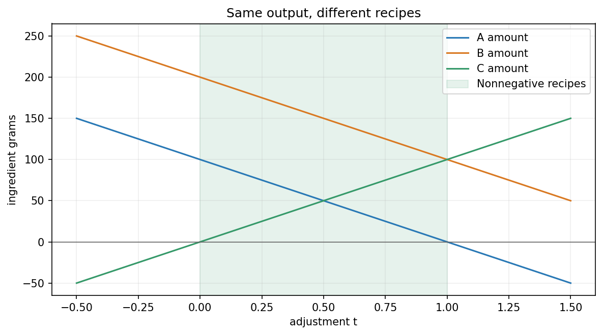

## 先把问题重新摆在桌上

前面我们已经知道：三种原料可能有不同用量，却产生相同的成分。这一章只追问一件事：**除了已经找到的两份，还有没有别的？怎样保证一份也没漏掉？**

仍采用假设成分，每份原料为 100 克：

| 每一份原料 | 蛋白质（克） | 脂肪（克） |
|---|---|---|
| 甲 | 10 | 20 |
| 乙 | 20 | 10 |
| 丙 | 30 | 30 |

目标始终是蛋白质 50 克、脂肪 40 克。我们只要求这两项成分，不要求混合物的总质量相同。把甲、乙、丙的份数记为 \(r,s,t\)，需要满足

\[
\begin{cases}
10r+20s+30t=50,\\
20r+10s+30t=40.
\end{cases}
\]

和第一章一样，每个方程规定一批允许的用量；我们要找两批用量的交集。这次有三个未知数，答案不一定只有一组。

## 先找到三份配方

暂时不放丙，取甲一份、乙两份：

\[
10\times1+20\times2=50,\qquad
20\times1+10\times2=40.
\]

所以 \((r,s,t)=(1,2,0)\) 是一份配方。

一份丙的两项成分，恰好等于一份甲加一份乙。因此，我们可以拿掉一份甲、一份乙，换进一份丙，得到 \((0,1,1)\)。

但不一定要一次换整份。只换半份呢？你先分别核对蛋白质和脂肪，再看下面的表。

| 配方 | 甲（份） | 乙（份） | 丙（份） | 蛋白质（克） | 脂肪（克） |
|---|---|---|---|---|---|
| 不换 | 1 | 2 | 0 | 50 | 40 |
| 换半份 | 0.5 | 1.5 | 0.5 | 50 | 40 |
| 换一份 | 0 | 1 | 1 | 50 | 40 |

三份都满足目标。我们可以继续列下去，但列表无法说明有没有漏掉。现在要找出一条覆盖所有用量的规则。

## 把丙的份数先定下来，甲乙还剩多少？

先假设丙取半份。它已经提供蛋白质 15 克、脂肪 15 克，甲乙还需要共同提供蛋白质 35 克、脂肪 25 克。甲乙的份数因此满足

\[
\begin{cases}
10r+20s=35,\\
20r+10s=25.
\end{cases}
\]

消元得到 \(r=0.5,s=1.5\)，正是表里的第二份配方。

现在不再固定半份，让丙取任意 \(t\) 份。它贡献两项成分各 \(30t\) 克，剩下的要求是

\[
\begin{cases}
10r+20s=50-30t,\\
20r+10s=40-30t.
\end{cases}
\]

第二式减去第一式的两倍：

\[
-30s=-60+30t,
\qquad s=2-t.
\]

代回第一式：

\[
10r+20(2-t)=50-30t,
\qquad r=1-t.
\]

所以全部用量必须是

\[
\boxed{(r,s,t)=(1-t,\;2-t,\;t).}
\]

这里的 \(t\) 没有神秘含义：**它就是我们选的丙原料份数。** 丙选定后，甲乙的用量就由两条方程确定了。

## 为什么这次真的找全了？

我们要检查两个方向，不能只说“试了几份都对”。

**先检查有没有混进错误答案。** 把 \((1-t,2-t,t)\) 代回，无论 \(t\) 是什么实数，都有

\[
\begin{aligned}
10(1-t)+20(2-t)+30t&=50,\\
20(1-t)+10(2-t)+30t&=40.
\end{aligned}
\]

所以这条规则产生的每组数都满足方程。

**再检查有没有漏掉正确答案。** 任取一组满足原方程的用量，把它的丙份数叫作 \(t\)。刚才的消元必然要求乙为 \(2-t\)、甲为 \(1-t\)。它也一定在这条规则里。

因此，这不是只找到一些例子，而是把全部实数解写出来了。

实际用量还要非负：

\[
1-t\ge0,\qquad 2-t\ge0,\qquad t\ge0.
\]

合起来就是 \(0\le t\le1\)。例如 \(t=1.5\) 仍满足两项成分方程，却需要甲取 \(-0.5\) 份，不是可用配方。

横轴是丙的份数 \(t\)，纵轴是三种原料各自的克数。蓝、橙线向下，绿线向上；浅绿色区间是可用配方。图画的是三项用量随 \(t\) 的变化，不是蛋白质和脂肪的变化。

## “一份配方”与“一次调整”，是两种不同的东西

现在回头比较表里的两份配方：

\[
\begin{aligned}
\text{原配方：}&\quad (1,2,0),\\
\text{新配方：}&\quad (0,1,1),\\
\text{新配方减原配方：}&\quad (-1,-1,1).
\end{aligned}
\]

最后一行不是要我们称出负的原料，而是在说：甲少一份，乙少一份，丙多一份。

这次调整使蛋白质变化 \(-10-20+30=0\) 克，使脂肪变化 \(-20-10+30=0\) 克。所以用量变了，目标成分没变。

换半份时，调整就是 \((-0.5,-0.5,0.5)\)。换 \(t\) 份时，调整就是 \(t(-1,-1,1)\)。于是刚才的全部解可以再读成

\[
\begin{bmatrix}1-t\\2-t\\t\end{bmatrix}
=\begin{bmatrix}1\\2\\0\end{bmatrix}
+t\begin{bmatrix}-1\\-1\\1\end{bmatrix}.
\]

左边是新用量；右边第一项是已知用量，第二项是不改变成分的调整。

这就是后面抽象公式想表达的事情。先记住这句话，不必急着记符号：**从一份正确配方出发，加上不改变目标成分的调整，仍然是正确配方。**

这里“不改变”只针对当前记录的两项成分。总质量会从 300 克变成 \(300-100t\) 克；如果额外要求总质量固定，就不能继续这样随意调整。

## 把配方和调整分别写成矩阵计算

我们把成分表写成

\[
A=\begin{bmatrix}10&20&30\\20&10&30\end{bmatrix}.
\]

输入向量 \(\mathbf x\) 记录三种原料的份数，输出 \(A\mathbf x\) 记录蛋白质、脂肪的克数。目标向量是 \(\mathbf b=(50,40)^T\)，已知配方是 \(\mathbf x_0=(1,2,0)^T\)，所以

\[
A\mathbf x_0=\mathbf b.
\]

另用 \(\mathbf z\) 记录**用量的变化**。调整后两项成分的变化为 \(A\mathbf z\)。对于 \(\mathbf z=t(-1,-1,1)^T\)，刚才逐项核对过：

\[
A\mathbf z=\mathbf0.
\]

两条等式右边不同，是因为它们问的事情不同：\(A\mathbf x=\mathbf b\) 问用量是否达到目标，\(A\mathbf z=\mathbf0\) 问调整是否让成分保持不变。后者不是要求整份配料没有成分。

## 所有这类调整，组成零空间

对固定矩阵 \(A\)，所有满足 \(A\mathbf z=\mathbf0\) 的向量组成它的**零空间**，记为

\[
\operatorname{Null}(A)
=\{\mathbf z:A\mathbf z=\mathbf0\}.
\]

“零”说的是调整产生的输出为零，不是说调整本身必须为零。

我们已经发现 \(t(-1,-1,1)^T\) 都在其中。有没有别的方向也不改变两项成分？仍然用方程检查：

\[
\begin{cases}
10z_1+20z_2+30z_3=0,\\
20z_1+10z_2+30z_3=0.
\end{cases}
\]

你先消元，再打开结果。

> [!DETAILS] 把所有零输出调整找全
> 第一式除以 10，得到 \(z_1+2z_2+3z_3=0\)。第二式减去第一式的两倍，得到 \(-30z_2-30z_3=0\)，所以 \(z_2=-z_3\)，再代回得 \(z_1=-z_3\)。
> 因此全部调整是 \((z_1,z_2,z_3)=t(-1,-1,1)\)，没有别的独立方向。

所以本例的零空间是三维输入坐标中的一条经过原点的直线。每个点记录一种调整，而不是一种成分目标。

它为什么叫“空间”？两次零输出调整相加，输出变化仍为零；把任意一次调整乘实数，输出变化仍为零。这来自矩阵的线性关系：

\[
A(\mathbf z_1+\mathbf z_2)=\mathbf0,\qquad
A(c\mathbf z_1)=\mathbf0.
\]

## 从这份配方，走到一般结论

现在把原料名称拿掉。只假设我们已经找到一个解 \(\mathbf x_0\)，满足 \(A\mathbf x_0=\mathbf b\)。

任意零空间向量 \(\mathbf z\) 加上去，都有

\[
A(\mathbf x_0+\mathbf z)
=A\mathbf x_0+A\mathbf z
=\mathbf b+\mathbf0=\mathbf b.
\]

所以“已知解加零空间调整”一定是解。

反过来，任意另一个解 \(\mathbf x\) 与已知解的差满足

\[
A(\mathbf x-\mathbf x_0)
=A\mathbf x-A\mathbf x_0
=\mathbf b-\mathbf b=\mathbf0.
\]

所以它与已知解的差一定在零空间里；没有其他类型的解被漏掉。因此

\[
\boxed{\{\mathbf x:A\mathbf x=\mathbf b\}
=\{\mathbf x_0+\mathbf z:\mathbf z\in\operatorname{Null}(A)\}.}
\]

这也简写成 \(\mathbf x_0+\operatorname{Null}(A)\)。这里不是把一个向量与某个数字相加，而是把 \(\mathbf x_0\) 加到零空间的**每个向量**上，得到整个解集。

本例中，零空间的直线经过 \((0,0,0)\)，解集的直线经过 \((1,2,0)\)。它们有相同的方向，但位置不同。若目标 \(\mathbf b\ne\mathbf0\)，零输入不能达到目标，所以解集不包含原点，不是向量空间；它是零空间的平移。

## 列空间问目标，零空间问调整

这两种向量的长度不同，要分开读：本例输入有三项用量，输出有两项成分。

\(A\) 各列的所有实数线性组合组成它的**列空间**，记为 \(\operatorname{Col}(A)\)。它就是所有能得到的实数输出。因此，目标 \(\mathbf b\) 在列空间里，方程才有解。

本例甲乙两列已张成整个二维平面，所以每个二维目标都有实数解；若要求非负配方，还须另行筛选。

解方程因此可以分为两问：

1. **目标有没有解？** 检查目标是否属于列空间。
2. **有解时怎样找全？** 找一个解，再加上全部零空间调整。

回到第一章的交集观点：两条成分方程的共同解，恰好就是我们找到的 \((1-t,2-t,t)\)。我们没有换掉“求交集”的理解，只是学会了把这个交集完整地写出来。

> [!DETAILS] 换成三根绳子，检查是否真的理解
> 第四章两根斜绳各拉 50 牛顿，合力向上 80 牛顿。再加一根竖直绳，让它承担 16 牛顿。两根斜绳各少提供 8 牛顿的竖直力，因此各少拉 \(8/0.8=10\) 牛顿。新分配为 \((40,40,16)\) 牛顿，合力不变。
> 若竖直绳承担 \(h\) 牛顿，全部实数解为 \((50-0.625h,50-0.625h,h)\)。基准分配是 \((50,50,0)\)，零输出调整为 \(h(-0.625,-0.625,1)\)。
> 三根绳都只能拉，要求 \(0\le h\le80\)。这给出的是平衡条件允许的分配；实际分担仍需要绳子的伸长、初始松紧等条件。[三绳实验](https://colab.research.google.com/github/xiaoheng008/linear-algebra-evolution/blob/main/experiments/physics_forces.ipynb)可用于核对。

## 实验与重建

打开[配方与零空间实验](https://colab.research.google.com/github/xiaoheng008/linear-algebra-evolution/blob/main/experiments/13_solution_sets.ipynb)。先比较两份用量，再看它们的差；随后改变丙的份数，检查两项成分与总质量各怎样变化。最后换一份已知配方作为起点，观察是否仍能写出相同的解集。

合上书，回答三问：

1. 为什么 \((0,1,1)\) 是配方，而 \((-1,-1,1)\) 是调整？它们分别乘上 \(A\)，结果是什么？
2. 为什么 \((1-t,2-t,t)\) 不只包含几个正确例子，而是包含全部实数解？
3. 为什么“用量的调整可以是负数”不等于“实际用量允许负数”？

能用这份配料把三问说清楚，再只用 \(A,\mathbf x_0,\mathbf z\) 重建证明。下一章才数一数：输出有几个独立方向，不改变输出的调整又有几个独立方向。
