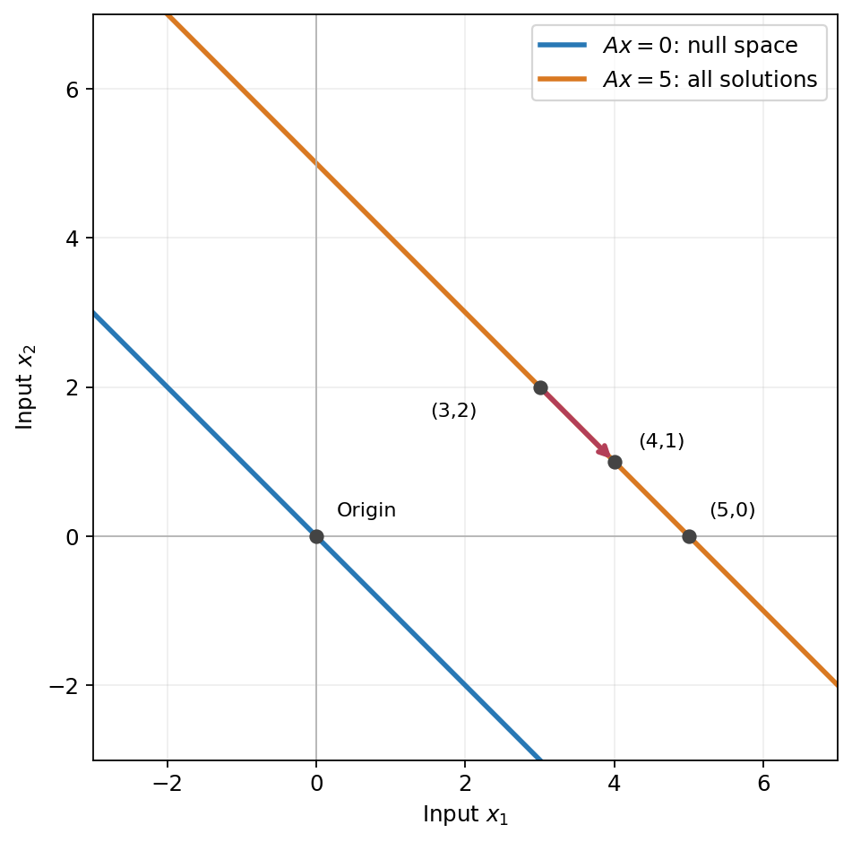

## 只知道两个数的和，能找回它们吗？

上一章，我们研究怎样从输出恢复输入。现在把计算变得很简单：输入两个数，输出它们的和。

\[
A=\begin{bmatrix}1&1\end{bmatrix},
\qquad
\mathbf x=\begin{bmatrix}x_1\\x_2\end{bmatrix},
\qquad
A\mathbf x=x_1+x_2.
\]

输入 \((3,2)^T\)，输出是 5。只告诉我们输出是 5，能确定输入就是 \((3,2)^T\) 吗？

不能。\((4,1)^T\)、\((5,0)^T\) 也得到 5。我们只记下了和，没有分别记下两个数。

上一章的逆矩阵不能替我们补回没有记录的区别。不过，知道“不能唯一恢复”还不够：我们仍然需要把解的集合写全。逐个列举 \((3,2)^T\)、\((4,1)^T\)、\((5,0)^T\)，只能列出几个，不能说明所有解是什么。

**如果先找到一个解，能不能再找到一条规则，从它出发得到全部其他解，而且一个也不漏？** 这是本章要解决的问题。加法例子可以直接写出 \(x_2=5-x_1\)；我们还希望找到一种适用于一般矩阵的办法。

先比较刚才两组输入。\((4,1)^T-(3,2)^T=(1,-1)^T\)：第一项多了 1，第二项少了 1。这份变化的和是 0。

这给我们一个更容易求解的问题：**哪些变化经过矩阵计算后得到零？** 找全这些变化，再把它们加到一个已知解上，我们就有希望写出全部解。后面还要证明这条办法确实不会漏解。

所以先研究零输出，不是因为它数字小，而是因为相同输出相减，得到的正好是零。

## 哪些非零输入也会得到零？

零输入当然得到零。有没有不是零向量的输入，也能得到零？

你先试一组两个数，再写出它们必须满足的关系。

> [!DETAILS] 从一组走到全部
> \((1,-1)^T\) 可以，因为 \(1+(-1)=0\)。
>
> 要得到零，必须有
> \[
> x_1+x_2=0,
> \]
> 因此 \(x_2=-x_1\)。第一个数一旦选好，第二个数就必须是它的相反数。

令第一个数为任意实数 \(t\)，所有这样的输入便是

\[
\mathbf x=\begin{bmatrix}t\\-t\end{bmatrix}
=t\begin{bmatrix}1\\-1\end{bmatrix}.
\]

先代入 \(t=2\)、\(t=-3\)、\(t=0\) 看看。两项输入在变，它们的和却始终为零。

为什么这是全部，而不是几个例子？因为任何满足 \(x_1+x_2=0\) 的输入，都只能把第二个数取成第一个数的相反数。这条规则没有漏掉任何解。

## 这些输入组成零空间

所有经过 \(A\) 的作用后得到零的输入，组成矩阵的**零空间**，记作 \(N(A)\)，也常记作 \(\operatorname{Null}(A)\)：

\[
N(A)=\{\mathbf x:A\mathbf x=\mathbf0\}.
\]

本例输出只有一个数，所以这里的输出零就是数值 0。我们已经求出

\[
N(A)=\left\{
t\begin{bmatrix}1\\-1\end{bmatrix}:t\in\mathbb R
\right\}.
\]

在输入的二维平面里，这是一条经过原点的直线。直线上的每个向量都被 \(A\) 映成同一个输出：0。

\((1,-1)^T\) 是零空间里的**一个向量**，不是整个零空间。它的全部实数倍才组成这条线。

“零”指的是输出为零，并不是说输入只能是零。

## 为什么输出看不出这些变化？

回到输入 \((3,2)^T\)。如果给第一个数加 1，同时给第二个数减 1，输入变成什么？输出会变吗？

> [!DETAILS] 比较两个输入
> \[
> \begin{bmatrix}3\\2\end{bmatrix}
> +\begin{bmatrix}1\\-1\end{bmatrix}
> =\begin{bmatrix}4\\1\end{bmatrix}.
> \]
> 原输入的和是 5，新输入的和也是 5。增加的那部分 \((1,-1)^T\) 的和为零。

这次改变沿着零空间的方向。矩阵只做加法，无法从输出区分这两个输入。

把 1 换成任意实数 \(t\)，结论仍然成立：

\[
A\begin{bmatrix}3+t\\2-t\end{bmatrix}
=(3+t)+(2-t)=5.
\]

所以，“矩阵丢掉了信息”在这里有很具体的意思：**沿着零空间改变输入，输出看不出区别。**

我们丢掉的不是两个输入数本身，也不是所有信息；它们的和仍然被记下了。但只凭这个和，我们分辨不出各自是多少。

## 找到一个解，怎样写出全部解？

现在要求输出为 5，也就是解

\[
x_1+x_2=5.
\]

先选一个容易看出的解：

\[
\mathbf x_p=\begin{bmatrix}5\\0\end{bmatrix}.
\]

从这里出发，给第一个数加 \(t\)，第二个数减 \(t\)。我们得到

\[
\mathbf x=
\begin{bmatrix}5\\0\end{bmatrix}
+t\begin{bmatrix}1\\-1\end{bmatrix}
=\begin{bmatrix}5+t\\-t\end{bmatrix}.
\]

先不要只看公式。试着找出得到 \((3,2)^T\)、\((4,1)^T\) 时，\(t\) 分别是多少。

> [!DETAILS] 核对参数
> \(t=-2\) 得到 \((3,2)^T\)；\(t=-1\) 得到 \((4,1)^T\)。
>
> \(t\) 不必为正。它只是我们选择的参数，不是必须满足某种实际用量限制的数量。

每个实数 \(t\) 都给出正确的解。反过来，任何满足 \(x_1+x_2=5\) 的输入，取 \(t=-x_2\)，就有 \(x_1=5-x_2=5+t\)。因此这次也没有漏解。

两条线都画在输入平面里。蓝线经过原点，是零空间；橙线不经过原点，是输出为 5 的全部解。它们平行，因为沿同一个方向移动，两个数的和都不变。

这里的 \(t\) 是一个自由变量：我们可以自由选一个数，但另一个数随后必须配合它，不能再独立选择。

## 换成一般矩阵，理由一样吗？

刚才的加法让我们看清了两件事：零空间里的输入得到零；给一个解加上这样的输入，输出不变。

现在设 \(A\mathbf x_p=\mathbf b\)。若 \(\mathbf z\) 属于零空间，就有 \(A\mathbf z=\mathbf0\)，因此

\[
A(\mathbf x_p+\mathbf z)
=A\mathbf x_p+A\mathbf z
=\mathbf b+\mathbf0
=\mathbf b.
\]

这说明“一个解加上零空间向量”仍然是解。但还需要反过来检查：会不会有别的解不在这个写法里？

假设 \(\mathbf x\) 是任意另一个解，则

\[
A(\mathbf x-\mathbf x_p)
=A\mathbf x-A\mathbf x_p
=\mathbf b-\mathbf b
=\mathbf0.
\]

所以两个解的差一定属于零空间。于是，只要方程有解，全部解就恰好是

\[
\mathbf x=\mathbf x_p+\mathbf z,
\qquad \mathbf z\in N(A).
\]

\(\mathbf x_p\) 是一个选定的解，叫**特解**；\(\mathbf z\) 可以遍历整个零空间。不是把一个向量加上一个集合，而是把特解分别加到集合中的每个向量上。

如果零空间只有零向量，那么有解时，解就是唯一的。如果零空间里有非零向量，我们可以加上它的任意实数倍，就会得到无穷多个不同的解。

注意前提是“有解”。目标不可达时，不能先凭空选出一个特解。

## 为什么叫“空间”？

我们不能只因为它画出来像一条线，就把所有解集都叫空间。零空间还满足前面学过的两个条件。

若 \(A\mathbf u=\mathbf0\)、\(A\mathbf v=\mathbf0\)，则

\[
A(\mathbf u+\mathbf v)=A\mathbf u+A\mathbf v=\mathbf0.
\]

所以两个零空间向量相加，仍在零空间里。对任意实数 \(c\)，还有

\[
A(c\mathbf u)=cA\mathbf u=\mathbf0.
\]

所以任意实数倍也在零空间里。零向量本身也在其中，这些解确实组成一个子空间。

但本例输出为 5 的橙线不是子空间：它连零向量都不包含。**零空间与非零目标的解集方向相同，但不是同一个集合。**

## 实验：改变计算规则，会发生什么？

打开[零空间与全部解实验](https://colab.research.google.com/github/xiaoheng008/linear-algebra-evolution/blob/main/experiments/13_solution_sets.ipynb)。

我们先改变输入，观察哪些变化让输出保持不变；再把计算从 \(x_1+x_2\) 改成 \(x_1+2x_2\)，重新找出被映成零的方向。最后增加一条记录：不只记录和，还记录差。两个数还能沿原来的方向改变而不被发现吗？

每次运行前，先写下预测。计算用于检验我们对零空间的判断，不代替求解。

合上书，试着回答：

1. 为什么 \((1,-1)^T\) 是零空间里的向量，而 \((3,2)^T\) 不是？
2. 为什么 \((3,2)^T\) 与 \((4,1)^T\) 虽然不在零空间里，它们的差却在？
3. 如果既知道两个数的和，也知道它们的差，为什么能唯一恢复输入？

下一章，我们再数一数：输入有几个坐标，输出能得到几个独立方向，还有几个自由变量？本章先把“什么变化不影响输出”看清楚，不急着背维数公式。

本章沿用 MIT 18.06 [第六讲先研究 \(A\mathbf x=\mathbf0\) 的引导顺序](https://ocw.mit.edu/courses/18-06-linear-algebra-spring-2010/bdefda5baee6ea0053bcd56eccabed15_MIT18_06S10_L06.pdf)，但换用了更简单的加法例子，不是原课逐字翻译。
