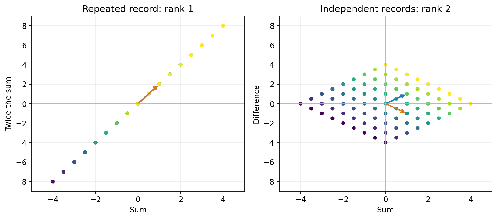

## 再记一个数，能找回输入吗？

上一章，我们只记录两个数的和：

\[
x_1+x_2=5.
\]

\((3,2)^T\)、\((4,1)^T\) 都符合记录。沿 \((1,-1)^T\) 改变输入，和不会变。我们找到了这种变化组成的零空间，但仍然不知道原来的两个数各是多少。

现在我们可以增加记录。**再记录一个数，就一定能唯一恢复输入吗？**

先别回答。我们试两种办法。

## 多写一条方程，却什么也没多知道

第一种办法：同时记录和，以及和的两倍。得到

\[
\begin{cases}
x_1+x_2=5,\\
2x_1+2x_2=10.
\end{cases}
\]

你先试试：上一章的两组输入，还都满足这两条方程吗？

> [!DETAILS] 看第二条有没有排除任何解
> \((3,2)^T\) 得到 \(5,10\)，\((4,1)^T\) 也得到 \(5,10\)。第二条只是把第一条乘了 2，没有排除第一条中的任何解。

用我们熟悉的消元，把第二条减去第一条的 2 倍：

\[
\begin{cases}
x_1+x_2=5,\\
0=0.
\end{cases}
\]

两条记录实际上只有一条独立的限制。第二条没有帮助我们分清两个输入。

所以不能只数方程有几条，或者输出写了几个数。**我们要数的是其中有几条不能由其他条推出来的关系。**

## 改记“和与差”，这次为什么有用？

第二种办法：仍然记录和，但把另一条改成差：

\[
\begin{cases}
x_1+x_2=5,\\
x_1-x_2=1.
\end{cases}
\]

先用上一组 \((4,1)^T\) 试试。它还能通过两条记录吗？

> [!DETAILS] 先排除，再求解
> 它的和是 5，但差是 3，因此被第二条排除了。
>
> 把两条方程相加，得到 \(2x_1=6\)，所以 \(x_1=3\)。代回第一条，得到 \(x_2=2\)。

这次第二条不是重复的记录。它分清了第一条分不清的输入。

再问：有没有非零变化仍然不被这两条记录发现？这样的变化必须同时满足

\[
\begin{cases}
z_1+z_2=0,\\
z_1-z_2=0.
\end{cases}
\]

相加得到 \(z_1=0\)，随后 \(z_2=0\)。零空间只剩零向量，因此有解时，输入唯一。

## 同样两个输出，能得到的范围却不同

把两种记录写成矩阵：

\[
D=\begin{bmatrix}1&1\\2&2\end{bmatrix},
\qquad
S=\begin{bmatrix}1&1\\1&-1\end{bmatrix}.
\]

先看 \(D\)。如果第一个输出为 \(p\)，第二个只能是 \(2p\)，所以输出只能落在直线

\[
\begin{bmatrix}p\\2p\end{bmatrix}
=p\begin{bmatrix}1\\2\end{bmatrix}
\]

上。输出虽然有两个坐标，但只能沿一个独立方向变化。

再看 \(S\)。给定任意“和” \(p\) 与“差” \(q\)，我们都可以取

\[
x_1=\frac{p+q}{2},\qquad x_2=\frac{p-q}{2}.
\]

因此输出可以是平面里的任意点 \((p,q)^T\)，有两个独立方向。

上一章的零空间问“哪些输入变化看不见”；这里我们又需要描述“输出到底能遍及多大的空间”。

**列空间的维数叫矩阵的秩**：

\[
\operatorname{rank}(A)=\dim\operatorname{Col}(A).
\]

于是 \(\operatorname{rank}(D)=1\)，\(\operatorname{rank}(S)=2\)。这个数不是输出坐标的数量，也不是矩阵里非零数的数量，而是可达输出中独立方向的数量。

为什么叫列空间？因为每个输出都是矩阵各列的线性组合。看 \(D\) 的两列，它们相同，只能提供一个方向；看 \(S\) 的两列，它们线性无关，能够张成平面。

## 输入再多一个：自由变量怎样出现？

现在我们记录三个数，但只有两次测量：第一次记前两个数的和，第二次记后两个数的和。

\[
\begin{cases}
x_1+x_2=p,\\
x_2+x_3=q.
\end{cases}
\qquad
B=\begin{bmatrix}1&1&0\\0&1&1\end{bmatrix}.
\]

例如 \(p=5,q=7\)。你先找到两组不同的输入，都符合这两次测量。

> [!DETAILS] 先选中间那个数
> 若选 \(x_2=2\)，就有 \(x_1=3,x_3=5\)。
>
> 若选 \(x_2=3\)，就有 \(x_1=2,x_3=4\)。
>
> 三个数可以改变，但两次测量都仍然得到 5 和 7。

我们把中间的数记为 \(t\)，便得到全部解：

\[
\mathbf x=\begin{bmatrix}p-t\\t\\q-t\end{bmatrix}
=\begin{bmatrix}p\\0\\q\end{bmatrix}
+t\begin{bmatrix}-1\\1\\-1\end{bmatrix}.
\]

这里一个参数就足够了。任意选定 \(x_2\) 后，另外两个都确定；而每个解都有某个 \(x_2\)，因此没有遗漏。

于是 \(N(B)\) 是一条直线，维数为 1。输出又能是任意 \((p,q)^T\)：取 \(x_2=0,x_1=p,x_3=q\) 就行。因此 \(\operatorname{rank}(B)=2\)。

我们得到第三组计数：

| 计算规则 | 输入坐标数 | 秩 | 零空间维数 |
| --- | --- | --- | --- |
| 和，以及和的两倍 | 2 | 1 | 1 |
| 和与差 | 2 | 2 | 0 |
| 前两项之和、后两项之和 | 3 | 2 | 1 |

最后两列加起来，总是输入坐标数。这是巧合，还是消元必然带来的结果？

## 用主元数，而不是靠例子猜

对 \(B\) 做一步消元：第一行减去第二行。得到

\[
R=\begin{bmatrix}1&0&-1\\0&1&1\end{bmatrix}.
\]

解 \(R\mathbf z=\mathbf0\) 时，有

\[
z_1-z_3=0,\qquad z_2+z_3=0.
\]

前两列有主元，所以 \(z_1,z_2\) 是主变量；第三列没有主元，所以 \(z_3\) 可以自由选。选 \(z_3=s\) 后，

\[
\mathbf z=s\begin{bmatrix}1\\-1\\1\end{bmatrix}.
\]

它与刚才的 \((-1,1,-1)^T\) 相反，但张成同一条直线。不同的参数选择不改变零空间。

这里有两个主元、一个自由变量。对一般 \(m\) 行 \(n\) 列矩阵，消元得到 \(r\) 个主元，也是这样：\(r\) 个主变量由方程决定，其余 \(n-r\) 个可以自由选。

为什么主元数也是秩？阶梯形中的主元列线性无关，其他列能由它们组合出来。行操作可以撤销，保留列之间的线性关系，所以原矩阵也恰好有 \(r\) 个独立列方向。

注意：原列空间的基要取**原矩阵中对应主元位置的列**。行操作通常改变输出坐标，不能直接把消元后的列当成原列空间的基。

## 自由变量怎样变成零空间的维数？

只有一个自由变量时，我们已经看见：选一个值，其余坐标跟着确定，得到一条线。

若有两个自由变量呢？先让第一个取 1、第二个取 0，回代得到一个解；再让第一个取 0、第二个取 1，回代得到另一个解。任意一组自由变量的取值，都可以由这两组取值组合出来。

同样，有 \(n-r\) 个自由变量时，每次让其中一个取 1，其余取 0，回代得到 \(n-r\) 个特殊解。

它们不会互相重复：看自由变量的坐标，每支向量只有自己的那个位置是 1。它们又能组合出所有解，因为自由变量可以任意取值，主变量随后由方程确定。

因此它们构成零空间的基，零空间的维数为 \(n-r\)。我们终于得到

\[
\operatorname{rank}(A)+\dim N(A)=n.
\]

这叫**秩-零化度定理**；“零化度”就是零空间的维数。右边是输入坐标数 \(n\)，不是输出坐标数 \(m\)。

它不是“有多少条方程，就减去多少个自由变量”。要先消掉重复关系，再数主元。

## 新增测量，怎样才真正有用？

回到三个数的例子。已经记录 \(x_1+x_2\) 和 \(x_2+x_3\)，如果再记录它们的和 \(x_1+2x_2+x_3\)，能消除剩下的自由变量吗？

> [!DETAILS] 先检查是否重复
> 不能。第三条只是前两条相加，沿 \((-1,1,-1)^T\) 改变输入时，第三条也没有变化。秩仍然为 2，零空间仍然是一条线。

如果改为记录总和 \(x_1+x_2+x_3=s\)，代入已有解，得到

\[
(p-t)+t+(q-t)=s,
\qquad t=p+q-s.
\]

自由变量被确定了。三项输入都能恢复：秩变成 3，零空间只剩零向量。

所以新增测量是否有用，可以问一个具体问题：**它能不能分清原来沿零空间变化的输入？** 对本例的一维零空间，能分清，就消除了最后的自由变量；不能分清，就没有新增独立约束。

> [!DETAILS] 重复记录还要求目标彼此一致
> 第一种规则 \(D\) 只能产生 \((p,2p)^T\)。若记录为 \((5,11)^T\)，消元得到 \(0=1\)，没有解。
>
> 用 \(\mathbf y=(-2,1)^T\) 写这条检查，就有 \(\mathbf y^TD=\mathbf0^T\)。可达目标必须满足 \(\mathbf y^T\mathbf b=0\)。所有满足 \(D^T\mathbf y=\mathbf0\) 的向量组成**左零空间**；它记录输出坐标之间必须遵守的关系。
>
> 普通零空间中的向量有输入坐标那么多项；左零空间中的向量有输出坐标那么多项，二者不能混用。

> [!DETAILS] 四个空间的计数
> 对 \(m\) 行 \(n\) 列矩阵，列空间维数是 \(r\)，零空间维数是 \(n-r\)。
>
> 各行的线性组合组成行空间。行操作保留行空间；阶梯形中恰好 \(r\) 条非零行线性无关，所以行空间维数也为 \(r\)。它就是转置矩阵的列空间，因此 \(\operatorname{rank}(A^T)=r\)。
>
> 对 \(A^T\) 再应用本章的计数，左零空间维数为 \(m-r\)。四个数分别为 \(r,n-r,r,m-r\)。这些结论将在讨论正交时重新展开，本章先掌握主元与自由变量的计数。

## 实验与重建

打开[新增测量、秩与自由变量实验](https://colab.research.google.com/github/xiaoheng008/linear-algebra-evolution/blob/main/experiments/14_rank.ipynb)。依次添加重复测量和独立测量，比较原来无法区分的两组输入何时被分开。计算秩只用于核对；先用行之间的关系预测结果。

合上书，回答：

1. 为什么同样是两行两列，\(D\) 与 \(S\) 的秩不同？
2. 为什么 \(B\) 的三个输入不能由两次测量唯一确定？写出全部不影响测量的变化。
3. 新增测量什么时候能减少自由变量？什么时候只是重复记录？
4. 不背公式，从主元与自由变量推出秩-零化度定理。

我们现在能判断一次变换能区分哪些输入。下一章把输出重新当作输入，看看同一个变换反复执行时会发生什么。

消元、主变量与自由变量的引导参考 [MIT 18.06 第七讲](https://ocw.mit.edu/courses/18-06-linear-algebra-spring-2010/1d48511dfc3158b035ab92820c9a41cd_MIT18_06S10_L07.pdf)。本章测量例子与推导为本书编写。
