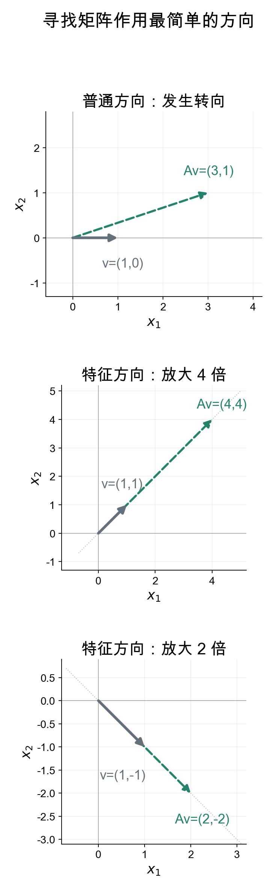
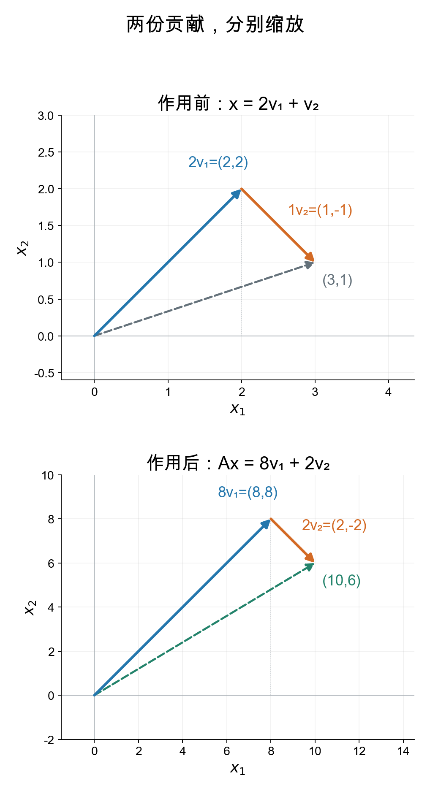

## 每次两个数都混在一起，能不能分开算？

前两章，我们用零空间描述全部解，用秩判断有几条独立关系。现在不再指定一个输出去求输入，而是研究矩阵本身的作用。

先看

\[
A=\begin{bmatrix}3&1\\1&3\end{bmatrix}.
\]

输入 \(\mathbf x=(x_1,x_2)^T\) 时，两个输出分别是

\[
3x_1+x_2,\qquad x_1+3x_2.
\]

可以把它看成两路信号的混合规则：每路输出都有自己的输入，也掺进了另一路输入。

我们当然会算。例如

\[
A\begin{bmatrix}1\\0\end{bmatrix}
=\begin{bmatrix}3\\1\end{bmatrix}.
\]

但这个输入原来沿横轴，输出却离开了横轴。再作用一次，得到 \((10,6)^T\)。每一步都重新混合两个坐标，不能直接说“这个向量每次乘几倍”。

我们想找一种更容易描述的作用：**有没有某些输入，经过矩阵后只是整个向量乘上同一个数？**

这不是所有向量天然都满足的性质，而是我们主动寻找的一类特殊输入。如果找到，沿这类输入反复作用时，就只需反复乘那个数。

## 先试两个坐标相等

观察矩阵：两行恰好把 3 和 1 交换了位置。

如果输入两个坐标相等，两项输出会不会也相等？你先算最简单的 \((1,1)^T\)。

> [!DETAILS] 核对输出
> \[
> A\begin{bmatrix}1\\1\end{bmatrix}
> =\begin{bmatrix}3+1\\1+3\end{bmatrix}
> =\begin{bmatrix}4\\4\end{bmatrix}
> =4\begin{bmatrix}1\\1\end{bmatrix}.
> \]
> 两个坐标都乘了 4，整个向量确实只乘了一个数。

把输入改成 \((2,2)^T\) 呢？改成 \((-1,-1)^T\) 呢？

它们都是 \((1,1)^T\) 的倍数。由线性关系，对任意实数 \(t\)，

\[
A\left(t\begin{bmatrix}1\\1\end{bmatrix}\right)
=4t\begin{bmatrix}1\\1\end{bmatrix}.
\]

所以我们找到的不只是一根箭头，而是一整条直线上的简单作用：**沿 \(x_2=x_1\) 这条线，矩阵只做四倍缩放。**

## 再试两个坐标互为相反数

相等的输入让两项一起相加。那么一项增加、另一项减少时，会不会也有简单的规则？

你先算 \((1,-1)^T\)，看两个输出是否仍然互为相反数。

> [!DETAILS] 核对第二个方向
> \[
> A\begin{bmatrix}1\\-1\end{bmatrix}
> =\begin{bmatrix}3-1\\1-3\end{bmatrix}
> =\begin{bmatrix}2\\-2\end{bmatrix}
> =2\begin{bmatrix}1\\-1\end{bmatrix}.
> \]
> 这次两个坐标都乘了 2。

因此沿 \(x_2=-x_1\) 的直线，矩阵只做两倍缩放。

<picture>
<source media="(min-width: 1200px)" srcset="eigen-directions-wide.png">

</picture>

灰色箭头是输入，绿色虚线箭头是输出。普通输入改变了所在直线，后两组没有。比较放大倍数时看坐标标注，各小图使用的刻度不同。

## 两个简单方向，能帮我们算普通输入吗？

先给这两个方向起临时名字：

\[
\mathbf v_1=\begin{bmatrix}1\\1\end{bmatrix},
\qquad
\mathbf v_2=\begin{bmatrix}1\\-1\end{bmatrix}.
\]

我们已经知道 \(A\mathbf v_1=4\mathbf v_1\)、\(A\mathbf v_2=2\mathbf v_2\)。

但普通输入不一定在这两条线上。例如 \(\mathbf x=(3,1)^T\)，两个坐标既不相等，也不相反。刚才的发现对它有什么用？

前面学过基与线性组合。我们试着把它拆成两个方向：

\[
\begin{bmatrix}3\\1\end{bmatrix}
=c_1\begin{bmatrix}1\\1\end{bmatrix}
+c_2\begin{bmatrix}1\\-1\end{bmatrix}.
\]

你先按坐标写出两条方程，求 \(c_1,c_2\)。

> [!DETAILS] 算出两份贡献
> \[
> c_1+c_2=3,\qquad c_1-c_2=1.
> \]
> 两式相加，得到 \(c_1=2\)，随后 \(c_2=1\)。因此
> \[
> \mathbf x=2\mathbf v_1+\mathbf v_2.
> \]

现在利用线性关系，让矩阵分别作用于两份贡献：

\[
A\mathbf x=2A\mathbf v_1+A\mathbf v_2.
\]

每个方向的作用已经知道，所以

\[
A\mathbf x=2(4\mathbf v_1)+2\mathbf v_2
=8\mathbf v_1+2\mathbf v_2.
\]

把两个向量相加，得到 \((8,8)^T+(2,-2)^T=(10,6)^T\)。直接乘原矩阵也得到这个结果。

<picture>
<source media="(min-width: 1200px)" srcset="eigen-decomposition-wide.png">

</picture>

蓝色表示沿 \(\mathbf v_1\) 的贡献，橙色表示沿 \(\mathbf v_2\) 的贡献。橙色箭头接在蓝色箭头末端，表示向量相加；虚线从原点直接指向总结果。两图刻度不同，不能用图片上的箭头长度直接比较倍数。

**关键不是把一次乘法少算几个数，而是把原来相互混合的作用，拆成了两个方向各自缩放。**

## 反复作用，优势就看出来了

再作用一次时，沿 \(\mathbf v_1\) 的系数继续乘 4，沿 \(\mathbf v_2\) 的系数继续乘 2。

你先不用原矩阵，写出第二次作用的两个系数。

> [!DETAILS] 从一次走到任意次
> 初始系数是 \(2,1\)，一次后是 \(8,2\)，两次后是 \(32,4\)。
>
> 第 \(k\) 次作用后，
> \[
> A^k\mathbf x=2\cdot4^k\mathbf v_1+2^k\mathbf v_2.
> \]

为什么能这样连续算？因为第一次以后，两份贡献仍分别在原来的两条直线上，没有混到其他方向里。下一次可以继续使用同一条缩放规则。

不仅 \((3,1)^T\) 可以拆。任意 \((p,q)^T\) 都有

\[
c_1=\frac{p+q}{2},\qquad c_2=\frac{p-q}{2}.
\]

这两个方向是一组基。我们找到了一套适合这个矩阵的坐标：用 \(c_1,c_2\) 记录两份贡献时，作用就是

\[
(c_1,c_2)\longmapsto(4c_1,2c_2).
\]

这正是后面“对角化”要正式表达的事情。本章先看清它为什么值得做，后面再把换坐标的过程写成矩阵。

## 现在给这种方向命名

对一个方阵 \(A\)，若非零向量 \(\mathbf v\) 满足

\[
A\mathbf v=\lambda\mathbf v,
\]

就称 \(\mathbf v\) 为**特征向量**，\(\lambda\) 为对应的**特征值**。

我们不是因为它叫特征向量，才规定它方向不变。我们先寻找“整个向量只乘一个数”的输入，再用这个名字描述找到的性质。

本例中，\(\mathbf v_1\) 对应特征值 4，\(\mathbf v_2\) 对应特征值 2。它们的任意非零倍数也分别是相同特征值的特征向量。

这里有三个条件需要说清：

- 向量必须非零。零向量对任何 \(\lambda\) 都满足等式，无法告诉我们特殊的缩放倍数。
- 在本书的定义中，矩阵是方阵。输入与输出位于同一个坐标空间，才能比较是不是同一向量的倍数。
- “方向不变”只是直觉说法。\(\lambda<0\) 会翻向，\(\lambda=0\) 会变成零；准确条件始终是 \(A\mathbf v=\lambda\mathbf v\)。

如果 \(A\mathbf v=\lambda\mathbf v\)，便有

\[
A^2\mathbf v=A(\lambda\mathbf v)
=\lambda A\mathbf v=\lambda^2\mathbf v,
\]

继续得到 \(A^k\mathbf v=\lambda^k\mathbf v\)。这说明为什么特征值能帮助我们描述反复作用。

## 不靠观察，怎样系统地寻找？

刚才两个方向容易看出来。换一个不那么整齐的矩阵，我们就需要一种一般办法。

现在 \(\lambda\) 和 \(\mathbf v\) 都未知。先把想满足的条件移项：

\[
A\mathbf v-\lambda\mathbf v=\mathbf0.
\]

单位矩阵满足 \(I\mathbf v=\mathbf v\)，因此

\[
(A-\lambda I)\mathbf v=\mathbf0.
\]

这个形式我们已经会处理：求零空间。区别是这次矩阵里还带着一个未知数 \(\lambda\)。

我们的步骤是：**先找哪些 \(\lambda\) 让 \(A-\lambda I\) 有非零零空间，再求这个零空间中的非零向量。**

为什么不能随便选 \(\lambda\)？若新矩阵有全部主元，零空间就只有零向量，不符合特征向量的要求。我们要找到使新矩阵缺少主元的倍数。对于方阵，这也就是使它不可逆的倍数。

> [!DETAILS] 用本例逐步算出候选倍数
> 本例的新矩阵是
> \[
> A-\lambda I=\begin{bmatrix}3-\lambda&1\\1&3-\lambda\end{bmatrix}.
> \]
> 只改变对角线，不是从每个元素减去 \(\lambda\)。
>
> 设 \(\mathbf v=(u,w)^T\)，要求
> \[
> \begin{cases}
> (3-\lambda)u+w=0,\\
> u+(3-\lambda)w=0.
> \end{cases}
> \]
> 第二条给出 \(u=-(3-\lambda)w\)。代入第一条：
> \[
> [1-(3-\lambda)^2]w=0.
> \]
> 非零解中 \(w\) 不能为零，否则第二条又要求 \(u=0\)。因此必须有
> \[
> (3-\lambda)^2=1.
> \]
> 得到 \(\lambda=4\) 或 \(\lambda=2\)。
>
> 把 4 代回，得到 \(-u+w=0\)，零空间是 \((1,1)^T\) 的全部倍数。
>
> 把 2 代回，得到 \(u+w=0\)，零空间是 \((1,-1)^T\) 的全部倍数。
>
> 去掉零向量，就分别得到两组特征向量，与前面的观察一致。

注意要研究的是 \(A-\lambda I\) 的零空间，而不是只研究 \(A\) 的零空间。对于方阵，\(A\) 的非零零空间向量只对应特征值 0：它们完全被映成零。本例的两条特征方向分别放大 4 倍、2 倍，都不属于 \(A\) 的零空间。

## 不是每个矩阵都有足够多的这种方向

本例找到两条独立方向，正好能拆开二维的任意输入。但不能据此假定所有矩阵都能这样做。

例如旋转90度，每个非零实向量都转到与原来不同的直线上，就没有我们这里寻找的实特征方向。有的矩阵虽然有特征向量，却凑不成一组基。后面会专门检查这些情况。

所以“找一个最适合的坐标系”有一个前提：**必须找到足够多的线性无关特征向量。**

> [!DETAILS] 回到客户迁移：同一种方法也能解释趋近
> 甲每天留存80%、乙每天留存70%，其余去对方平台。我们记录预期人数，迁移矩阵是
> \[
> M=\begin{bmatrix}0.8&0.3\\0.2&0.7\end{bmatrix}.
> \]
> 先分别乘 \((3,2)^T\)、\((1,-1)^T\)，你会得到
> \[
> M\begin{bmatrix}3\\2\end{bmatrix}=\begin{bmatrix}3\\2\end{bmatrix},
> \qquad
> M\begin{bmatrix}1\\-1\end{bmatrix}
> =0.5\begin{bmatrix}1\\-1\end{bmatrix}.
> \]
> 特征值分别是 1 和 \(0.5\)。总人数100、初始分配为 \((80,20)^T\) 时，
> \[
> \begin{bmatrix}80\\20\end{bmatrix}
> =20\begin{bmatrix}3\\2\end{bmatrix}
> +20\begin{bmatrix}1\\-1\end{bmatrix}.
> \]
> 第一份贡献不动，第二份每天减半。因此第 \(k\) 天是
> \[
> \begin{bmatrix}60\\40\end{bmatrix}
> +20(0.5)^k\begin{bmatrix}1\\-1\end{bmatrix}.
> \]
> 本章主例子的两个倍数都大于1，贡献会放大；这里一个不动、一个衰减，所以人数趋向 \((60,40)^T\)。方法相同，结果由倍数决定。

## 实验与重建

打开[寻找简单方向与分解输入实验](https://colab.research.google.com/github/xiaoheng008/linear-algebra-evolution/blob/main/experiments/15_eigenvectors.ipynb)。先比较普通输入与两条特殊直线，再改输入坐标，手算两份贡献并核对结果。

随后把矩阵对角线上的3改成别的数。原来的方向还满足条件吗？缩放倍数会怎样变化？最后试旋转90度，检查“每个实矩阵都应该有实特征方向”的猜测。

合上书，自己重建：

1. 为什么我们要主动找“整个向量只乘一个数”的输入？
2. 为什么拆成两项还不够，必须让这两项都沿特征方向？
3. 怎样把 \((5,1)^T\) 拆开，并直接写出第 \(k\) 次作用？
4. 为什么找特征向量会回到 \(A-\lambda I\) 的非零零空间？

下一章解决寻找未知倍数时出现的问题：能不能用一个数检查 \(A-\lambda I\) 什么时候不可逆？

特征方向、小矩阵观察及零空间连接参考 [MIT 18.06 第二十一讲](https://ocw.mit.edu/courses/18-06-linear-algebra-spring-2010/e820a9d3c5709407ebbd6cf8a065d1ed_MIT18_06S10_L21.pdf)。本章按“寻找简单作用，再分解一般输入”的问题线编写，不是原课逐字翻译。
