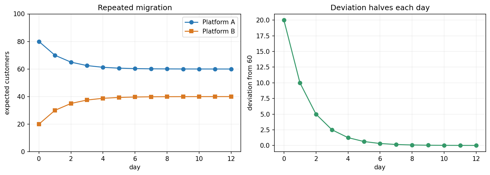

## 一百位客户，在两个平台间迁移

假设每天平台甲的客户有 80% 留在甲、20% 去乙；乙的客户有 30% 去甲、70% 留在乙。不新增或流失客户。我们记录预期人数，所以中间可以是小数，不把它当实际的零点几个客户。

令 `x_k` 按甲、乙顺序记录第 `k` 天的预期人数。每天更新的规则是

\[
\mathbf{x}_{k+1}=A\mathbf{x}_k,\qquad
A=\begin{bmatrix}0.8&0.3\\0.2&0.7\end{bmatrix}.
\]

列记录每个平台原有客户的去向，列和为 1，所以总人数保持不变。先从 `(80,20)` 开始。明天甲有多少？乙有多少？

> [!DETAILS] 算前两天
> 一天后是 `(70,30)`，两天后是 `(65,35)`。每一步都把前一天的输出作为新输入。

可以一直乘下去，但我们想知道很久以后，也想知道有没有更容易描述的变化。

## 有没有一组人数保持不动？

若甲、乙分别是 `a,b`，保持不动要求 `0.8a+0.3b=a`，即 `0.2a=0.3b`。再加总人数 100，得到 `(60,40)`。代入第二行，也保持不动。

这就是 `A(60,40)=(60,40)`。变换没有改变这个向量。

我们再看两个起始分配之间的差别。总人数相同，其差一定是 `(d,−d)`。先算最简单的方向 `(1,−1)`：

\[
A\begin{bmatrix}1\\-1\end{bmatrix}
=\begin{bmatrix}0.5\\-0.5\end{bmatrix}
=0.5\begin{bmatrix}1\\-1\end{bmatrix}.
\]

方向没变，幅度减半。这里的负数表示相对另一份分配少了多少人，不是负人数。

## 沿这些方向，反复作用只是反复乘一个数

如果非零向量 `v` 满足 `Av=λv`，就称 `v` 为 `A` 的**特征向量**，`λ` 为对应的**特征值**。定义必须排除零向量，否则任何 `λ` 都能满足 `A0=λ0`。

本例中 `(60,40)` 的特征值为 1，`(1,−1)` 的特征值为 0.5。对这样的向量，`A²v=λ²v`，继续得到 `A^k v=λ^k v`。

于是初始分配可以拆成

\[
\begin{bmatrix}80\\20\end{bmatrix}
=\begin{bmatrix}60\\40\end{bmatrix}
+20\begin{bmatrix}1\\-1\end{bmatrix}.
\]

经过 `k` 天，便有

\[
\mathbf{x}_k=\begin{bmatrix}60\\40\end{bmatrix}
+20(0.5)^k\begin{bmatrix}1\\-1\end{bmatrix}.
\]

稳定部分留下，偏差不断减半，最终趋向 `(60,40)`。这里的收敛来自 `|0.5|<1`，不是所有迁移模型都自动收敛。

左图是预期人数，右图是甲相对 60 的偏差。右图的衰减正是第二个特征方向的变化。

## 特征值还能怎样解释？

在一个特征方向上，`λ=0` 表示该方向被压成零；`λ=1` 保持不变；`λ=−1` 每次翻向，长度不变；`|λ|<1` 反复衰减；`|λ|>1` 反复放大。负值会同时翻转方向。

这些说法先针对特征方向。要描述任意输入，还得能把它拆成足够多的特征方向。不是每个矩阵都有这样的基，后面会专门检查。

## 怎样找特征值？

我们把 `Av=λv` 移项，得到 `(A−λI)v=0`。要找到非零方向，`A−λI` 必须不可逆。

本例的两式是 `(0.8−λ)a+0.3b=0`、`0.2a+(0.7−λ)b=0`。消去变量，非零解要求

\[
(0.8-\lambda)(0.7-\lambda)-0.3\cdot0.2=0,
\]

即 `λ²−1.5λ+0.5=(λ−1)(λ−0.5)=0`。然后分别代回求向量。不是把每个元素减去 `λ`：`λI` 只改变对角线。

## 实验与重建

打开[客户迁移实验](https://colab.research.google.com/github/xiaoheng008/linear-algebra-evolution/blob/main/experiments/15_eigenvectors.ipynb)。改变初始分配，比较逐天计算与特征方向公式；再观察两个起始分配之间的差是否每天减半。

合上书，重新找出稳定人数和偏差方向，再推导第 `k` 天的式子。下一章研究刚才那种判断：能否用一个数检查矩阵何时不可逆？
