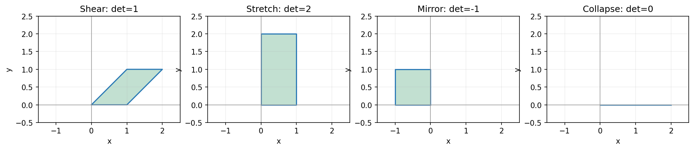

## 同样是变形，哪些把面积丢了？

图片宽度拉长两倍、高度不变，单位正方形变成面积 2 的长方形。剪切后变成平行四边形，但面积仍是 1。把所有点压到横轴，面积变成 0。

这提示我们：除了跟踪每个点，还可以跟踪一块区域的面积。设矩阵为

\[
A=\begin{bmatrix}a&b\\c&d\end{bmatrix}.
\]

标准基的输出是两列 `(a,c)` 与 `(b,d)`，单位正方形的输出就是由它们撑起的平行四边形。

## 两列怎样给出面积？

我们先看第一列水平的情形 `(a,0)`。第二列是 `(b,d)`，底边长度是 `|a|`，高度是 `|d|`，面积为 `|ad|`；水平偏移 `b` 不改变它。

一般的两列，带方向的面积是 `ad−bc`。可以把两列拆成水平与竖直部分：同方向的两段撑不出面积，交叉的两项分别贡献 `ad` 与相反方向的 `bc`。交换两列会翻转方向，所以应相减。普通面积取绝对值。

这个数叫矩阵的**行列式**：

\[
\det A=ad-bc.
\]

它同时记录面积缩放倍数与方向：正数保留平面的朝向，负数翻转朝向，零表示单位正方形被压成线或点。比如镜像矩阵 `diag(−1,1)` 的行列式是 `−1`，普通面积没有变。

## 用几个具体变换核对

剪切矩阵 `[[1,1],[0,1]]` 的行列式是 1；竖直拉伸 `diag(1,2)` 是 2；压缩矩阵 `[[1,1],[0,0]]` 是 0。上一章的迁移矩阵行列式是 `0.8×0.7−0.3×0.2=0.5`。

最后一个数不是“客户总数减少了一半”。总人数仍不变。它描述二维坐标区域的面积变化；稳定方向不变，另一个方向缩短到一半。

对二维方阵，`det A=0` 恰好意味着两列线性相关，平面被压扁，矩阵不可逆。若非零，直接相乘可验证

\[
A^{-1}=\frac{1}{ad-bc}\begin{bmatrix}d&-b\\-c&a\end{bmatrix}.
\]

这里出现的分母，也解释为什么行列式为零时不能用这条逆公式。

镜像翻转朝向，却没有改变普通面积；压扁后，只剩一段线，二维面积为零。

## 更多维数，跟踪体积

三维中，两列还不够，要看三列撑起的平行六面体；普通体积是行列式的绝对值。更高维的行列式可以不用画图定义：它对每一列分别线性，交换两列改变符号，并且 `det I=1`。这三条规则唯一确定它。

由这些规则可以按一行展开计算。例如三维矩阵的第一行为 `(a,b,c)`，下两行为 `(d,e,f)`、`(g,h,i)`，有

\[
\det A=a(ei-fh)-b(di-fg)+c(dh-eg).
\]

我们在二维算过的“主对角线乘积减另一条对角线乘积”，到更多维数时不能直接沿用。

消元也能算行列式：交换两行变号；一行乘非零数 `q`，行列式乘 `q`；一行加上另一行的倍数，行列式不变。化成三角形后，行列式就是对角线元素的乘积，并要把之前的缩放与交换计入。

这些规则同时说明，对任何方阵，`det A≠0` 当且仅当消元得到全部主元，即矩阵可逆。

## 两步作用，面积倍数相乘

先 `A` 再 `B`，每一步都按自己的倍数缩放带方向的体积，所以

\[
\det(BA)=\det B\det A.
\]

代数上也可从逐列线性与交换变号验证：函数 `det(BA)` 作为 `A` 各列的函数，满足同样的线性与交替规则；在 `A=I` 时值为 `det B`，因此就是 `det B·det A`。

这条乘法关系不意味着 `BA=AB`；两个不同矩阵可以有相同行列式。行列式也不满足一般的加法规则，例如 `det(I+I)=4`，却 `det I+det I=2`。

## 回到特征值

`A−λI` 有非零零空间，等价于 `det(A−λI)=0`。上一章求特征值的二次式，就是这个行列式。求出候选 `λ` 后，仍要解 `(A−λI)v=0` 找方向。

## 实验与重建

打开[面积与行列式实验](https://colab.research.google.com/github/xiaoheng008/linear-algebra-evolution/blob/main/experiments/16_determinant.ipynb)，比较剪切、拉伸、镜像与压扁。先从两列算面积，再运行核对。

合上书，用单位正方形解释行列式为何为零时不能恢复输入。再举两个行列式相同但作用不同的矩阵。下一章问：如果特征方向足够多，能不能换一组坐标，让变换更好算？
