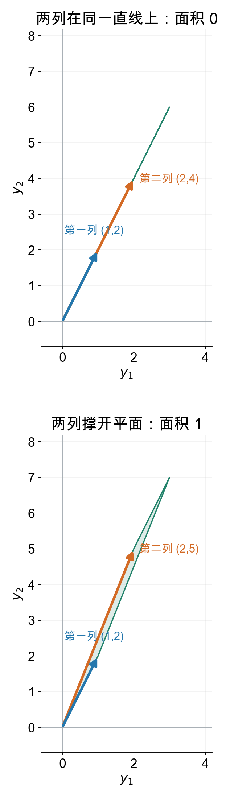
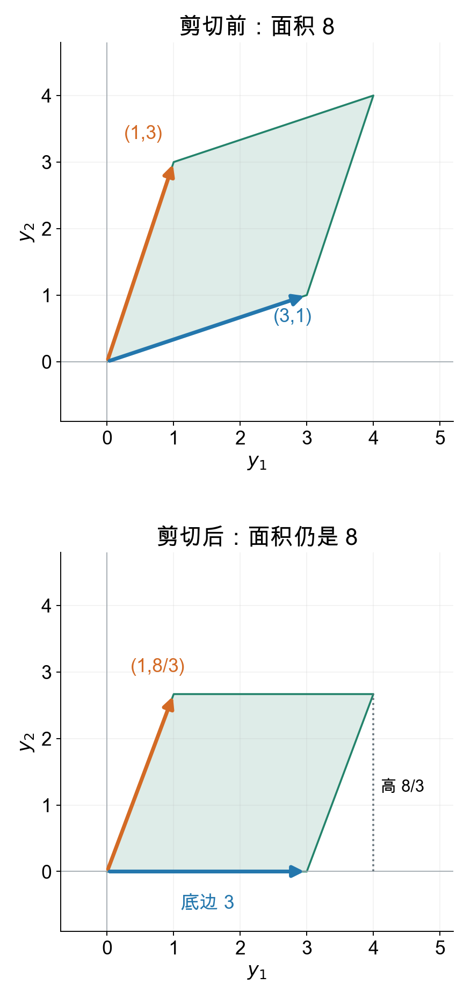

## 上一章留下了什么问题？

上一章，我们主动寻找只被缩放的方向，要求

\[
A\mathbf v=\lambda\mathbf v,
\qquad \mathbf v\ne\mathbf0.
\]

移项以后，问题变成

\[
(A-\lambda I)\mathbf v=\mathbf0.
\]

所以要找哪些 \(\lambda\)，使新矩阵有非零零空间。前两章告诉我们：对于方阵，这等价于缺少主元、不能唯一恢复输入，也就是不可逆。

我们已经能用消元判断。但每换一个矩阵，都要重新检查哪些约束重复了。现在我们想把消元中决定答案的那部分提取出来：

**对于一个二维方阵，能不能从四个系数算出一个数，用它判断是否存在非零的零空间向量？**

先从两个具体矩阵算起，不急着给公式。

## 两个方程组，只差一个系数

第一组要求

\[
\begin{cases}
z_1+2z_2=0,\\
2z_1+4z_2=0.
\end{cases}
\]

你先用第二条减去第一条的2倍。还剩几条独立限制？

> [!DETAILS] 看消元后的最后一条
> 第二条变成 \(0=0\)，没有增加限制。
>
> 第一条要求 \(z_1=-2z_2\)。取 \(z_2=1\)，就得到非零解 \((-2,1)^T\)。全部解是它的任意实数倍。

现在只把第二条的4改成5：

\[
\begin{cases}
z_1+2z_2=0,\\
2z_1+5z_2=0.
\end{cases}
\]

再做同一步消元。最后一条是什么？

> [!DETAILS] 这次多了一条限制
> 第二条变成 \(z_2=0\)。代回第一条，又得到 \(z_1=0\)。
>
> 这次零空间只有零向量，没有非零解。

两个矩阵分别是

\[
M_4=\begin{bmatrix}1&2\\2&4\end{bmatrix},
\qquad
M_5=\begin{bmatrix}1&2\\2&5\end{bmatrix}.
\]

原来的四个系数看起来很接近，结论却不同。决定差别的是消元后有没有剩下第二条限制。

## 先把那个系数留成未知数

把右下角记为 \(t\)，我们得到

\[
M_t=\begin{bmatrix}1&2\\2&t\end{bmatrix}.
\]

同样用第二条减去第一条的2倍：

\[
\begin{cases}
z_1+2z_2=0,\\
(t-4)z_2=0.
\end{cases}
\]

现在不必分别重做许多组方程，只要检查 \(t-4\)：

- \(t-4=0\)，第二条不再限制 \(z_2\)，存在非零零空间向量。
- \(t-4\ne0\)，第二条要求 \(z_2=0\)，随后 \(z_1=0\)。

这个数把“有没有第二个主元”的判断压缩了下来。

对于任意四个系数，也能提取出这样的数吗？

## 从一般方程中提取判据

设

\[
M=\begin{bmatrix}a&b\\c&d\end{bmatrix},
\qquad
\begin{cases}
az_1+bz_2=0,\\
cz_1+dz_2=0.
\end{cases}
\]

先让第一条乘 \(d\)，第二条乘 \(b\)，两式相减。你试着算：哪一项被消去了？

> [!DETAILS] 消去第二个未知数
> \[
> d(az_1+bz_2)-b(cz_1+dz_2)=0.
> \]
> 两个 \(bdz_2\) 抵消，剩下
> \[
> (ad-bc)z_1=0.
> \]

再让第二条乘 \(a\)，第一条乘 \(c\)，相减得到

\[
(ad-bc)z_2=0.
\]

同一个数出现了两次。把它暂时记为 \(\Delta=ad-bc\)。

若 \(\Delta\ne0\)，两个等式分别要求 \(z_1=z_2=0\)。因此零空间只有零向量。

若 \(\Delta=0\)，是否一定有非零解？不能只说“推不出坐标为零”，还要真正找出一个。

> [!DETAILS] 检查零的情形，包含特殊系数
> 若第一行 \((a,b)\) 不全为零，取
> \[
> \mathbf z=\begin{bmatrix}b\\-a\end{bmatrix}.
> \]
> 它非零，而且
> \[
> M\mathbf z=\begin{bmatrix}ab-ba\\cb-da\end{bmatrix}
> =\begin{bmatrix}0\\-\Delta\end{bmatrix}
> =\mathbf0.
> \]
> 若第一行全为零，但第二行不全为零，取 \((d,-c)^T\)，同样得到非零解。
>
> 若两行全为零，任意输入都被映成零，当然也有非零解。
>
> 因此，无论是否遇到零系数，\(\Delta=0\) 都恰好对应非零零空间。

我们没有除以 \(a\)，所以即使左上角是零，这个判据也能用。它检查的是整个矩阵，不是要求每一个元素都非零。

## 这个数叫行列式

对二维方阵，我们把刚才提取出的数叫**行列式**：

\[
\det\begin{bmatrix}a&b\\c&d\end{bmatrix}=ad-bc.
\]

矩阵是四个数排成的表，行列式则是从这张表算出的**一个数**。它不能描述矩阵的全部作用，但能回答本章的核心问题：

\[
\det M=0
\quad\Longleftrightarrow\quad
N(M)\text{ 包含非零向量}.
\]

对于方阵，非零零空间意味着不同输入可以产生相同输出，不能唯一恢复输入，所以矩阵不可逆。行列式非零，则矩阵可逆。

回到两个例子：

\[
\det M_4=1\times4-2\times2=0,
\qquad
\det M_5=1\times5-2\times2=1.
\]

数字0与1，正好对应我们已经做过的两次消元。

## 按列看，为什么一个失去维度，另一个没有？

\(M_4\) 的两列分别是 \((1,2)^T\)、\((2,4)^T\)。第二列就是第一列的2倍。

因此所有输出都只能写成

\[
M_4\mathbf x=(x_1+2x_2)\begin{bmatrix}1\\2\end{bmatrix}.
\]

输出只能落在一条直线上。两个输入坐标经过计算后，不能再分别辨认；沿 \((-2,1)^T\) 改变输入，输出完全不变。

\(M_5\) 的第二列改成 \((2,5)^T\)，不再与第一列在同一条直线上。两列线性无关，能组合出整个平面的输出。

<picture>
<source media="(min-width: 1200px)" srcset="det-columns-wide.png">

</picture>

蓝箭头是第一列，橙箭头是第二列。淡绿色区域是单位正方形经过矩阵后的形状：左边只剩线段，右边还撑得出面积。

这把三个判断连了起来：**非零零空间、独立方向减少、二维面积变成零，描述的是同一次信息丢失。**

注意：行列式只对方阵定义。长方形矩阵也有秩、列空间和零空间，但不能直接套用这一条行列式判据。

## 为什么行列式还能算面积？

我们已经从方程得到 \(ad-bc\)。它与面积的关系，还需要解释，不能只凭一幅图宣布成立。

先看第一列水平的矩阵：

\[
T=\begin{bmatrix}a&b\\0&h\end{bmatrix}.
\]

两列是 \((a,0)^T\)、\((b,h)^T\)。它们撑起的平行四边形底边长 \(|a|\)，高度是 \(|h|\)，所以面积为 \(|ah|\)。第二列的水平偏移 \(b\) 不改变底和高。

一般矩阵的第一列 \((a,c)^T\) 可能是斜的。先考虑 \(a\ne0\)：把图中每个点 \((x,y)\) 改成

\[
\left(x,\ y-\frac ca x\right).
\]

这只是上下剪切。想象把图形切成很窄的竖条：同一条中的点都上下平移同样距离，竖条的宽和长没有变，因此面积不变。

剪切后，两列变成

\[
\begin{bmatrix}a\\0\end{bmatrix},
\qquad
\begin{bmatrix}b\\d-\frac ca b\end{bmatrix}.
\]

第一列水平了！用刚才的底乘高，得到

\[
\text{面积}
=|a|\left|d-\frac ca b\right|
=|ad-bc|.
\]

若 \(a=0\) 但第一列非零，可交换两个坐标轴后做同样的计算，普通面积不变；若第一列为零，图形只剩线或点，面积与行列式也都为零。

<picture>
<source media="(min-width: 1200px)" srcset="det-shear-wide.png">

</picture>

图中用上一章的 \(A=\begin{bmatrix}3&1\\1&3\end{bmatrix}\)：剪切后底边为3，高度为 \(8/3\)，所以面积是8。我们看到的不是一个新公式，而是消元里的 \(ad-bc\) 在图形上的另一种表现。

## 负的行列式是什么意思？

面积不能为负，但 \(ad-bc\) 可以为负。负号记录的是朝向，不是负的面积，也不是不可逆。

把上一章矩阵的两列交换：

\[
\begin{bmatrix}1&3\\3&1\end{bmatrix}.
\]

两条边撑起的平行四边形相同，面积仍是8，但行列式从8变成了 \(-8\)。

所以要分开看：

- \(|\det M|\)：单位正方形输出的普通面积，也就是面积缩放倍数。
- \(\det M\) 的正负：是否保持平面的朝向。
- \(\det M\) 是否为零：有没有被压成低维，能否唯一恢复输入。

例如交换横纵坐标的矩阵 \(\begin{bmatrix}0&1\\1&0\end{bmatrix}\) 行列式为 \(-1\)。它有两个主元，可以撤销交换，完全可逆。

## 现在回去找特征值

上一章的矩阵是

\[
A=\begin{bmatrix}3&1\\1&3\end{bmatrix}.
\]

我们需要 \(A-\lambda I\) 有非零零空间。用新得到的判据，就要求

\[
\det(A-\lambda I)=0.
\]

把它写开：

\[
\det\begin{bmatrix}3-\lambda&1\\1&3-\lambda\end{bmatrix}
=(3-\lambda)^2-1=0.
\]

所以 \(\lambda=4\) 或 \(\lambda=2\)。这与上一章直接消元的结果一样，但现在我们知道了：那个最后需要为零的式子，就是新矩阵的行列式。

求出倍数后，还要分别解

\[
(A-4I)\mathbf v=\mathbf0,
\qquad
(A-2I)\mathbf v=\mathbf0,
\]

才能得到相应的特征方向。**行列式筛选哪些倍数可能成立，零空间给出对应的向量。**

原矩阵的行列式是8，它可逆。要求不可逆的是特定 \(\lambda\) 下的 \(A-\lambda I\)，不要把这两个矩阵混淆。

> [!DETAILS] 回到一般输出，为什么逆公式也出现同一个数？
> 解
> \[
> ax_1+bx_2=p,\qquad cx_1+dx_2=q.
> \]
> 做前面同样的两次消元，得到
> \[
> (ad-bc)x_1=dp-bq,
> \qquad
> (ad-bc)x_2=aq-cp.
> \]
> 行列式非零时可以相除，对任意目标 \((p,q)^T\) 得到唯一解。这也给出
> \[
> M^{-1}=\frac1{ad-bc}\begin{bmatrix}d&-b\\-c&a\end{bmatrix}.
> \]
> 行列式为零时，不能用此公式。不是所有目标都无解：目标仍可能在列空间里，但有解时不唯一。

> [!DETAILS] 更多维数与两步作用
> 更高维方阵也有行列式：可从单位矩阵的值为1、交换两行变号、对每一行分别线性这三条性质定义。这里的“分别线性”要求其他行固定，并不是对整个矩阵做加法都能拆开。
>
> 与二维的面积对应，三维的绝对值表示体积缩放倍数。消元化成三角形后，行列式是对角线元素的乘积；若交换过行或缩放过行，必须把符号和倍数计回去。因此一般方阵也满足：行列式非零，当且仅当有全部主元。
>
> 两次作用的面积或体积倍数相乘，对应 \(\det(BC)=\det B\det C\)。它不意味着 \(BC=CB\)，也不意味着行列式可以描述全部作用。比如单位矩阵与剪切矩阵的行列式都为1，作用却不同。
>
> 本章先掌握二维判据的来由；不要求同时背下高维展开公式。

## 实验与重建

打开[从消元到面积与特征值实验](https://colab.research.google.com/github/xiaoheng008/linear-algebra-evolution/blob/main/experiments/16_determinant.ipynb)。改变 \(t\)，先预测自由变量是否保留，再比较两列与单位正方形的输出。随后交换两列，观察面积不变而行列式变号。

最后改变候选 \(\lambda\)，检查 \(A-\lambda I\) 何时失去一个独立方向。不要先调用行列式函数，再凭结果猜理由。

合上书，自己重建：

1. 从两条方程的消元重新得到 \(ad-bc\)，说明为什么它不为零时只有零解。
2. 为什么行列式为零不等于每个目标都无解？
3. 为什么负的行列式不等于不可逆？
4. 为什么求特征值时要检查 \(A-\lambda I\)，而不是只检查 \(A\)？

下一章回到第十五章找到的两条独立特征方向，把“分别缩放”的换坐标过程写成完整的矩阵关系。

行列式与消元、可逆性及特征值的联系参考 [MIT 18.06 第十八讲](https://ocw.mit.edu/courses/18-06-linear-algebra-spring-2010/04979ab05f4f27e621e1e26ece4586fd_MIT18_06S10_L18.pdf)。本章从二维方程提取判据的引导为本书编写，不是原课逐字翻译。
