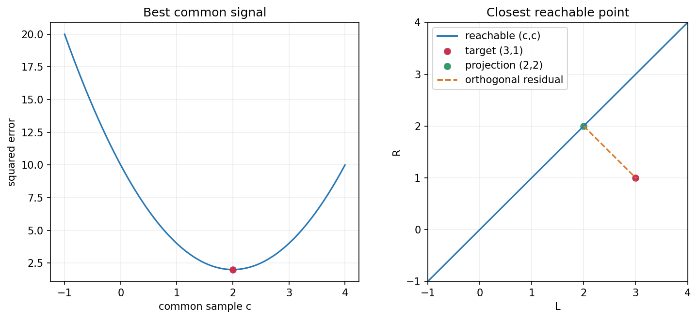

## 两个声道不同，只能输出同样的信号

目标采样值是 `b=(3,1)`，设备却只能把一个数 `c` 同时送到左右两边，输出 `(c,c)=cu`，其中 `u=(1,1)`。目标不在这条直线上，所以方程没有精确解。

但可以比较误差。取 `c=1`，误差为 `(2,0)`；取 `c=3`，误差为 `(0,−2)`；取 `c=2` 呢？先算三者的误差平方和。

> [!DETAILS] 比较候选值
> 前两者都是 4；`c=2` 时误差 `(1,−1)`，平方和为 2。它更好。但要确认最优，还不能只比三个数。

## 怎样确认所有候选中的最小值？

我们把任意 `c` 的误差平方展开：

\[
f(c)=(3-c)^2+(1-c)^2=2(c-2)^2+2.
\]

平方项非负，最小值恰好在 `c=2`。所以最近的输出是 `p=(2,2)`，残差 `r=b−p=(1,−1)`。

它与可达方向正交：`u^Tr=1−1=0`。这正是第八章丢掉双声道差别部分后的结果。现在我们知道，在左右误差同权的平方距离下，它是最接近的单声道输出。

左图比较所有候选系数，右图把同一计算放到左右采样值平面。绿点是最近输出，虚线是残差。

## 投影到任意一条过原点的直线

设非零方向 `u` 固定，寻找最近的 `p=cu`。将长度平方展开并配方：

\[
\|\mathbf{b}-c\mathbf{u}\|^2
=\|\mathbf{u}\|^2\left(c-\frac{\mathbf{u}^T\mathbf{b}}{\mathbf{u}^T\mathbf{u}}\right)^2
+\|\mathbf{b}\|^2-\frac{(\mathbf{u}^T\mathbf{b})^2}{\mathbf{u}^T\mathbf{u}}.
\]

后两项不随 `c` 变，因此

\[
\mathbf{p}=\frac{\mathbf{u}^T\mathbf{b}}{\mathbf{u}^T\mathbf{u}}\mathbf{u},\qquad
\mathbf{u}^T(\mathbf{b}-\mathbf{p})=0.
\]

这个最近点叫 `b` 在直线上的**正交投影**。若把投影写成矩阵，就是 `P=uu^T/(u^Tu)`，`p=Pb`。

## 投影到一个平面，怎样找？

设子空间 `W` 有正交单位基 `q_1,...,q_r`。把 `b` 沿这些方向的部分保留：

\[
\mathbf{p}=\sum_{j=1}^{r}(\mathbf{q}_j^T\mathbf{b})\mathbf{q}_j=QQ^T\mathbf{b}.
\]

残差与每支基都正交，因此与整个 `W` 正交。任意另一个可达点 `w`，其误差分解为

\[
\mathbf{b}-\mathbf{w}=(\mathbf{b}-\mathbf{p})+(\mathbf{p}-\mathbf{w}).
\]

前者垂直 `W`，后者在 `W` 内，所以长度平方是 `||b−p||²+||p−w||²`。后项非负，且只有 `w=p` 时为零。这证明投影确实是唯一最近点。

投影矩阵满足 `P²=P`：点已经投到 `W`，再投一次不会变；也满足 `P^T=P`。误差部分由 `I−P` 保留。

## 报表不一致时，最近的一致报表是什么？

报表目标 `b=(120,80,210)` 元不满足“总额等于两渠道之和”。所有一致记录组成平面 `W={(s,t,s+t)}`，它的垂直方向是 `n=(−1,−1,1)`。

我们先投出垂直的误差部分：`n^Tb=10`，`n^Tn=3`。于是残差 `r=(10/3)n`，最近的一致记录是

\[
\mathbf{p}=\mathbf{b}-\frac{10}{3}(-1,-1,1)
=(123\tfrac13,83\tfrac13,206\tfrac23).
\]

三项都调整了。这是把三个字段同等对待时的最小平方修改，不是在判断哪一个记录真的错了。如果已知两渠道数据可靠、只修总额，约束与权重就不同，应改成 200 元。数学最优取决于你先定义的问题。

## 实验与重建

打开[最近可达点实验](https://colab.research.google.com/github/xiaoheng008/linear-algebra-evolution/blob/main/experiments/19_projection.ipynb)。移动单声道输出，观察误差曲线；再检查报表投影后的总额关系与垂直残差。

合上书，从配方平方推导直线投影；再用勾股关系证明子空间投影最优。接下来，我们把投影变成求模型系数的方法。
