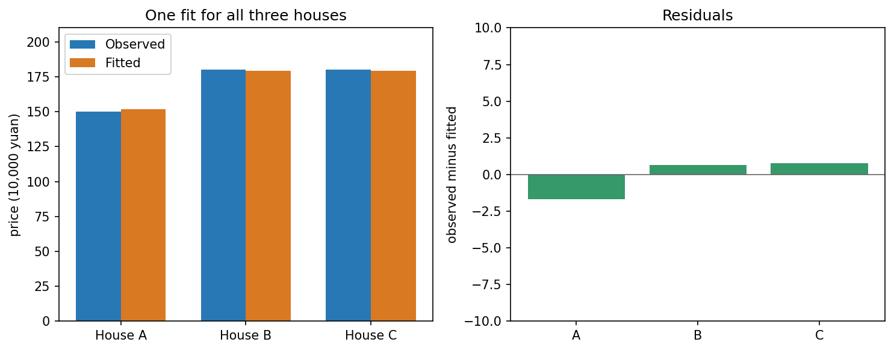

## 三个观测，无法同时精确解释

假设一个简化仪器模型认为输出等于输入乘同一个系数 `c`。输入为 1、2、3，测得输出是 1、2、2。前两个观测要求 `c=1`，第三个却要求 `c=2/3`。不存在共同解。

我们把输入与观测分别排成一列：

\[
\mathbf{a}=\begin{bmatrix}1\\2\\3\end{bmatrix},\qquad
\mathbf{b}=\begin{bmatrix}1\\2\\2\end{bmatrix},\qquad
\text{模型输出}=c\mathbf{a}.
\]

所有模型输出组成三维空间里的一条直线。我们的任务变成上一章的问题：找这条线上离 `b` 最近的点。

## 误差平方和最小的系数

用投影公式，

\[
\hat c=\frac{\mathbf{a}^T\mathbf{b}}{\mathbf{a}^T\mathbf{a}}
=\frac{1+4+6}{1+4+9}=\frac{11}{14}.
\]

预测是 `(11/14,22/14,33/14)`，残差是 `(3/14,6/14,−5/14)`。检查 `a^Tr=(3+12−15)/14=0`。三个原方程没有变得精确成立，而是找到平方误差最小的共同解释。

这种选择输入 `x` 使 `||Ax−b||²` 最小的方法，叫**最小二乘**。残差记为 `r=b−Ax`，正负说明观测比预测大或小。

## 多个系数时，残差应该垂直什么？

我们已经知道，模型输出全部在 `Col(A)` 中，所以最佳输出是 `b` 到列空间的投影。把残差与每一列正交的条件写出来，就是

\[
A^T(\mathbf{b}-A\hat{\mathbf{x}})=0,
\qquad A^TA\hat{\mathbf{x}}=A^T\mathbf{b}.
\]

这组式子叫**正规方程**。它也足以保证最优：若残差垂直列空间，换任何输入，新增的输出变化仍在列空间里；用勾股关系，误差平方只能增加。

若 `A` 的列线性无关，`A^TA` 可逆，因为对非零 `z` 有 `z^TA^TAz=||Az||²>0`。此时系数唯一。若列相关，最近的预测仍唯一，但系数可能不唯一；它们的差位于零空间，正如第十三章。

## 再回到三套房的数据

继续使用第三章的假设模型：价格（万元）等于面积（平方米）乘 `α`，加距离（公里）乘 `β`，暂不加固定起价。

| 房屋 | 面积 | 距离 | 观测价格 |
|---|---|---|---|
| 甲 | 80 | 1 | 150 |
| 乙 | 100 | 2 | 180 |
| 丙 | 90 | 0.5 | 180 |

前两套房要求系数 `(2,−10)`，却对丙预测 175，与这里的观测 180 不同。三条约束无共同解。注意丙的 180 是本章新设的观测，不是第三章的模型预测。

\[
A=\begin{bmatrix}80&1\\100&2\\90&0.5\end{bmatrix},\qquad
\mathbf{b}=\begin{bmatrix}150\\180\\180\end{bmatrix}.
\]

两列分别记录面积与距离在三套房上的数值。列的组合组成三维价格空间中的一个平面；观测向量在平面外。最小二乘投影给出一组尽量解释三套房的系数，而不是只让前两条精确成立。

我们拟合时，三套房要一起参与，而不是先固定前两套房的结果。先预测：新的系数会怎样改变丙的价格？前两套房还能都精确算对吗？

> [!DETAILS] 核对这组数据的拟合结果
> 面积系数约为 `2.06739`，距离系数约为 `−13.69565`。三套房的预测依次约为 `151.69565、179.34783、179.21739` 万元，残差约为 `−1.69565、0.65217、0.78261` 万元。
> 三项残差都不为零，却共同满足 `A^Tr=0`（用未舍入的数核对）。这组系数使整体平方误差最小，不能只看丙一项改善多少。

实验会计算这些量，也允许改变第三套房的观测。这里仍是假设数据的教学计算，不是现实房屋的估值结论。

蓝柱是观测，橙柱是预测，单位为万元。右图记录同一次拟合的残差；它们不必分别为零，而应共同满足与模型列空间正交的条件。

## 误差小，不等于模型一定合理

平方误差明确了本章的任务。它不自动证明面积与距离足以解释房价，也不说明距离系数有因果含义。增加固定项时，可给 `A` 加一列全 1，新增一个系数；若各观测可信程度不同，还可以设置权重。更换模型与更换目标函数都会改变问题。

正规方程方便推导，但实际数值求解通常用 QR 或 SVD，避免显式求逆，也避免形成 `A^TA` 时放大数值困难。下一章先从正交基构造 QR。

## 实验与重建

打开[拟合观测与房价实验](https://colab.research.google.com/github/xiaoheng008/linear-algebra-evolution/blob/main/experiments/20_least_squares.ipynb)。改变第三个观测，先预测拟合如何移动，再比较旧系数与新系数的误差。实验使用 NumPy 的最小二乘求解，并检查正交残差。

合上书，从“最佳残差垂直可达空间”推导正规方程。再说清：没有精确解、最佳预测唯一、最佳系数唯一，三者各在问什么。
