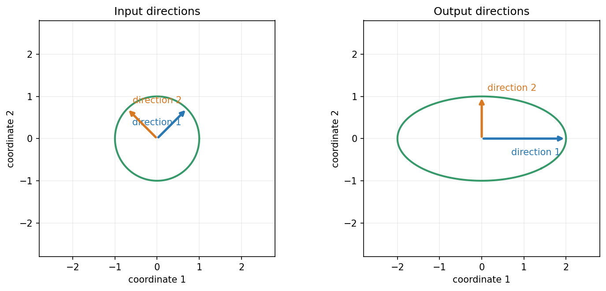

## 对角化留下了什么限制？

剪切没有足够的特征向量，长方形矩阵甚至不能把输入方向与输出方向当成同一个空间。对角化要求同一组基既记录输入又记录输出，这个要求太强。

如果允许输入、输出各用自己的正交单位基，能否让每支输入基只沿一支输出基缩放？先看一个具体矩阵：

\[
A=\frac{1}{\sqrt2}\begin{bmatrix}2&2\\-1&1\end{bmatrix}.
\]

标准基的输出并不正交。但换成输入方向 `v_1=(1,1)/sqrt2`、`v_2=(−1,1)/sqrt2`，算一下会怎样？

> [!DETAILS] 沿两支新输入基计算
> `Av_1=(2,0)=2u_1`，`Av_2=(0,1)=u_2`，其中 `u_1=(1,0)`、`u_2=(0,1)`。两支输入基正交，两支输出基也正交，缩放倍数分别是 2 和 1。

于是输入 `x=c_1v_1+c_2v_2` 的输出是 `2c_1u_1+c_2u_2`。整个过程分成：取输入基坐标、分别缩放、按输出基组合。

蓝、橙箭头跟踪两支输入基。左图它们是斜方向，右图成为水平、竖直方向，长度分别是 2 与 1。输入基和输出基不必相同。

## 这叫奇异值分解

把输入基排成 `V`，输出基排成 `U`，缩放倍数排进矩形对角矩阵 `Σ`，便有

\[
A=U\Sigma V^T.
\]

这是**奇异值分解**，简称 SVD。`U,V` 的列是各自空间的正交单位基，`Σ` 的非零对角项叫**奇异值**，通常按 `σ_1≥σ_2≥...>0` 排列。

对 `m×n` 矩阵，完整形式的尺寸是 `U:m×m`、`Σ:m×n`、`V:n×n`。若有 `r` 个非零奇异值，只保留参与作用的方向，也可写成简化形式

\[
A=U_r\Sigma_rV_r^T,
\]

尺寸依次是 `m×r、r×r、r×n`。输入、输出基可以不同，所以不要求方阵或可对角化。

## 为什么任意实矩阵都有这种分解？

我们先研究实对称矩阵 `A^TA`。它有正交单位特征基 `v_i`，并且特征值非负：若 `A^TAv_i=λ_iv_i`，则

\[
\lambda_i=\mathbf{v}_i^TA^TA\mathbf{v}_i=\|A\mathbf{v}_i\|^2\ge0.
\]

我们令 `σ_i=sqrt(λ_i)`。若 `σ_i>0`，把 `Av_i` 除以它的长度，得到 `u_i=Av_i/σ_i`。再检查这些输出方向的内积：

\[
\mathbf{u}_i^T\mathbf{u}_j
=\frac{\mathbf{v}_i^TA^TA\mathbf{v}_j}{\sigma_i\sigma_j}.
\]

当 `i≠j` 时为零，`i=j` 时为 1，所以这些输出方向正交且为单位长度。若 `σ_i=0`，则 `||Av_i||=0`，即这个输入方向被压掉。按所有 `v_i` 展开任意输入，就得到上面的分解；需要完整输出基时，再补齐正交方向。

这个论证保证 SVD 存在。数值库通常不会简单地先形成 `A^TA` 来计算它，因为这样可能损失精度。

## 秩与四个空间，重新读一遍

`r` 个非零奇异值就是 `rank A`。对应的 `u_i` 张成列空间，`v_i` 张成行空间。其余输入基构成零空间；其余输出基构成左零空间。

输入沿 `v_i` 的分量被缩放 `σ_i` 后送到 `u_i`。若奇异值很小，反向恢复时要除以很小的数，测量误差可能被放大。这说明“理论上可逆”与“数值上容易恢复”不是同一件事。

奇异值非负，描述长度缩放；特征值可能负或非实，要求方向在同一空间保持。不要把两者当成同一个名称的不同写法。

## 用 SVD 找最短的最小二乘解

将 `b` 在输出基上的分量记为 `u_i^Tb`。对每个非零奇异值，令输入系数为 `(u_i^Tb)/σ_i`，得到

\[
\hat{\mathbf{x}}=\sum_{i=1}^{r}\frac{\mathbf{u}_i^T\mathbf{b}}{\sigma_i}\mathbf{v}_i=A^+\mathbf{b}.
\]

`A^+` 叫伪逆。输出是 `b` 在列空间上的投影；无法到达的分量成为残差。再给输入加任意零空间向量，预测不会变；由于零空间与上式的输入正交，添加后长度平方增加，所以这里给出最小欧氏长度的最小二乘解。

“最短”依赖输入坐标的刻度。若系数单位不同，不能把它无条件解释成最合理的业务参数。对可逆方阵，伪逆退化为普通逆。

## 实验与重建

打开[输入输出方向与 SVD 实验](https://colab.research.google.com/github/xiaoheng008/linear-algebra-evolution/blob/main/experiments/22_svd.ipynb)，跟踪两支输入基的输出，再对剪切与长方形矩阵检查分解。使用 NumPy 的 SVD，并用重建误差与正交关系核对。

合上书，从 `A^TA` 的特征方向推导 `Av_i=σ_i u_i`。如果有些缩放倍数很小，能否只保留重要方向，用更少数据近似整个矩阵？
