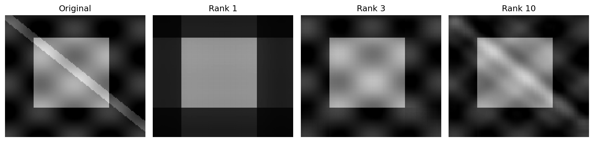

## 一张数值表，有必要逐格记住吗？

假设温度表的行是传感器位置，列是时刻，每格记录一个读数。若整张表近似等于“各位置的系数”乘“共同的时间曲线”，就能用两个向量记它：

\[
A\approx\mathbf{u}\mathbf{v}^T.
\]

第 `j` 列只是 `v_j` 倍的 `u`，所以这是秩至多为 1 的矩阵。`m×n` 个数字，改用 `m+n` 个数字就能记录这份模型。

实际表可能还有第二种变化。上一章的 SVD 正好给出一组彼此配合的秩一分量：

\[
A=\sum_{i=1}^{r}\sigma_i\mathbf{u}_i\mathbf{v}_i^T.
\]

每项描述一种输入输出方向的配合，奇异值表示它的大小。

## 先试一个能手算的近似

矩阵 `diag(4,1)` 的两项分别是 `4e_1e_1^T` 和 `e_2e_2^T`。若只留一项，保留哪个？

> [!DETAILS] 计算损失
> 保留第一项，剩余误差只有右下角的 1；保留第二项，误差是左上角的 4。平方误差分别是 1 与 16，因此先保留较大的分量。

我们沿用刚才的办法，按奇异值从大到小保留 `k` 项，得到

\[
A_k=\sum_{i=1}^{k}\sigma_i\mathbf{u}_i\mathbf{v}_i^T.
\]

它的秩不超过 `k`，称为截断 SVD。

## 用什么量衡量整张表的误差？

定义 Frobenius 范数为所有元素平方和的平方根：`||E||_F²=ΣE_ij²`。由于不同 SVD 分量在这种逐元素内积下正交，截断的误差是

\[
\|A-A_k\|_F^2=\sum_{i>k}\sigma_i^2.
\]

这样，我们只看奇异值，就能算保留多少、丢掉多少。对 `diag(4,1)`，保留一项保存 `16/17` 的平方总量，但它只衡量这里选定的数值误差，不能直接换成业务价值。

## 为什么它是最佳的秩 k 近似？

结论是：在所有秩不超过 `k` 的矩阵 `B` 中，`A_k` 的 Frobenius 误差最小。下面用投影说明，不只比较几个候选。

> [!DETAILS] 从一个候选的列空间开始证明
> 设 `P` 是到 `B` 列空间的正交投影，维数不超过 `k`。因为 `(I−P)B=0`，误差至少包括 `A` 落在该空间外的部分：
> \[
> \|A-B\|_F^2\ge\|(I-P)A\|_F^2
> =\|A\|_F^2-\|PA\|_F^2.
> \]
> 利用 SVD，`||PA||_F²=Σσ_i²||Pu_i||²`。每个权重 `||Pu_i||²` 在 0 与 1 之间，所有权重之和不超过 `k`，因为 `u_i` 是正交单位向量而投影空间最多有 `k` 维。
> 奇异值已从大到小排列，这个加权和至多为 `Σ_{i≤k}σ_i²`。因此任何候选的误差至少是 `Σ_{i>k}σ_i²`，而 `A_k` 恰好达到这个值。

如果截断处奇异值重复，最佳近似可能不唯一；最佳误差仍由上式确定。

## 数值图像也是矩阵

灰度图片可以把每格像素亮度排成矩阵。截断 SVD 能以较少的方向近似它，实验用一张明确构造的灰度图，比较 `k=1、3、10` 的结果和误差。亮度重建可能超出显示区间，显示时会裁到合法范围；误差则在裁切前的矩阵上计算。

存储 `U_k、σ_1,...,σ_k、V_k` 需要约 `k(m+n+1)` 个数，而原矩阵需要 `mn` 个。只有前者更小才真的节省这类存储；不能把任意低秩表达都称为压缩。它也不是现代图片格式的完整编码方案。

四幅图使用同一亮度刻度。多保留一些分量，斜带和边界能恢复得更细；具体平方误差由实验计算，不能只凭视觉判断。

## 实验与重建

打开[低秩近似实验](https://colab.research.google.com/github/xiaoheng008/linear-algebra-evolution/blob/main/experiments/23_low_rank.ipynb)。先看奇异值，预测几个 `k` 的损失，再运行重建。检查实际误差与尾部平方和是否一致，以及存储何时更少。

合上书，从秩一分量解释截断近似，再写出它的误差。我们已经压缩了一张表；如果每行是一位对象的多个特征，怎样选择最能说明差异的坐标？
