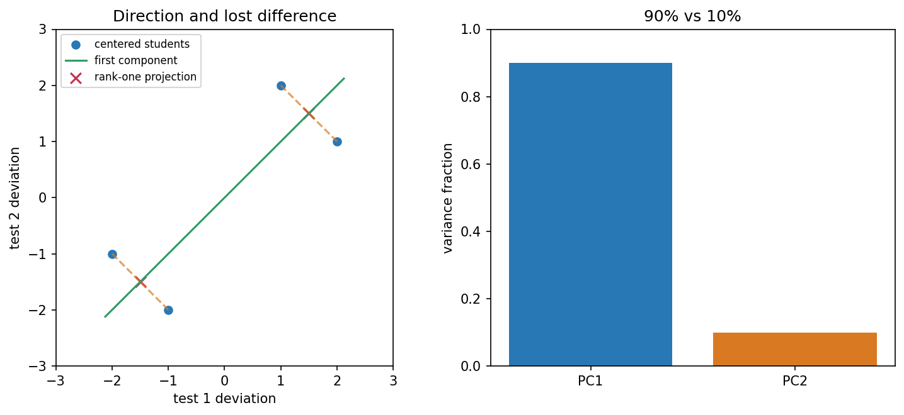

## 两列成绩，哪些变化值得保留？

假设四位学生的两次测验成绩是 `(72,71)、(71,72)、(69,68)、(68,69)`，两次测验都按相同的百分制计分。每行是一位学生，每列是一项特征。

两列的平均数都是 70。我们先减去平均向量，得到中心化数据：

\[
X=\begin{bmatrix}2&1\\1&2\\-1&-2\\-2&-1\end{bmatrix}.
\]

中心化让我们研究相对平均值的差异，而不是把“大家都在 70 分附近”当成主要变化。

## 选一个方向，怎样记录每位学生？

对单位方向 `v`，一位学生的中心化行向量 `x^T` 在这个方向的坐标是 `x^Tv`。所有学生的新坐标排成 `Xv`。我们想选一个方向，让这些坐标的平方总量最大，即最大化

\[
\|X\mathbf{v}\|^2=\mathbf{v}^TX^TX\mathbf{v},\qquad \|\mathbf{v}\|=1.
\]

由于已经中心化，新坐标平均值为零；平方总量除以样本数减一，就是样本方差。

这个对称矩阵可用特征方向分析。把 `v` 用 `X^TX` 的正交特征基展开，平方总量就是各特征值按坐标平方加权；坐标平方和为 1，所以最大值在最大特征值方向取得。

## 本例的共同方向与差别方向

我们直接计算这两列之间的平方与乘积关系：

\[
X^TX=\begin{bmatrix}10&8\\8&10\end{bmatrix}.
\]

`v_1=(1,1)/sqrt2` 对应特征值 18，`v_2=(1,−1)/sqrt2` 对应 2。第一个方向记录两次成绩共同偏高或偏低，第二个记录两次之间的差别。

第一方向的坐标是 `3/sqrt2、3/sqrt2、−3/sqrt2、−3/sqrt2`。只记录它，再投回原特征平面，前两人都成为中心化位置 `(1.5,1.5)`，后两人都成为 `(−1.5,−1.5)`。加回平均值，近似成绩分别是 `(71.5,71.5)` 与 `(68.5,68.5)`。

我们保留了主要的共同高低，却不能区分前两人各自哪次更高。降维省掉坐标，也丢掉相应的区别。

## 主成分分析就是这样选坐标

对中心化的“对象×特征”矩阵 `X` 做 SVD：`X=UΣV^T`。`V` 的列是特征空间里的**主成分方向**。保留前 `k` 支，新的坐标矩阵是

\[
Z=XV_k=U_k\Sigma_k,
\]

它有“对象数×k”的尺寸。近似恢复中心化数据是 `ZV_k^T`，再加回平均向量，就回到原特征刻度。这种方法叫**主成分分析**，简称 PCA。

注意方向 `V_k` 与新坐标 `Z` 是两个对象；不能把载荷方向和每位学生的分数混在一起。

本例只留一个方向，保留的方差比例为 `18/(18+2)=90%`，重建平方误差为 2。这个比例衡量所选数据刻度下的方差，不表示保留了 90% 的知识或预测能力。

左图蓝点是四位学生相对平均的成绩，绿线是第一主成分方向，红叉是只保留这一方向的重建，橙色虚线记录丢掉的差别。右图是两方向的方差比例。

## 特征单位不同，要先决定刻度

若把成绩与通勤公里数放在一张表里，较大的数值刻度可能主导主成分。是否按各列标准差缩放，要由任务决定；缩放后研究的是不同的距离与方差问题。

本例两次测验刻度相同，所以没有另做标准化。若某列完全不变，标准差为零，也不能直接除以它。

## 实验与重建

打开[两项成绩与 PCA 实验](https://colab.research.google.com/github/xiaoheng008/linear-algebra-evolution/blob/main/experiments/24_pca.ipynb)，先手算平均值和两支方向，再检查主成分坐标与重建。改变一列的刻度，比较未缩放与按标准差缩放后的方向。

合上书，从“一个方向上的平方变化最多”推导主成分。再说明它为什么等价于中心化数据的最佳低秩重建。最后一章回到最初的问题，把整条路线重建出来。
